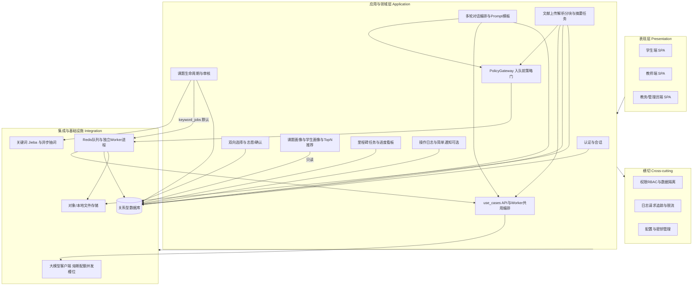
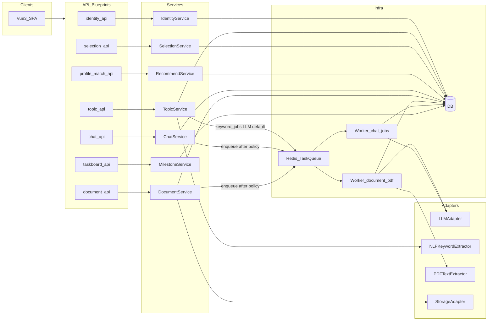
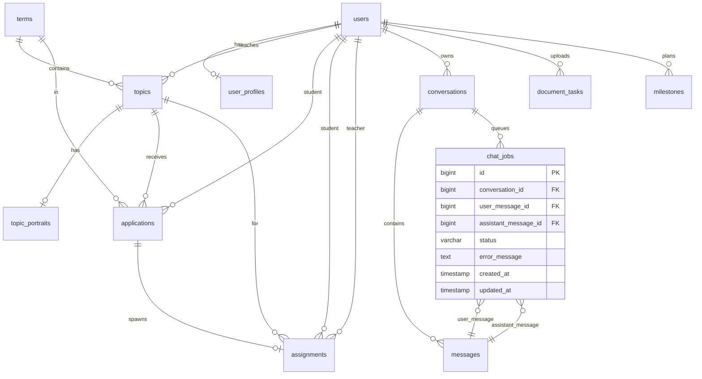

# 智能化毕业设计选题与辅助系统 — 从需求到架构的推导

依据开题报告中的定位：**B/S、Vue 3 + Flask、以“辅助学生”为核心**，并明确三大模块（智能选题推荐、智能问答与文档辅助、过程管理与进度看板）。以下按工程顺序给出可落地的架构推导（不绑定你仓库里是否已有代码；若后续实现，可与 [plan.txt](d:\毕业设计\plan.txt) 对齐为需求基线）。

**架构复审修订（设计级，未推翻 Vue + Flask + LLM）**：针对「同步 Chat 阻塞 HTTP worker」「进程内队列与长 PDF」「MaaS 熔断与预算」「画像写读边界」「管理员配置域」「志愿路由唯一归属」「assignments 与计数一致性」「文献任务状态机/幂等」「列表接口大字段」「分层 import 约束」等高/中风险项，已在 **§4、§5～§7、§8～§11** 嵌入对应条文；**§12** 汇总论文可用表述。**二次设计优化**（队列健康、背压、共享用例层、入队与 DB 一致性、Refresh 主路径、LLM 配置与 `term_id` 绑定等）见 **§4.2、§7～§9、§10、§13**。**三次复审补充**（队列与 worker 隔离、准入与精确计量分层、TOCTOU、同会话异步顺序、连接池与慢查询、OpenAPI/CSRF、分层强制工具化、观测最小集、§9.3 图与主链一致）见 **§14**。

---

## 1. 功能模块拆解（分层）

采用经典 **表现层 / 应用与领域服务层 / 集成与基础设施层 / 横切能力** 的分层，便于写论文里的“概要设计”与部署说明。



**总览图注（二次优化，详 §7、§8、§13）**：**PolicyGateway** 置于 Chat/文献等 **入队前** 路径；**`use_cases`** 为 **Flask API 内 service** 与 **Worker** 的 **共享编排层**，避免异步侧复制 Prompt/分块规则；**LLMClient** 以 **Worker → use_cases → LLMClient** 为主链，API 进程 **默认不**直连 MaaS；课题侧 **LLM 抽词** 经 **keyword_jobs** 进 **QueueWorker**（与 **§4.2、§9.2** 一致）。**实线至 DB**：认证、课题、互选、看板、审计及 Chat/文献 **受理阶段** 的结构化持久化；**ProfileMatch** 仅 **只读**；**QueueWorker → DB/FileStore** 表示 Worker **回写状态/结果** 与 **读上传文件**。

**各层职责（与开题一一对应）**

- **表现层**：Vue 3 + 组件库（如 Element Plus）；路由按角色拆分；对话 UI、文献上传、课题列表与推荐、甘特/图表看板。
- **应用与领域层**：
  - **课题与流程**：课题 CRUD、审核状态机（未审核/通过/已选等）、学生志愿填报、教师确认指导关系（开题所述流程的数字化）。
  - **智能选题推荐**：教师侧构建**课题画像**（Jieba 或 LLM 抽关键词/技术栈标签）；学生侧**学生画像**（特长、兴趣）；**基于内容/标签命中率的 Top-N 统计算法**（开题明确“不训练大推荐模型”）。
  - **智能问答**：会话管理、系统提示词（“大学辅导教师”角色）、上下文裁剪、引用免责声明与学术诚信边界（文献综述中已强调风险）。
  - **文档辅助**：PDF 文本抽取 → 分块 → 调用 LLM 生成摘要/结论提炼/对比（**轻量 RAG 验证**，可不引入完整向量检索也能交卷）。
  - **进度看板**：学生任务 CRUD、时间轴；教师只读查看与预警（“提前预警与督促”）。
- **集成与基础设施层**：Flask 提供 REST API；持久化；文件存储；**Redis 队列 + 独立 Worker 进程**承载 Chat / 长文献 / CPU 密集 PDF 解析（避免阻塞默认 HTTP worker）；对外 **文心一言 / 通义千问** 等 MaaS 调用封装在 Worker 侧经 **`use_cases` + 适配层**访问；受理路径配合 **PolicyGateway**（Redis 健康、队列背压、配额与并发槽位，**§4.2**）。
- **横切**：JWT/Session、角色权限、接口限流、密钥不入库、审计日志（便于论文写“安全设计”）；**Access 短令牌 + HttpOnly Refresh** 为交付默认（**§10.1**）。

---

## 2. 用户流程（系统如何被使用）

以 **管理员 / 教师 / 学生** 三条主线描述（与文献中角色划分一致）。

**管理员（或教务）**

1. 维护基础数据：学年学期、学院专业班级、用户账号与角色绑定。
2. 配置选题开放时间窗口、志愿规则（如第一/第二志愿）；**LLM 厂商、日预算、每用户配额等须按 `term_id` 绑定学期**（单一真源，**§10.1.1、§13**）。
3. 审核课题、处理异常（如课题下线、调剂）。

**教师**

1. 登录 → 提交课题（名称、简介、任务要求、技术指标）→ 等待审核通过进入课题库。
2. 选题阶段：查看报名/志愿学生列表 → 结合成绩与系统给出的**匹配提示**（标签重合度等）→ 确认或拒绝 → 形成指导关系。
3. 指导过程：进入所指导学生空间 → 查看**进度看板与里程碑** → 对滞后节点进行督促。

**学生**

1. 登录 → 完善个人画像（技术特长、兴趣偏好）。
2. 浏览课题库 → 调用 **Top-N 推荐** 缩小范围 → 阅读课题详情 → 填报第一/第二志愿。
3. 选题确定后：使用 **AI 对话助手** 进行多轮技术/格式咨询；上传 PDF 文献走 **文档分析** 拿摘要与要点。
4. 在独立页面维护毕设子任务与时间节点 → 通过图表查看自我进度；教师侧同步可见。

**系统级后台流程（用户无感但要在设计里写清）**

- 文献上传：**校验格式与大小 → 落盘 → 写 `document_tasks` → PolicyGateway → 入队** → Worker（**`use_cases` 分块**，**chunk 并行度受限**）→ PDF/LLM → **回写 DB/对象存储指针**（**默认不在 API 进程内同步全文解析**，**§9.5-F**）；**入队失败** 按 **§9.2.1** 补偿，避免悬挂 `pending`。
- AI 对话：**`use_cases` 组装 → PolicyGateway → 事务内用户消息 + assistant 占位落库 → 提交 → 入队 `chat_jobs`**（**§9.2.1**）→ Worker（**`use_cases` → LLM**）→ 回写终态；前端轮询或订阅（建议 **ETag/`updated_at` 或退避**，**§13**）。
- LLM 调用失败：**分级熔断、退避、全站槽位与预算**、降级文案、超时提示（开题要求“网络延迟或并发导致的回调异常”可处理）；队列满或 Redis 不可用返回 **`POLICY_QUEUE_DEPTH` / `QUEUE_UNAVAILABLE`**（**§4.2、§10**）。

---

## 3. 系统边界（系统内 vs 外部依赖）

**系统内（你负责实现与运维的原型范围）**

- Vue 3 前端 SPA 与打包部署。
- Flask 后端：业务 API、权限、会话、课题/用户/任务等**结构化数据**的 CRUD 与状态机。
- 本地或服务器上的**文件存储**（上传文献、可选导出报表）。
- **Prompt 模板与编排逻辑**、简单推荐算法、PDF 文本抽取与分块策略。
- 日志、限流、配置（除密钥外的运行参数）。

**外部依赖（明确边界与契约）**

- **大模型 MaaS API**：文心一言、通义千问等（HTTP/SDK）；输出质量与时延不由你方完全控制，需 **适配层 + 超时重试 + 熔断降级**。
- **可选**：邮件/短信网关（若要做通知）；学校统一身份认证（若对接真实校园网，通常超出毕设原型，可作为“未来工作”）。
- **运行环境**：操作系统、HTTPS 证书、反向代理（Nginx）——部署层依赖，在论文里单独写“部署架构”即可。

**边界原则（写进“系统上下文图”很好用）**

- 系统**不**自研通用大模型；**不**承诺文献结论的学术真实性（需 UI 与文档双重免责）。
- 推荐模块以**可解释的标签命中**为主，避免“黑盒深度模型推荐”与开题表述冲突。
- **前端边界（前后端分离）**：Vue SPA **仅**通过 **HTTPS + Flask REST**（`/api/v1`）访问业务数据与异步任务状态；**禁止**浏览器直连 **关系型数据库、Redis（队列与缓存）、Worker 进程** 或内网队列管理端口；队列消费与 LLM 调用 **仅发生在服务端 Worker**。若文献等大结果采用 **对象存储预签名 URL**，须由后端签发、**短时有效、仅 GET、不可列目录**，前端仍 **不**持有数据库或 Redis 凭证（与 **§13** 预签名说明一致）。

---

## 4. 非功能需求（性能 / 并发 / 延迟 / 数据量）

结合开题中的“原型 + 小规模试用 + 压力测试”表述，建议把指标写成 **区间 + 测量方法**，答辩时更站得住脚。

| 维度 | 建议指标（可按学校规模裁剪） | 说明 |
|------|------------------------------|------|
| **并发** | 50～200 在线用户同时浏览与提交；核心写接口 20～50 TPS 级 | 毕设答辩以“教学班级”为量级即可；LLM 相关接口单独限流 |
| **API 延迟（非 LLM）** | P95 &lt; 300～800 ms（内网或同机） | 普通 CRUD、列表分页 |
| **LLM 延迟** | 首 token 或整段返回 P95 3～15 s（视厂商与 prompt 长度） | 必须 **异步任务 + 前端轮询/WebSocket** 或明确“长时等待”体验 |
| **上传与文档** | 单文件 10～30 MB 上限；单篇分块总数可控（如 ≤ 50～100 块） | 防止成本与超时爆炸；超长文献只摘要部分章节 |
| **数据量** | 课题数百～数千条；学生数百级；对话与摘要记录随时间增长 | 需索引字段（课题状态、学生 id、创建时间）；定期归档策略可选 |
| **可用性** | 原型期 95%+（无 SLA 硬承诺亦可） | 重点写清 **失败重试与降级** 而非五个九 |
| **安全** | HTTPS、RBAC、上传类型白名单、敏感配置环境变量 | 符合教务系统常规要求 |

### 4.1 复审后的非功能补强（设计级）

以下不推翻 **Vue + Flask + LLM** 主栈，作为 §7～§11 的交叉约束，写论文时可并入「非功能需求 / 可靠性与安全设计」。

| 主题 | 设计决策 |
|------|----------|
| **部署单点** | 单机 Nginx + 单库在毕设范围可接受；论文中标注为 **原型约束**，并补一句 **DB 定时 dump、上传与文件存储路径规范、恢复步骤**。 |
| **认证与前端安全** | 在「安全设计」中明确一种主路径：**短寿命 Access Token + HttpOnly Refresh Cookie**（或纯 Bearer 时的 XSS 防护策略）；统一 **CORS** 白名单、`/api/v1` 与静态资源分离（与现有部署一致）。 |
| **上传与反代** | Nginx **`client_max_body_size`**、**proxy 读写超时**与后端 Gunicorn/任务超时 **一致**；超大 PDF 可将「分片上传」列为扩展（方案 B）。 |
| **外部 MaaS** | **分级熔断**（连续失败→打开→半开→恢复）、**指数退避 + 抖动**、**每用户/每日 token 预算**、失败时 **可展示降级文案**；**关键路径**（选题核心流程）与 **非关键路径**（润色类）**分开熔断**。 |
| **HTTP 与 LLM 解耦** | Chat 与长文献 **不得**在默认 API worker 内同步整段阻塞等模型；见 **§7.4、§9、§10.5～10.6**。 |
| **Redis 不可用 / 入队失败** | API 返回可机器识别错误（如 `QUEUE_UNAVAILABLE`）；**禁止**留下长期 `pending` 且无队列消费的悬挂任务。默认采用 **§9.5** 固定顺序：**事务提交占位/任务行 → 入队**；入队失败则 **补偿**：将占位 assistant / `document_tasks` 标为 `failed` 并写入 `error_code`，或有限次重试入队（择一写死并在实现中一致）。 |
| **队列背压与体验** | 监控各队列深度与预估等待时间；超阈值时对受理接口返回 **429/503**（与厂商限流 `LLM_RATE_LIMITED` 区分），提示「系统繁忙」。Worker 并发 = worker 进程数 × 每进程允许的 **LLM in-flight 槽位**，在文档与配置中可解释。 |
| **LLM 滥用与费用（高优先级）** | 在「每用户/每日 token 预算」之外，增加 **全站 LLM 并发槽位**、**每用户同时进行中的 Chat/文献任务数**上限；管理端提供 **按日/按用户用量只读聚合**（可落表或日志汇总），便于答辩演示治理。 |
| **文献分块调用** | `document_jobs` 对同一 `document_task_id` 的 chunk 级 LLM 调用须设 **并行度上限**（如 1～3），并与全站槽位叠加，避免对 MaaS 触发限流与重试风暴。 |
| **共享用例层** | 引入 **`use_cases`（应用用例层）**：Prompt 组装、上下文裁剪、文献分块计划等 **API 与 Worker 共用**，`task/*_jobs` **薄封装**、禁止复制业务规则；见 **§7.2、§8.1、§9、§13**。 |
| **策略门（PolicyGateway）** | 入队前集中校验：**Redis 连通性**、**队列深度**、**用户/全站 in-flight**、**日预算**；逻辑可落在 `app/common/` 或独立模块，架构叙述见 **§7.2、§13**。 |

### 4.2 二次设计优化摘要（与 §13 对照）

- **认证主路径**：交付默认 **HttpOnly + Secure 的 Refresh Cookie**；Access Token 仍用 `Authorization: Bearer`（短寿命）。与 **§10.1** 一致。
- **LLM 配置真源**：厂商路由、日预算、每用户配额等 **必须绑定 `term_id`**（独立表或 `terms` JSON 列二选一），避免 `/terms` 与 `/admin/llm-config` 漂移。
- **课题 LLM 抽词**：**生产默认**仅经 **`keyword_jobs` + Worker** 调 `LLMAdapter`；API 进程内 **禁止**同步 MaaS（开发环境可开关，不写入论文主路径）。

---

## 5. 两套技术方案

### 方案 A：保守可交付（与开题技术栈强一致）

- **前端**：Vue 3 + Vue Router + Pinia + Element Plus；ECharts 或轻量甘特组件做看板。
- **后端**：Flask **单体** 应用，模块化 Blueprint；Gunicorn + Nginx。
- **数据库**：MySQL 或 PostgreSQL（SQLite 仅适合单机演示，论文建议仍写 MySQL/PG）。
- **推荐**：Jieba + TF-IDF/标签重合度 + 简单加权；可选“课题录入时 LLM 抽一次关键词”写入结构化字段，查询时不反复调模型。**二次优化**：课题侧 LLM 抽词 **生产默认**走 **`keyword_jobs`**（见 **§4.2、§9.2**），避免 API worker 同步阻塞。
- **AI（复审修订 + 二次优化）**：**Chat 与长文献默认**走 **异步任务 + 占位消息 + 前端轮询**（或 WebSocket 推送）；受理路径经 **PolicyGateway** 校验队列健康与配额后再 **入队**（**§4.2、§7.2**）。可选 **SSE 流式** 时须 **独立 worker 组/进程** 且 Nginx **`proxy_read_timeout` 与后端一致**。短文档、极少分块仍可在 worker 内同步调 LLM，但 **不宜**在 Gunicorn 默认 API worker 内长时间阻塞。**仅开发环境**可用进程内 `ThreadPoolExecutor`；交付与论文描述以 **Redis + RQ/Celery 等独立 worker** 为准，避免重启丢队与 CPU 解析拖垮整站。Prompt 组装与分块计划收敛到 **`use_cases`**，与 Worker 共用（**§8、§13**）。
- **部署**：单机 Docker Compose（web + db + nginx）即可。

**优点**：实现路径短、与开题文字一致、论文好写“实现与验证”。**缺点**：LLM 高峰时接口排队明显；语义能力弱于向量检索方案。

### 方案 B：高性能 / 可扩展（偏工程展示）

- **后端拆分**：`api`（Flask/FastAPI）+ `worker`（Celery/RQ）消费队列；**Redis** 做队列与缓存（课题列表、会话上下文摘要缓存）。
- **检索增强**：课题/学生描述 **Embedding + 向量库**（如 Milvus/pgvector），Top-N 由向量相似度 + 规则重排（可解释分仍保留）。
- **LLM**：流式 SSE/WebSocket 输出；多厂商路由与熔断；**token 计费与配额**中间表。
- **文件**：MinIO/S3 兼容存储；大 PDF **分片上传**。
- **观测**：OpenTelemetry 或结构化日志 + Prometheus 指标（可选）。

**优点**：并发与长任务体验好，推荐“像 AI 系统”。**缺点**：复杂度高，超出开题“轻量级”表述的风险大，论文篇幅与调试成本上升。

---

## 6. 推荐最终方案 + 理由

**推荐：以方案 A 的「单体 Flask + 清晰模块」为交付主线；将方案 B 中的「Redis + 独立 Worker + 队列」提升为默认可依赖项（非仅“增强可选项”），以消除复审标出的高/中风险（同步 Chat 阻塞 worker、进程内队列重启丢任务、PDF CPU 与 API 同进程）。向量库、分片上传、全链路观测等仍按时间与学校要求 **可选**。

**理由（对齐开题目标与风险）**

1. **与预期成果一致**：开题明确 Vue 3 + Flask、经济高效的推荐、MaaS 调用与异常处理验证；单体 + 清晰模块最能稳定产出“可运行原型 + 测试报告”。
2. **LLM 成本与不可控性**：向量库与多服务拆分都会放大变量；毕设更宜把创新点放在 **Prompt、文档分块、轻量 RAG、异常处理与评测** 上，而不是运维复杂度。**队列 + 独立 worker** 仍属单机 Compose 可承载范围，复杂度可控。
3. **可写进论文的“折中增强”**（不加整套方案 B 也能写“优化章节”）：
   - **文献摘要与 Chat**：**后台任务 + 状态查询**（Redis 作 broker + 独立 worker）；文献侧另设 **`pdf_parse` 与 `document_llm` 队列或同 worker 分阶段**，上传 API 只做 **校验 + 落盘 + 入队**；
   - 推荐在标签算法基础上，**可选**对课题简介做一次 embedding 缓存相似度（若时间充裕）。

若你的学校明确要求“高并发演示”或已有现成中间件环境，再整体偏向方案 B。

**二次设计优化**（`use_cases`、PolicyGateway、入队一致性、LLM 槽位与 `term_id` 配置等）已并入 **§4.2、§7～§10、§13**，实现与论文应与之对齐。

---

## 7. 系统架构设计（基于推荐方案：单体 Flask + 清晰模块 + 独立 Worker）

本节回答：**整体分层、模块职责、调用关系、队列/缓存/并发、是否微服务**，可直接并入论文“系统总体设计/概要设计”。**复审修订要点**：HTTP API 进程与 **LLM 调用 / 重 CPU 解析** 在 **进程级** 解耦；`LLMAdapter` 的调用默认发生在 **Worker 进程**（Chat、长文献、可选 PDF 解析），API 进程仅 **受理、鉴权、经 PolicyGateway 入队、查询状态**。**二次优化**：**`use_cases`** 为 API 与 Worker 的 **共享编排入口**（**§8、§13**）。

### 7.1 架构说明（整体分层）

系统采用 **B/S + 前后端分离**：浏览器运行 Vue 3 SPA；服务端在部署上为 **同一代码仓库内的多进程**：**Gunicorn API 进程池**（Flask 路由，短事务）与 **独立 Worker 进程池**（消费 Redis 队列，执行 LLM 与长耗时任务）；对外统一暴露 REST JSON；关系型数据落库；大结果可经 **对象存储/文件** 存放指针。入口经 **Nginx** 做反向代理、TLS 终结与静态资源托管。

逻辑分层自上而下为：

1. **客户端表现层**：路由、状态、表单校验、图表与对话 UI；仅调用后端 REST，不直连数据库；长耗时能力采用 **轮询/WebSocket**（或可选 SSE）展示进度。
2. **接入层**：Nginx（HTTPS、静态资源、反向代理、可按路径限流；**`client_max_body_size` 与超时**与后端对齐）。
3. **应用服务层（Flask API 进程）**：认证授权、课题与互选流程、**学期/窗口/LLM 厂商等管理员配置（`terms` 域）**、推荐查询入口、对话与文献任务的 **受理与状态查询**、进度看板、审计日志；受理异步任务前经 **PolicyGateway（策略门）** 校验 Redis、队列深度、用户/全站 in-flight 与预算（**§4.2**）。
4. **应用用例层（`use_cases`，与 HTTP 解耦）**：**Chat** 的 Prompt 组装与上下文裁剪、**Document** 的分块与阶段计划等 **纯函数式用例**；**由同域 `service` 与 `task/*_jobs` 共同调用**，避免 Worker 内复制编排逻辑（**§8.1、§13**）。
5. **领域与数据访问层**：实体模型、事务边界、仓储/DAO（可用 SQLAlchemy 等）；保证互选、选题人数等 **一致性**（见 **§11.2.4 / §11.3** 与 **§9.5**）。
6. **集成适配层**：`LLMAdapter`（文心/通义 HTTP/SDK、**分级熔断、退避抖动、配额、全站并发槽位**）、`PDFTextExtractor`、`NLPKeywordService`（Jieba/可选 LLM 抽词）；**由 Worker 与 `use_cases` 调用链末端调用**；API 进程 **默认不**直连 MaaS。
7. **基础设施**：MySQL/PostgreSQL、本地磁盘或对象存储、**Redis（队列 + 可选限流计数）**、**异步 Worker**（`chat_jobs` / `document_jobs` / `pdf_parse` 等）。

### 7.2 模块划分（每个模块职责）

| 模块 | 职责 |
|------|------|
| **Web SPA（学生/教师/管理员）** | 页面与交互；Access Token 携带；Refresh 按 **§10.1** 默认 HttpOnly Cookie；Chat/文献 **任务轮询或 WebSocket**（可选 SSE）；上传组件与进度展示；轮询建议带 **`updated_at`/ETag** 或指数退避（**§13**）。 |
| **Nginx** | TLS、静态前端、`/api` 反代至 Gunicorn、基础限流与超时（含大上传与长连接/SSE 时的 **`proxy_read_timeout`**）。 |
| **IdentityAuth** | 登录、JWT 或 Session、RBAC、密码哈希、密码学安全的会话续期；**Refresh 默认 HttpOnly Cookie**（**§10.1**）。 |
| **TermsAdmin（或 `terms` 包）** | **管理员可写**：学年学期、选题开放窗口、志愿规则参数；**LLM 厂商路由、日预算、每用户配额等须带 `term_id` 绑定**（独立表或 `terms` 内嵌，避免与 `/admin/llm-config` 双真源，**§10.1.1**）；`SelectionFlow` 等仅 **只读依赖**其服务接口，与 Identity 解耦。 |
| **PolicyGateway（策略门，逻辑模块）** | 入队前：**Redis 连通性**、**队列深度/背压**、**全站与用户 LLM in-flight**、**日预算**；不通过则 **不入队** 并返回约定错误码；与 **§4.2、§9.5** 补偿策略衔接。 |
| **UseCases（应用用例层）** | Chat 消息组装与裁剪、文献分块与阶段计划等 **无 Flask `request` 的用例函数**；**仅**被 **各域 `service`** 与 **`task/*_jobs`** 调用；**禁止**被 `api` 直接 import（经 service 编排）。 |
| **TopicLifecycle** | 课题 CRUD、审核状态机、课题上下线；**课题画像（`topic_portraits` / 画像列）的唯一写入口**：保存/审核链路触发 **Jieba 同步** 或 **`keyword_jobs` 异步 LLM** 写入（**生产默认异步 LLM**，见 **§4.2、§9.2**）；**不**承担志愿 HTTP 资源（见 **§10.3**）。 |
| **SelectionFlow** | **志愿 `applications` 与决策 API 的唯一归属域**；志愿填报、查询、教师确认/拒绝、最终指导关系落库；与学期时间窗配置联动。 |
| **ProfileMatch** | **只读**课题画像、学生画像与可选缓存列；为学生计算 **Top-N** 并返回可解释理由；**不调 LLM**、不重复 NLP 抽词（避免与 Topic 写路径不一致）。 |
| **ChatOrchestration** | 会话与用户消息持久化；**经 `use_cases` 组装**系统 Prompt 与用户消息、上下文裁剪；**默认**：**PolicyGateway** 通过后创建 **占位 assistant 消息** + **`chat_jobs` 入队**（顺序见 **§9.5-E**）；Worker 调 **`use_cases` + LLMAdapter** 回写内容与状态；免责声明与降级文案策略。 |
| **DocPipeline** | 上传鉴权与类型/大小校验；**落盘 + 创建 `document_tasks`**；**PolicyGateway** 通过后 **入队**；**默认不在 API worker 内做 CPU 密集全文解析**；Worker 经 **`use_cases` 分块计划** → PDF 抽取、**受限并行**多段 LLM、汇总写回；大 `result_json` 可写对象存储、DB 存指针。 |
| **TaskBoard** | 学生里程碑 CRUD；时间轴数据；教师只读聚合视图；简单“逾期预警”计算（可选）。 |
| **NotifyAudit（可选）** | 站内通知或邮件占位；关键业务操作审计日志。 |
| **LLMAdapter** | 统一厂商接口；**分级熔断、指数退避+抖动、每用户/每日 token 预算、全站并发槽位、每文档 chunk 并行度上限**；关键/非关键路径 **分策略**；配额与错误码映射；**由 Worker 内 `use_cases` 调用链调用**；API 进程 **禁止**默认路径直连。 |
| **NLPKeywordService** | Jieba 分词与停用词；可选“LLM 一次性抽关键词”写入结构化列。 |
| **FileStore** | 存储路径约定、按用户/任务隔离、下载鉴权。 |

### 7.3 模块之间调用关系（谁调用谁）

- **浏览器** → **Nginx** → **Flask 路由** → 各域 **`service`**（同进程内调用）；异步路径 **`service` → `PolicyGateway` → `task.queue`**。
- **TopicLifecycle** → **NLPKeywordService**（同步）与/或 **`keyword_jobs` 入队**（**生产默认** LLM 抽词仅异步）→ Worker → **`use_cases` + LLMAdapter** → 写回 **DB** 画像字段；**Recommend 不得重复调用**。
- **TermsAdmin** → 写 **terms / 系统配置表**；**SelectionFlow、TopicLifecycle** 等 → **只读**配置。
- **ProfileMatch** → 读 **DB**（课题画像、学生画像、可选向量缓存列；**带 `term_id` 等索引条件**）→ 纯内存/DB 侧排序 Top-N → 返回前端。
- **ChatOrchestration** → 读/写 **DB** → **`use_cases` 组装** → **PolicyGateway** → **enqueue `chat_jobs`** → **Worker** → **`use_cases` + LLMAdapter** → 外部 **MaaS** → 回写 **DB**；可选 SSE 时仍为 **专用 worker/进程组** 承载流式。
- **DocPipeline** → **FileStore** 落盘 → 创建任务行 → **PolicyGateway** → **enqueue**（`pdf_parse` / `document_jobs`）→ **Worker**：**PDFTextExtractor** → **`use_cases` 分块计划** → **LLMAdapter**（**chunk 并行度受限**）→ 写 **DB** 状态与结果指针。
- **SelectionFlow** / **TaskBoard** → **DB**；教师看学生看板时经 **IdentityAuth** 校验师生关系。
- 全链路依赖 **横切**：鉴权中间件、结构化日志、配置模块。

### 7.4 是否需要队列 / 缓存 / 并发控制

**队列（异步任务）— 复审后定为交付默认**

- **必须有（进程级）**：**Chat**、**长文献多段 LLM**、**默认 PDF 解析** 若放在 Gunicorn API worker 同步执行，并发略升即 **排队、504、假死**；与外部 MaaS 强依赖叠加后风险更高。
- **默认实现（论文与实现一致）**：**Redis + RQ/Celery（或同类）+ 独立 worker 进程** + 任务表；API：**202/任务 id** 或 **占位消息 + 轮询**；Worker：消费队列、经 **`use_cases`** 调用 `LLMAdapter`、回写 DB。**全局 LLM 并发槽位**、**每用户 in-flight**、**每文档 chunk 并行度上限** 与 **退避** 在 Adapter 与队列配置侧实现（**§4.2**）。
- **Redis 持久化（原型建议）**：答辩/部署说明中写明 **AOF 或 RDB** 策略或明确「原型可丢队」边界；与 **§4.2** 入队失败补偿一致。
- **背压**：队列深度超阈值时 **PolicyGateway** 拒绝新入队并返回 **429/503**（与 `LLM_RATE_LIMITED` 区分），避免无限 pending。
- **开发期例外**：单机无 Redis 时可用进程内线程池 **仅限本地调试**；不得作为答辩/交付主路径（**重启丢队、与请求线程争用**）。

**缓存**

- **非必须**：课题列表分页、热点课题可用 **短 TTL 缓存**（内存或 Redis）减轻 DB 压力。
- **可选**：对“已算过的课题关键词/摘要”做缓存键，避免重复抽词（注意课题变更失效）。

**并发控制**

- **必须**：互选与选题容量建议 **数据库事务 + 行级锁/乐观锁**；**以 `assignments`（或等价真源）为准**，`topics.selected_count` 为派生字段，须在 **同一事务内** 与真源同步更新，或靠 **触发器/定时对账任务** 纠偏（见 **§11.2.4、§11.3**）。
- **必须**：对 **LLMAdapter** 做 **全站并发槽位 + 全局限流 + 每用户配额 + 每用户并发任务数**（令牌桶或滑动窗口），防止刷爆 API 费用与触发厂商封禁（**§4.2**）。
- **建议**：上传大小与页数上限；文档任务并发上限；Gunicorn worker 数与 LLM 阻塞调用隔离（长任务尽量不出现在同步 worker 中）。

### 7.5 是否需要微服务（理由）

**结论：毕设原型阶段不需要微服务；保持单体多模块即可。**

**理由简述**

1. **规模与团队**：典型毕设为单人或小团队，微服务带来的 **部署、联调、分布式事务、可观测性** 成本远高于收益。
2. **与开题一致**：开题强调轻量级 Flask 与可交付原型；单体更符合“工程可控 + 论文可描述”。
3. **性能瓶颈不在拆分**：首要是 **LLM 外部延迟与配额** 与 **文档解析**，拆微服务不解决该瓶颈，反而增加网络跳转。
4. **演进路径**：若将来接入校级统一认证、独立 AI 计费网关，可将 **LLMAdapter** 或 **DocPipeline** 拆为独立服务——在论文中写“演进方向”即可，无需毕设阶段落地。

### 7.6 简单架构图（文本）

复审修订版：**API 进程不直连 MaaS**；Chat / 长文献 / PDF 解析经 **Redis 队列 → 独立 Worker**；`LLMAdapter` 仅在 Worker（及极短同步路径）侧调用。

```
                    +------------------+
                    |   浏览器 Vue3    |
                    | (学生/教师/管理)  |
                    +--------+---------+
                             | HTTPS
                             v
                    +--------+---------+
                    |      Nginx       |
                    | 静态 /api 反代    |
                    | body_size/超时    |
                    +--------+---------+
                             | /api
                             v
         +-------------------------------------------+
         |     Gunicorn：Flask API（短事务）         |
         |  Identity  TermsAdmin  Topic  Selection   |
         |  ProfileMatch  Chat*  Document* TaskBoard |
         |  (* 受理/查状态；经 PolicyGateway 入队)    |
         |       PolicyGateway -> enqueue（Redis 健康）|
         +----------------------+--------------------+
                                |
                    enqueue     |   读写
                        +-------+--------+
                        v                v
                 +-------------+   +-----------+
                 | Redis 队列   |   | DB        |
                 | chat/doc/pdf|   | 真源/任务行 |
                 +------+------+   +-----------+
                        |
                        v
         +-------------------------------------------+
         |  Worker 进程池（与 API 分离）              |
         |  chat_worker | document_worker | pdf...  |
         |       use_cases（与 API 共用编排逻辑）     |
         |        \         |         /              |
         |         +--- LLMAdapter ---+              |
         |         （槽位/熔断/配额/分块并行上限）      |
         +-----------------+--------------------------+
                           v
                    +-------------+
                    | 外部 MaaS    |
                    +-------------+
         +-----------+   文件/对象存储（大 result 指针）
```

**与旧图差异摘要**：原「Flask 盒内直连 LLM」改为 **队列化 + Worker 侧 Adapter**；管理员学期/窗口配置独立为 **TermsAdmin**；**ProfileMatch** 不连 LLM。**二次优化**：增加 **PolicyGateway**、**use_cases**、Adapter **槽位与分块并行上限**。

---

## 8. Flask 可实现的项目结构（按域分包 + 分层）

本节将 §7 中的模块映射为 **可落地的目录树**：每个业务域（Identity、Topic 等）独占一个包，包内再分 `api` / `service` / `model`；**跨域复用**的 LLM、PDF、存储等放在全局 `adapter`；**异步执行**集中在 `task`（可与 RQ/Celery 或进程内队列对接）。

### 8.1 分层说明（五层在工程中的含义）

| 层级 | 目录位置 | 职责 | 典型内容 |
|------|-----------|------|----------|
| **api** | 各域包下的 `api/` | **接口层**：HTTP 契约、参数校验、鉴权装饰器挂载、HTTP 状态码与序列化；**不写**复杂业务与事务编排；**禁止** `import app.adapter`；**禁止**直接 `import app.use_cases`（经 **同域 service** 编排）。 | Flask Blueprint、`request.get_json()`、marshmallow / pydantic schema、`jsonify`。 |
| **service** | 各域包下的 `service/` | **业务层**：用例流程、事务边界、领域规则（志愿规则、选题容量、推荐打分）；调用本域 `model`、**`app.use_cases`（Chat/Document/Topic 编排）**、**`app.common.policy`（PolicyGateway）** 与 **`task.queue` 入队**；**不在** Chat/长文献路径直接调 `adapter.llm`（复审默认架构）。 | `XxxService` 类或模块函数、`db.session` 事务、`enqueue`。 |
| **model** | 各域包下的 `model/` | **数据层**：ORM 实体、表关系、查询封装；可含简单 **repository** 风格函数（避免 service 直接拼 SQL）。 | SQLAlchemy `Model`、`relationship`、索引字段。 |
| **use_cases** | `app/use_cases/` | **应用用例层**：无 Flask `request`；**Chat / Document / Keyword** 等跨步骤编排（Prompt、裁剪、分块计划）；**仅**被 **各域 `service`** 与 **`task/*_jobs`** 调用。 | `chat_orchestration.py`、`document_pipeline.py`、`topic_keyword_extract.py` 等模块。 |
| **adapter** | `app/adapter/` | **外部系统适配**：文心/通义 HTTP、NLP、PDF 文本抽取、文件存储路径；对上层暴露稳定 Python API；**由 `use_cases` 或 Worker 任务末尾调用**，**禁止**被 `api` 导入。 | `LLMClient`、`ErnieAdapter`、`QwenAdapter`、重试熔断、并发槽位。 |
| **task** | `app/task/` | **异步任务定义与入队封装**；**Worker 进程**消费：`chat_jobs`、`document_jobs`、`pdf_parse`、**`reconcile_selected_count`（可选）**；Job 内 **薄**：参数校验 → 调 **`use_cases`** → `adapter`；入参可序列化；**禁止**回调 HTTP `api`。 | RQ job、`celery` task；开发环境可临时 `executor`（不写入交付说明）。 |

**横切**（不属于五层之一，但与各层配合）：`app/extensions.py`（`db`、`migrate`、`jwt` 等）、`app/common/`（统一异常、RBAC 装饰器、分页、**`policy.py` 实现 PolicyGateway**）、`app/config.py`。

**工程约束（复审 + 二次优化）**：在评审清单或 lint 规则中写明：**`api` 不得 import `adapter`、不得 import `use_cases`**；**`task` / worker 代码不得 import `api`**；**`use_cases` 不得 import `api`**；防止执行期绕过分层。

### 8.2 业务域包与职责（与 §7 模块一一对应）

| 包名（目录） | 对应架构模块 | 职责摘要 |
|--------------|--------------|----------|
| `identity` | IdentityAuth | 注册/登录/刷新令牌、RBAC、当前用户解析；用户基础资料。 |
| `terms`（或 `admin_config`） | TermsAdmin | 学年学期、选题窗口、志愿规则参数、LLM 厂商与配额等；**仅管理员可写**；供 `selection`/`topic` **只读**查询。 |
| `topic` | TopicLifecycle | 课题 CRUD、审核状态机、容量与已选人数；**课题画像唯一写入口**（Jieba 同步 + **`keyword_jobs` 默认异步 LLM** 写入 `topic_portraits` 或画像列，**§4.2**）。 |
| `selection` | SelectionFlow | **志愿与决策 API 唯一归属**；志愿填报与修改、教师确认/拒绝、指导关系、与学期时间窗联动。 |
| `profile_match` | ProfileMatch | Top-N 计算、**只读**画像与解释性结果组装；**不调** `adapter.llm`；**不**在推荐请求中做全量 NLP。 |
| `chat` | ChatOrchestration | 会话与消息 CRUD；**`use_cases` 组装** Prompt 与裁剪；**PolicyGateway** 后 **`task.queue` → `chat_jobs`**；Worker 调 **`use_cases` + `adapter.llm`** 回写。 |
| `document` | DocPipeline | 文献上传元数据、**校验+落盘**、创建 `document_tasks`、**PolicyGateway** 后 **入队** `pdf_parse`/`document_jobs`；**默认**不在 API 进程内跑全文 PDF 解析。 |
| `taskboard` | TaskBoard | 里程碑 CRUD、进度查询、教师只读列表与逾期计算（可选）。 |
| `audit`（可选） | NotifyAudit | 审计日志写入、简单通知占位。 |

### 8.3 完整目录树（约定）

根目录名可自定（示例 `graduation_backend/`）。前端 Vue 工程可与之后并列 `graduation_frontend/`，此处仅后端。

```
graduation_backend/
├── wsgi.py                      # WSGI 入口：from app import create_app; app = create_app()
├── run.py                       # 可选：flask run / 开发启动
├── requirements.txt
├── .env.example
├── migrations/                  # flask-migrate 生成（若使用）
├── tests/
│   ├── conftest.py
│   ├── identity/
│   ├── topic/
│   └── ...
└── app/
    ├── __init__.py              # create_app()：注册 extensions、按域注册 Blueprint
    ├── config.py                # Development / Production 配置类
    ├── extensions.py            # db = SQLAlchemy(); jwt = JWTManager(); ...
    ├── common/
    │   ├── __init__.py
    │   ├── errors.py            # 业务异常类 + 全局 errorhandler 注册点
    │   ├── rbac.py              # role_required 等装饰器
    │   ├── pagination.py
    │   └── policy.py            # PolicyGateway：Redis/队列深度/in-flight/预算
    ├── use_cases/               # 应用用例层：无 request；供 service 与 task 共用
    │   ├── __init__.py
    │   ├── chat_orchestration.py
    │   ├── document_pipeline.py
    │   └── topic_keywords.py
    ├── adapter/                 # 全局：LLM / NLP / PDF / 存储（禁止 api import；由 use_cases/worker 调用）
    │   ├── __init__.py
    │   ├── llm/
    │   │   ├── __init__.py
    │   │   ├── base.py          # 抽象：complete(messages, **kwargs)
    │   │   ├── ernie.py
    │   │   └── qwen.py
    │   ├── nlp/
    │   │   ├── __init__.py
    │   │   └── keyword_extractor.py
    │   ├── pdf/
    │   │   ├── __init__.py
    │   │   └── text_extractor.py
    │   └── storage/
    │       ├── __init__.py
    │       └── local_fs.py      # 或 minio_client.py
    ├── task/                    # 异步任务定义与队列入口（worker 单独进程部署）
    │   ├── __init__.py
    │   ├── queue.py             # 统一 enqueue（RQ / Celery；生产不用线程池冒充队列）
    │   ├── chat_jobs.py         # 调 use_cases → adapter.llm → 回写 messages / job 状态
    │   ├── document_jobs.py     # use_cases 分块计划；受限并行 LLM；幂等键；回写 document_tasks
    │   ├── pdf_jobs.py          # CPU 密集 PDF 解析（可与 document_jobs 分阶段）
    │   ├── keyword_jobs.py      # 可选：异步抽课题关键词（写回仍归 topic 域）
    │   └── reconcile_jobs.py    # 可选：selected_count 与 assignments 对账
    ├── identity/
    │   ├── __init__.py          # 可在此 register_blueprint
    │   ├── api/
    │   │   ├── __init__.py
    │   │   └── routes.py        # Blueprint: /api/v1/auth/...
    │   ├── service/
    │   │   ├── __init__.py
    │   │   └── auth_service.py
    │   └── model/
    │       ├── __init__.py
    │       └── user.py
    ├── terms/                   # 管理员：学期、选题窗口、LLM 配置（与 identity 解耦）
    │   ├── __init__.py
    │   ├── api/
    │   │   └── routes.py        # Blueprint: /api/v1/terms/... 或 /admin/terms/...
    │   ├── service/
    │   │   └── term_service.py
    │   └── model/
    │       └── term.py
    ├── topic/
    │   ├── __init__.py
    │   ├── api/
    │   │   ├── __init__.py
    │   │   └── routes.py
    │   ├── service/
    │   │   ├── __init__.py
    │   │   └── topic_service.py
    │   └── model/
    │       ├── __init__.py
    │       └── topic.py
    ├── selection/
    │   ├── __init__.py
    │   ├── api/
    │   │   ├── __init__.py
    │   │   └── routes.py
    │   ├── service/
    │   │   ├── __init__.py
    │   │   └── selection_service.py
    │   └── model/
    │       ├── __init__.py
    │       ├── application.py     # 志愿/报名实体命名示例
    │       └── assignment.py      # 最终指导关系
    ├── profile_match/
    │   ├── __init__.py
    │   ├── api/
    │   │   ├── __init__.py
    │   │   └── routes.py
    │   ├── service/
    │   │   ├── __init__.py
    │   │   └── recommend_service.py
    │   └── model/                 # 若无独立表可仅 __init__.py + 复用 topic/user 模型
    │       └── __init__.py
    ├── chat/
    │   ├── __init__.py
    │   ├── api/
    │   │   ├── __init__.py
    │   │   └── routes.py
    │   ├── service/
    │   │   ├── __init__.py
    │   │   └── chat_service.py
    │   └── model/
    │       ├── __init__.py
    │       ├── conversation.py
    │       └── message.py
    ├── document/
    │   ├── __init__.py
    │   ├── api/
    │   │   ├── __init__.py
    │   │   └── routes.py
    │   ├── service/
    │   │   ├── __init__.py
    │   │   └── document_service.py
    │   └── model/
    │       ├── __init__.py
    │       └── document_task.py
    ├── taskboard/
    │   ├── __init__.py
    │   ├── api/
    │   │   ├── __init__.py
    │   │   └── routes.py
    │   ├── service/
    │   │   ├── __init__.py
    │   │   └── milestone_service.py
    │   └── model/
    │       ├── __init__.py
    │       └── milestone.py
    └── audit/                     # 可选域
        ├── __init__.py
        ├── api/
        │   └── routes.py
        ├── service/
        │   └── audit_service.py
        └── model/
            └── audit_log.py
```

**说明**

- **Blueprint 注册**：可在 `app/__init__.py` 中统一 `register_blueprint`，也可在各域 `__init__.py` 暴露 `register_*` 函数，二选一保持风格一致即可。
- **`profile_match/model`**：若画像完全落在 `topic` / `user` 表字段上，该包 `model` 可空，仅保留 `service` + `api`；论文中仍算独立「推荐域」。
- **`task` 与 `document` / `chat`**：`document.service`、`chat.service` 经 **`use_cases` + PolicyGateway** 创建任务行/占位消息并 `task.queue.enqueue`；`task.*_jobs` 调 **`use_cases` + `adapter`**，**避免**在 `api` 层直接调 LLM；**worker 禁止**反向依赖 `api`。

### 8.4 调用关系（与目录的对应）

- `xxx/api/routes.py` → 调用同域 `xxx/service/*.py` →（按需）**`app.use_cases`**、**`app.common.policy`** → 读写同域 `xxx/model` + 全局 `app.extensions.db`。
- **`task/*_jobs`（worker 进程）** → **`app.use_cases`** → `app.adapter.llm` / `nlp` / `pdf` / `storage`；**`chat/service`、`document/service`** 默认 → **`policy`** → `app.task.queue`。
- `topic/service`（课题画像写入）→ 同步 `nlp`；LLM 路径 **生产默认** `enqueue keyword_jobs`；**不**经 `profile_match` 写画像。
- `document/service` → **`policy`** → `app.task.queue` → `task/pdf_jobs.py`（可选）→ `task/document_jobs.py` → **`use_cases` + `adapter`** + 回写 `document/model`。

---

## 9. 模块调用关系与数据流（I/O、同步/异步、队列）

本节以 **service 层** 为「模块」边界描述调用（`api` 仅转调同域 `service`，不单独展开）。**`use_cases`（应用用例）**、**`PolicyGateway`**、**adapter** 与 **task** 为全局模块；**二次优化**见 **§4.2、§13**。

### 9.1 各模块输入 / 输出（service 语义）

| 模块（包） | 主要输入 | 主要输出 |
|------------|----------|----------|
| **Identity** | 用户名/密码或令牌刷新请求；角色绑定数据 | 访问令牌/刷新令牌；当前用户上下文；校验失败错误 |
| **Topic** | 课题表单（标题、简介、要求、容量等）；审核动作；操作者角色 | 持久化课题实体；审核后状态；**课题画像字段的唯一写入出口**（Jieba 同步；**LLM 抽词生产默认经 `keyword_jobs`**） |
| **Selection** | 学生志愿（课题 ID、优先级）；教师确认/拒绝；从 **`terms` 只读** 时间窗配置 | 志愿记录；最终 **`Assignment`（真源）**；与 `topics.selected_count` **同事务**或触发器一致；业务异常（超窗、重复志愿） |
| **Terms** | 管理员维护学期、窗口、**与 `term_id` 绑定的 LLM 配置**等 | 持久化配置行；供 `Selection`/`Topic` **只读**消费；**单一真源**（**§10.1.1**） |
| **ProfileMatch** | 学生 ID；**必选 `term_id` 等索引化筛选**；可选关键词 | Top-N 课题列表及可解释命中；**只读 DB**；**不调 LLM**、不做全量在线 NLP |
| **Chat** | 会话 ID；用户消息文本；历史消息（从 DB 加载） | **`use_cases` 组装**；**PolicyGateway** 通过后用户消息落库 + **占位 assistant + `chat_jobs` id**；Worker 调 **`use_cases`+LLM** 更新状态；可选 SSE 由专用 worker 承载 |
| **Document** | 上传文件流与元数据；任务查询条件 | 存储路径；`DocumentTask` 行；**PolicyGateway** 后入队；列表 **不含**大 `result_json`；Worker **`use_cases` 分块 + 受限并行 LLM**（**§11.2.11**） |
| **TaskBoard** | 里程碑 CRUD 负载；查询所指导学生 ID（教师端） | 里程碑列表；简单逾期标记（可选） |
| **Audit（可选）** | 操作者、资源类型、动作、摘要 | 审计行；供管理端查询 |

**Adapter（被调用方）**

| 适配器 | 输入 | 输出 |
|--------|------|------|
| **LLMAdapter** | messages 列表（system/user/assistant）、温度、max_tokens、厂商路由键（**含 `term_id` 路由**） | 模型文本；token 用量（若返回）；可映射的错误码；**受全站槽位与 chunk 并行度约束** |
| **NLPKeywordExtractor** | 课题/学生描述纯文本 | 关键词列表或结构化标签 |
| **PDFTextExtractor** | 本地/对象存储上的文件路径或文件句柄 | 纯文本或按页文本列表 |
| **StorageAdapter** | 二进制流、逻辑 key（user_id/task_id） | 存储 URI 或绝对路径 |

**Task（任务模块）**

| Job | 输入（可序列化） | 输出 |
|-----|------------------|------|
| **document_jobs** | `document_task_id`、存储路径、分块参数、**`chunk_index`/`stage` 幂等键** | 分段更新状态、**断点续跑**、写入摘要/多段结果到 DB 或对象存储指针 |
| **chat_jobs** | `conversation_id`、用户消息 id、模型参数路由键 | 调 `LLMAdapter`、回写 assistant `messages`、更新 job 终态 |
| **pdf_jobs（可选）** | `document_task_id`、存储路径 | 抽取全文文本，供 `document_jobs` 后续分块 |
| **keyword_jobs（课题 LLM 默认路径）** | `topic_id`、文本快照、`term_id` | 经 **`use_cases`** 调 LLM；回写课题画像关键词字段（写入口仍在 topic 语义域） |
| **reconcile_jobs（可选）** | `term_id` 或全表扫描范围 | 对账 `selected_count` 与 `assignments` |

### 9.2 谁调用谁（含同步/异步与是否经队列）

**约定**：「同步」指请求线程内完成并返回 HTTP；「异步」指先返回任务 ID，由 worker 完成后客户端轮询/订阅。

| 调用方 → 被调用方 | 同步 / 异步 | 是否需要队列 |
|-------------------|-------------|----------------|
| **api（各域）** → **同域 service** | 同步 | 否 |
| **Identity.service** → **User model / DB** | 同步 | 否 |
| **Topic.service** → **Topic model / DB** | 同步 | 否 |
| **Topic.service** → **NLPKeywordExtractor**（Jieba 抽词） | 同步（通常毫秒级） | 否 |
| **Topic.service** → **LLMAdapter**（录入时 LLM 抽关键词） | **禁止（生产默认）**；**开发环境**可开关同步 | **生产默认**：仅 **`keyword_jobs` + 队列 + Worker → `use_cases` + LLMAdapter** |
| **Selection.service** → **Topic / User / Application / Assignment model** | 同步（事务内） | 否 |
| **Selection.service** → **Terms（只读）** | 同步 | 否 |
| **Selection.service** → **Identity**（仅通过 JWT 载荷拿 user_id，非循环 HTTP） | 同步 | 否 |
| **ProfileMatch.service** → **DB**（读 Topic/User 画像） | 同步 | 否 |
| **ProfileMatch.service** → **NLPKeywordExtractor** | **禁止**（默认）；画像分词已在 Topic 写入路径完成 | 否 |
| **Chat.service** → **`use_cases`（组装/裁剪）** | 同步（纯内存 + DB 读） | 否 |
| **Chat.service** → **PolicyGateway** | 同步 | 否 |
| **Chat.service** → **Conversation/Message model** | 同步（写 user + **pending assistant 占位**；**顺序见 §9.5-E**） | 否 |
| **Chat.service** → **`task.queue` → `chat_jobs`** | **异步（默认）** | **是** |
| **Chat（worker）/ `task.chat_jobs`** → **`use_cases` → LLMAdapter** | 异步 | 否（已在队列内） |
| **Chat.service** → **LLMAdapter** | **禁止**（默认）；**例外**：若采用 SSE，则由 **专用 worker/进程组** 持有长连接，且与 Nginx 超时对齐 | **否**（不占用默认 API worker） |
| **Document.service** → **`use_cases`（分块计划准备，元数据级）** | 同步（可选；亦可在 worker 内首次调用） | 否 |
| **Document.service** → **PolicyGateway** | 同步 | 否 |
| **Document.service** → **StorageAdapter** | 同步 | 否 |
| **Document.service** → **PDFTextExtractor** | **默认异步**（`pdf_jobs`）；开发期小样例外需在文档中声明 | **是**（默认） |
| **Document.service** → **LLMAdapter** | **默认不在 API 进程调用**；极短文本若保留同步，须 **块数阈值** 保护 | 默认 **是**（`document_jobs`） |
| **task.document_jobs** → **PDFTextExtractor**（若上传时未解析） | 异步 | 已在队列内 |
| **task.document_jobs** → **`use_cases` → LLMAdapter**（每块或聚合；**chunk 并行度 ≤ 配置上限**） | 异步 | 否（队列即「排程」；并行度由 Adapter/配置约束） |
| **task.document_jobs** → **DocumentTask model / DB** | 异步 | 否 |
| **TaskBoard.service** → **Milestone model**；教师端读学生数据时 → **Assignment** 或师生关系校验 | 同步 | 否 |
| **各域 service（可选）** → **Audit.service** | 同步 | 否 |

**禁止**：`api` → `adapter` / `use_cases` 直连；`task` → `api` 回调（应写 DB）；`use_cases` → `api`。

### 9.2.1 入队与数据库一致性（固定顺序）

**交付默认（占位体验优先）**：在 **同一数据库事务** 内写入 **用户消息 + assistant 占位（`pending`）** 或 **`document_tasks(pending)`** 等必要行 → **提交事务** → 调用 **`enqueue`**。若 `enqueue` 失败：**补偿路径**将占位行或任务行更新为 **`failed`**，写入 `error.code = QUEUE_UNAVAILABLE`（或等价字段），或 **有限次重试入队**（二选一在实现与论文中保持一致，**推荐失败即标记 failed** 便于用户重试请求）。**禁止**：仅入队成功而库中无对应任务行，或库中 `pending` 长期无队列消费者。

### 9.3 模块调用图（Mermaid）



**图注（二次优化）**：图中 **LLM** 在实现上等价为 **`use_cases` → LLMAdapter**；`enqueue` 前须经 **PolicyGateway**（此图省略独立节点）。`TopicService` 的 **LLM 抽词** 生产路径为 **`keyword_jobs` 入队**（见 **§9.2**），**禁止** API 进程同步直连 MaaS。

### 9.4 模块调用图（文本简图）

```
Vue SPA
  |  HTTPS JSON
  v
+------------------+------------------+------------------+
| identity_api     | topic_api        | selection_api    | ...
+---------+--------+---------+--------+---------+--------+
          |                  |                  |
          v                  v                  v
   IdentityService    TopicService      SelectionService
          |                  |                  |
          v                  +------> NLP ------+--> DB
          |                  |
          |                  +--> TaskQueue (keyword_jobs) --> worker --> use_cases --> LLM --> DB
          v
         DB

chat_api --> ChatService --> use_cases / policy --> DB
                         --> TaskQueue --> chat_jobs --> worker --> use_cases --> LLM --> DB

document_api --> DocumentService --> Storage
                                 --> use_cases / policy --> TaskQueue (pdf + doc)
                                         |
                                         v
                               worker --> PDF --> use_cases --> LLM（chunk 并行受限） --> DB

profile_match_api --> RecommendService --> DB
                                        (read-only, no LLM)

taskboard_api --> MilestoneService --> DB
```

### 9.5 数据流说明（按业务场景）

**A. 登录与鉴权**

- 流：Vue → `identity_api` → `IdentityService` → 校验密码、签发 **Access JWT** → **Set-Cookie 下发 HttpOnly Refresh**（默认，**§10.1**）→ 返回 access 与用户摘要。  
- 数据：凭证进、令牌与用户角色出；**DB** 读写用户表。全程 **同步**、**无队列**。

**B. 教师提交课题与审核**

- 流：Vue → `topic_api` → `TopicService` → 写课题表；若配置「保存即抽词」→ **NLP** 同步；**LLM 抽词生产默认** → **`keyword_jobs` 入队** → Worker → **`use_cases` + LLMAdapter** → 回写画像字段 → 管理员审核仅 **DB** 状态迁移。  
- 数据：课题 JSON 入；持久化课题 + 画像标签出。**Jieba 同步**；**LLM 异步**（**§4.2、§9.2**）。

**C. 学生志愿填报与教师确认**

- 流：Vue → `selection_api` → `SelectionService` → 从 **`terms` 只读** 时间窗与规则 → 读课题容量 → 写志愿表 → 教师确认在 **单事务** 内写 **`assignments`（真源）** 并同步更新 **`topics.selected_count`（派生）**；失败整体回滚；可选 **`reconcile_jobs`** 定时对账。  
- 数据：志愿/确认指令进；指导关系与计数出。**同步**、**无队列**（一致性路径不走 LLM）。

**D. 智能选题 Top-N**

- 流：Vue → `profile_match_api` → `RecommendService` → **带 `term_id` 等条件** 读学生画像与课题画像（**DB**，必要时只读缓存列）→ **内存/DB 侧打分排序** → 返回列表与解释。  
- 数据：学生 ID 与筛选条件进；Top-N 与分数明细出。**同步**、**无队列**；**不调 LLM**、不在此路径做 NLP 抽词。

**E. AI 对话**

- 流：Vue → `chat_api` → `ChatService` → **`use_cases` 组装与裁剪** → **PolicyGateway**（Redis、队列深度、用户/全站 in-flight、预算）→ **单事务** 写用户消息 + **assistant 占位（`pending`）** → **提交** → **`enqueue chat_jobs`** → 立即返回 **202**（**§9.2.1**：若入队失败则补偿占位行为 `failed` / `QUEUE_UNAVAILABLE`）→ 前端 **轮询** `messages`（建议带 **`updated_at`/ETag** 或退避）或 **`GET /chat/jobs/{id}`** → **Worker**：**`use_cases` → LLMAdapter** → 回写 **DB** 终态。  
- 数据：用户消息进；最终助手消息出。**默认异步 + 队列**；SSE 为可选增强（专用 worker + Nginx 超时对齐）。

**F. 文献上传与摘要**

- 流：Vue上传 → `document_api` → `DocumentService` → **Storage** 落盘 → 创建 `DocumentTask(pending)` → **PolicyGateway** → **`pdf_jobs`（解析）→ `document_jobs`（`use_cases` 分块计划 + chunk 并行度上限内的 LLM 调用/二次汇总）** → 状态 **`running/success/failed`**，**幂等键** `task_id + chunk_index (+stage)`；**watchdog** 将超时 `running` 置为可重试/失败；大结果写 **对象存储**、DB 存指针；**入队失败** 同 **§9.2.1** 补偿策略。  
- 数据：文件二进制与元数据进；任务 ID 与最终摘要/要点出。**默认全异步 + 队列**（与「短同步」相比，统一路径更易答辩解释）。

**G. 进度看板**

- 流：Vue → `taskboard_api` → `MilestoneService` → **DB**；教师端需校验师生指导关系（读 **Assignment** 或关联表）。  
- 数据：里程碑 CRUD；**同步**、**无队列**。

---

## 10. RESTful API 设计（与 §7～§9 对齐）

**全局约定**

- **Base URL**：`/api/v1`（下表 URL 均为相对该前缀的路径）。  
- **认证（二次优化默认）**：除登录外，请求头 `Authorization: Bearer <access_token>`（短寿命 Access Token）。**Refresh Token 默认置于 HttpOnly + Secure + SameSite 的 Cookie**（如 `refresh_token`），**不在 JSON body 往返**，以降低 XSS 窃取刷新令牌风险；若课程要求纯 JSON 演示，须在「安全设计」中单独声明威胁模型与缓解并与实现一致（**§4.1、§13**）。  
- **内容类型**：JSON；文件上传接口使用 `multipart/form-data`。  
- **分页**（列表类）：查询参数 `page`（默认 1）、`page_size`（默认 20，上限如 100）。  
- **统一错误体**（示例）：`{ "error": { "code": "TOPIC_NOT_FOUND", "message": "...", "details": {} } }`。**补充约定错误码**：`QUEUE_UNAVAILABLE`（Redis/入队失败）、`LLM_RATE_LIMITED`（厂商或本地配额）、`POLICY_QUEUE_DEPTH`（背压拒绝）等，与 **§4.2** 一致。  
- **统一成功列表**：`{ "items": [...], "page": 1, "page_size": 20, "total": 123 }`（无分页的接口可直返对象或数组，但建议全站一致）。

---

### 10.1 用户（Identity）

| 方法 | URL | 说明 |
|------|-----|------|
| POST | `/auth/login` | 登录 |
| POST | `/auth/refresh` | 刷新访问令牌 |
| GET | `/users/me` | 当前用户资料 |
| PATCH | `/users/me` | 更新资料（含学生画像：兴趣、技术栈等） |
| POST | `/users` | 管理员创建用户（可选） |
| GET | `/users` | 管理员用户列表（分页，可选 `role`、`keyword`） |
| GET | `/users/{user_id}` | 管理员或教师查看指定用户摘要 |

**POST `/auth/login`**

- **请求**：`{ "username": "string", "password": "string" }`  
- **响应（默认，二次优化）**：`{ "access_token": "string", "token_type": "Bearer", "expires_in": 3600, "user": { "id": 1, "username": "...", "role": "student|teacher|admin", "display_name": "..." } }`，并 **`Set-Cookie`** 下发 **HttpOnly** 的 `refresh_token`（**不在 JSON 中返回 refresh**）。  
- **兼容说明（可选）**：若教学演示必须 JSON 携带 refresh，可保留 `refresh_token` 字段，但论文主路径应以 **HttpOnly Cookie** 为准并与 **§4.1** 一致。

**POST `/auth/refresh`**

- **请求（默认）**：无 JSON body；浏览器 **自动携带** Refresh Cookie；服务端校验后签发新 Access Token。  
- **响应**：`{ "access_token": "string", "token_type": "Bearer", "expires_in": 3600 }`；可按旋转策略更新 Refresh Cookie。  
- **兼容**：若使用 body 模式，请求仍为 `{ "refresh_token": "string" }`，但须在安全章节声明为 **备选**。

**GET `/users/me`**

- **请求**：无 body。  
- **响应**：`{ "id", "username", "role", "display_name", "email", "student_profile": { "skills": ["Vue","Flask"], "interests": "...", "major": "..." } | null, "teacher_profile": { ... } | null }`

**PATCH `/users/me`**

- **请求**（部分字段）：`{ "display_name": "...", "email": "...", "student_profile": { "skills": [...], "interests": "..." } }`  
- **响应**：更新后的 `users/me` 同结构。

### 10.1.1 学期与系统配置（Terms / Admin）

**归属**：独立 **`terms` 蓝图**（或 `admin_config`），**仅管理员**可写；`identity` 不承载学年/窗口/LLM 厂商等业务配置，避免 RBAC 与配置 API 膨胀。

| 方法 | URL | 说明 |
|------|-----|------|
| GET | `/terms` | 学期列表（管理员全量；其他角色可仅返回当前可用学期，按实现裁剪） |
| POST | `/terms` | 管理员新建学期 |
| PATCH | `/terms/{term_id}` | 管理员更新名称、**选题窗口**、志愿规则摘要字段等 |
| GET | `/terms/{term_id}` | 单学期详情（含窗口时间） |
| GET/PATCH | `/admin/llm-config?term_id=` 或 `/terms/{term_id}/llm-config`（推荐） | 管理员读写 **该学期** 的 LLM 厂商路由、**日预算/每用户配额** 等；**须带 `term_id`，与 `terms` 行绑定，单一真源**（亦可全部并入 `PATCH /terms/{term_id}` 的 JSON 字段，**禁止**无 `term_id` 的全局游离配置与学期配置并存而不声明优先级） |

**说明**：`SelectionFlow`、`TopicLifecycle` 仅 **读取** 上述配置（读路径始终带 **`term_id`**）；写操作集中在管理端 UI + 本组 API。**二次优化**：LLM 策略以 **`term_id`** 为命名空间，避免 `/terms` 与 admin 配置漂移。

---

### 10.2 选题 — 课题（Topic）

| 方法 | URL | 说明 |
|------|-----|------|
| GET | `/topics` | 课题列表（筛选见下） |
| POST | `/topics` | 教师创建课题（草稿） |
| GET | `/topics/{topic_id}` | 课题详情 |
| PATCH | `/topics/{topic_id}` | 教师改草稿/已驳回课题 |
| DELETE | `/topics/{topic_id}` | 逻辑删除或撤回（仅允许状态内） |
| POST | `/topics/{topic_id}/submit` | 教师提交审核 |
| POST | `/topics/{topic_id}/review` | 管理员审核（通过/驳回） |

**GET `/topics` 查询参数（示例）**

- `status`：`draft|pending_review|published|closed` 等  
- `teacher_id`：教师过滤（教师默认仅自己）  
- `q`：标题/简介关键词  
- `page`, `page_size`

**POST `/topics`**

- **请求**：`{ "title": "string", "summary": "string", "requirements": "string", "tech_keywords": ["可选","覆盖"], "capacity": 1, "term_id": 1 }`  
- **响应**：`{ "id", "title", "status": "draft", "capacity", "selected_count", "teacher_id", "created_at", ... }`

**GET `/topics/{topic_id}`**

- **响应**：完整课题 + `portrait`（可选内嵌）：`{ "keywords": [...], "extracted_at": "..." }`

**POST `/topics/{topic_id}/review`（管理员）**

- **请求**：`{ "action": "approve|reject", "comment": "string" }`  
- **响应**：`{ "id", "status": "published|rejected", ... }`

---

### 10.3 选题 — 互选（Selection）

资源命名：**志愿** `applications`（学生对课题），**指导关系** `assignments`。

| 方法 | URL | 说明 |
|------|-----|------|
| POST | `/applications` | 学生新增一条志愿 |
| GET | `/applications` | 当前学生志愿列表；教师可加 `topic_id` 查某课题报名 |
| DELETE | `/applications/{application_id}` | 学生在允许窗口内撤销 |
| PATCH | `/applications/{application_id}` | 可选：改志愿优先级（若规则允许） |
| GET | `/applications?topic_id={topic_id}` | **推荐唯一对外形态**：教师查看某课题全部报名（**蓝图归属 `selection`**，实现上可与嵌套路由二选一，**禁止**在 `topic` 蓝图重复挂接以免鉴权分叉） |
| POST | `/applications/{application_id}/decisions` | 教师接受/拒绝某一志愿 |
| GET | `/assignments` | 当前用户相关指导关系（学生看自己；教师看名下） |
| GET | `/assignments/{assignment_id}` | 单条指导关系详情 |

**POST `/applications`（学生）**

- **请求**：`{ "topic_id": 10, "priority": 1 }`（`priority` 1 或 2 表示志愿序）  
- **响应**：`{ "id", "topic_id", "student_id", "priority", "status": "pending|withdrawn|...", "created_at" }`

**GET `/applications`**

- **响应**：`{ "items": [ { "id", "topic_id", "topic_title", "priority", "status" } ], "page", "page_size", "total" }`

**POST `/applications/{application_id}/decisions`（教师）**

- **请求**：`{ "action": "accept|reject", "comment": "string" }`  
- **响应**：`{ "application": { ... }, "assignment": { "id", "student_id", "teacher_id", "topic_id", "status": "active" } | null }`（接受时创建 assignment，并触发课题已选人数更新）

**GET `/assignments`**

- **响应**：列表项示例：`{ "id", "topic_id", "topic_title", "student_id", "student_name", "teacher_id", "status", "confirmed_at" }`

---

### 10.4 推荐（ProfileMatch）

| 方法 | URL | 说明 |
|------|-----|------|
| GET | `/recommendations/topics` | 为当前登录学生返回 Top-N 推荐课题 |

**GET `/recommendations/topics`**

- **查询参数**：`top_n`（默认 10，上限如 30）、**`term_id`（复审：生产路径建议必填，避免全表扫描）**、`explain=true|false`（是否返回命中明细）  
- **响应**：

```json
{
  "items": [
    {
      "topic_id": 1,
      "title": "...",
      "score": 0.82,
      "explain": {
        "matched_skills": ["Vue"],
        "matched_keywords": ["前后端分离"],
        "reasons": ["技能命中: Vue", "关键词命中: 前后端分离"]
      }
    }
  ],
  "top_n": 10
}
```

- **错误**：非学生角色可返回 `403` 或 `ROLE_FORBIDDEN`。

---

### 10.5 AI 问答（Chat）

| 方法 | URL | 说明 |
|------|-----|------|
| GET | `/conversations` | 当前用户会话列表 |
| POST | `/conversations` | 新建会话 |
| GET | `/conversations/{conversation_id}` | 会话元数据 |
| DELETE | `/conversations/{conversation_id}` | 软删除或归档（可选） |
| GET | `/conversations/{conversation_id}/messages` | 历史消息分页 |
| POST | `/conversations/{conversation_id}/messages` | 发送用户消息；**默认**创建占位回复并入队（**202**）；详情见下 |
| GET | `/chat/jobs/{job_id}` | **可选**：查询 Chat 异步任务状态（或改为轮询 `messages` 中 `assistant` 占位行的 `status` 字段） |

**POST `/conversations`**

- **请求**：`{ "title": "可选标题", "context_type": "general|topic|document", "context_ref_id": null }`  
- **响应**：`{ "id", "title", "created_at", "context_type", "context_ref_id" }`

**GET `/conversations/{conversation_id}/messages`**

- **查询参数**：`page`, `page_size`（按时间正序或倒序由实现约定，建议 `order=asc|desc`）  
- **响应**：`{ "items": [ { "id", "role": "user|assistant|system", "content": "...", "created_at" } ], "page", "page_size", "total" }`

**POST `/conversations/{conversation_id}/messages`**

- **请求**：`{ "content": "用户问题文本" }`  
- **响应（默认，复审修订）**：HTTP **202 Accepted**，Body 示例：`{ "job_id": "uuid", "user_message": { "id", "role": "user", "content", "created_at" }, "assistant_message": { "id", "role": "assistant", "content": "", "status": "pending", "created_at" } }`；前端轮询 **`GET /conversations/{conversation_id}/messages`**（查占位行状态）或 **`GET /chat/jobs/{job_id}`** 直至 `status` 为 `completed|failed`。失败时 `assistant_message.content` 可为 **降级文案**（来自 `LLMAdapter` 策略）。  
- **可选**：SSE 流式时约定 `Accept: text/event-stream` 或 `GET .../messages/stream`，且由 **专用 worker/进程组** 执行，Nginx **`proxy_read_timeout`** 与后端一致。  
- **不推荐**：在默认 Gunicorn worker 内 **同步整段** 等待 LLM 完成后再返回 200（易排队与 504，仅作对照实验）。

---

### 10.6 文档分析（Document）

| 方法 | URL | 说明 |
|------|-----|------|
| POST | `/document-tasks` | 上传 PDF 并创建分析任务 |
| GET | `/document-tasks` | 当前用户任务列表 |
| GET | `/document-tasks/{task_id}` | 任务状态与结果（轮询） |

**POST `/document-tasks`**

- **请求**：`multipart/form-data`：`file`（PDF）、可选字段 `task_type`（`summary|conclusions|compare`）、`language`（`zh|en`）。  
- **响应**（立即返回，异步处理）：`{ "id", "status": "pending|running|success|failed", "filename", "created_at", "result": null, "error_message": null }`

**GET `/document-tasks/{task_id}`**

- **响应**：`{ "id", "status", "filename", "task_type", "created_at", "updated_at", "result": { "summary": "...", "bullet_points": ["..."], "raw_model": "..." } | null, "error_message": "string|null" }`

**GET `/document-tasks`**

- **响应**：分页 `items` 为任务摘要数组；**硬性约定**：列表 **不返回** 完整 `result_json` / `raw_model`（可省略或仅返回 `result_preview` 长度上限内摘要）；完整结果仅 **`GET /document-tasks/{task_id}`** 或对象存储预签名 URL。

---

### 10.7 任务看板（TaskBoard）

| 方法 | URL | 说明 |
|------|-----|------|
| GET | `/milestones` | 里程碑列表 |
| POST | `/milestones` | 学生创建里程碑 |
| GET | `/milestones/{milestone_id}` | 单条详情 |
| PATCH | `/milestones/{milestone_id}` | 更新 |
| DELETE | `/milestones/{milestone_id}` | 删除 |

**GET `/milestones`**

- **查询参数**：`student_id`（教师查看指定学生时必填且须校验指导关系；学生省略即本人）、`from_date`、`to_date`  
- **响应**：`{ "items": [ { "id", "title", "description", "start_date", "end_date", "status": "todo|doing|done", "sort_order", "is_overdue": false } ], "page", "page_size", "total" }`

**POST `/milestones`（学生）**

- **请求**：`{ "title": "string", "description": "string", "start_date": "2026-04-01", "end_date": "2026-04-14", "status": "todo", "sort_order": 0 }`  
- **响应**：创建的完整对象。

**PATCH `/milestones/{milestone_id}`**

- **请求**：部分字段同 POST。  
- **响应**：更新后对象。

---

### 10.8 模块与路由前缀对照（实现时 Blueprint）

| 业务域 | 建议 Blueprint `url_prefix` |
|--------|-----------------------------|
| Identity | `/auth`、`/users` |
| Terms / Admin | `/terms`；LLM 配置推荐 **`/terms/{term_id}/llm-config`** 或查询参数 **`?term_id=`**，与 **§10.1.1** 单一真源一致 |
| Topic | `/topics`（**不含**志愿列表路由） |
| Selection | `/applications`、`/assignments`；**教师按课题查报名** 用 **`GET /applications?topic_id=`**（注册在 selection 蓝图） |
| 推荐 | `/recommendations` |
| AI 问答 | `/conversations` |
| 文档分析 | `/document-tasks` |
| 任务看板 | `/milestones` |

---

## 11. 数据库设计（与 §7～§10 对齐）

**说明**

- 类型以 **PostgreSQL / MySQL 通用语义** 表述；时间统一 `TIMESTAMP`（UTC 或服务器本地，论文中写清即可）。  
- 主键：`BIGINT` 自增或 **雪花/UUID**（二选一全库统一）。  
- 软删除：需要审计的表用 `deleted_at`；否则物理删除。  
- **任务**一词在业务中有两类：**看板里程碑**（`milestones`）与 **文献分析异步任务**（`document_tasks`）；二者分表，避免混淆。

---

### 11.1 表结构总览

| 表名 | 业务含义 |
|------|----------|
| `users` | 用户账号与角色 |
| `user_profiles` | 学生/教师扩展画像（推荐用） |
| `terms` | 学年学期（选题窗口、课题归属） |
| `topics` | 课题主表 |
| `topic_portraits` | 课题画像（关键词 JSON，可选拆表） |
| `applications` | 学生选题志愿 |
| `assignments` | 最终师生指导关系 |
| `milestones` | 毕设进度看板子任务 |
| `conversations` | AI 会话 |
| `messages` | 会话内聊天记录 |
| `document_tasks` | 文献上传与摘要等异步任务 |
| `chat_jobs`（可选） | Chat 异步生成任务，与 `messages` 占位行或 `delivery_status` 配合 |

若希望极简表数量，可将 `topic_portraits` 合并进 `topics` 的 JSON 列（见下表「可选」列）；`chat_jobs` 亦可合并进 `messages` 的扩展列策略。

---

### 11.2 表结构与字段说明

#### 11.2.1 `users`（用户）

| 字段 | 类型 | 约束 | 说明 |
|------|------|------|------|
| `id` | BIGINT / UUID | PK | 用户主键 |
| `username` | VARCHAR(64) | UNIQUE, NOT NULL | 登录名 |
| `password_hash` | VARCHAR(255) | NOT NULL | 密码哈希 |
| `role` | ENUM 或 VARCHAR(16) | NOT NULL | `student` / `teacher` / `admin` |
| `display_name` | VARCHAR(64) | NOT NULL | 展示姓名 |
| `email` | VARCHAR(128) | NULL | 联系邮箱 |
| `is_active` | BOOLEAN | NOT NULL, DEFAULT TRUE | 是否启用 |
| `created_at` | TIMESTAMP | NOT NULL | 创建时间 |
| `updated_at` | TIMESTAMP | NOT NULL | 更新时间 |

#### 11.2.2 `user_profiles`（画像扩展，推荐）

| 字段 | 类型 | 约束 | 说明 |
|------|------|------|------|
| `user_id` | BIGINT | PK, FK → users.id | 一对一 |
| `profile_type` | VARCHAR(16) | NOT NULL | `student` / `teacher` |
| `skills_json` | JSON / TEXT | NULL | 学生技术栈列表，供推荐 |
| `interests` | TEXT | NULL | 兴趣方向描述 |
| `major` | VARCHAR(128) | NULL | 专业 |
| `title` | VARCHAR(64) | NULL | 教师职称等（可选） |
| `updated_at` | TIMESTAMP | NOT NULL | 画像更新时间 |

也可把 `skills_json`、`interests` 直接放在 `users` 上；拆表利于角色字段隔离。

#### 11.2.3 `terms`（学期，可选但利于多届数据）

| 字段 | 类型 | 说明 |
|------|------|------|
| `id` | PK | |
| `name` | VARCHAR(64) | 如 `2026春` |
| `selection_start_at` | TIMESTAMP | 志愿填报开始 |
| `selection_end_at` | TIMESTAMP | 志愿填报结束 |
| `created_at` | TIMESTAMP | |

#### 11.2.4 `topics`（课题）

| 字段 | 类型 | 说明 |
|------|------|------|
| `id` | PK | |
| `teacher_id` | FK → users.id | 负责教师 |
| `term_id` | FK → terms.id | 所属学期 |
| `title` | VARCHAR(256), NOT NULL | 课题名称 |
| `summary` | TEXT | 简介 |
| `requirements` | TEXT | 任务要求 |
| `capacity` | INT, NOT NULL | 可带学生上限 |
| `selected_count` | INT, NOT NULL, DEFAULT 0 | **派生缓存**：与 **`assignments` 真源** 一致；须在 **接受/拒绝同一事务** 内更新，或 **触发器/定时 reconcile** 纠偏（见 **§9.5-C**） |
| `status` | VARCHAR(32), NOT NULL | `draft` / `pending_review` / `published` / `rejected` / `closed` 等 |
| `tech_keywords` | JSON / TEXT | 教师手填或系统抽取的关键词列表 |
| `review_comment` | TEXT | 审核备注 |
| `deleted_at` | TIMESTAMP, NULL | 软删除 |
| `created_at` / `updated_at` | TIMESTAMP | |

**可选**：`portrait_json`（课题画像、抽取时间）若不用独立 `topic_portraits` 表。

#### 11.2.5 `topic_portraits`（课题画像，可选拆表）

| 字段 | 类型 | 说明 |
|------|------|------|
| `topic_id` | PK, FK | 一对一 |
| `keywords_json` | JSON | NLP/LLM 抽取结果 |
| `extracted_at` | TIMESTAMP | 抽取时间 |
| `extractor` | VARCHAR(32) | `jieba` / `llm` |

#### 11.2.6 `applications`（选题志愿）

| 字段 | 类型 | 说明 |
|------|------|------|
| `id` | PK | |
| `student_id` | FK → users.id | NOT NULL |
| `topic_id` | FK → topics.id | NOT NULL |
| `term_id` | FK → terms.id | NOT NULL |
| `priority` | SMALLINT, NOT NULL | 志愿优先级，如 1、2 |
| `status` | VARCHAR(32), NOT NULL | `pending` / `withdrawn` / `accepted` / `rejected` / `superseded` 等 |
| `teacher_comment` | TEXT | 教师拒绝/备注 |
| `created_at` / `updated_at` | TIMESTAMP | |

业务约束：同一 `student_id + term_id + topic_id` 唯一；同一学期每名学生的 `priority` 唯一（用唯一索引实现）。

#### 11.2.7 `assignments`（指导关系）

| 字段 | 类型 | 说明 |
|------|------|------|
| `id` | PK | |
| `student_id` | FK → users.id | NOT NULL |
| `teacher_id` | FK → users.id | NOT NULL |
| `topic_id` | FK → topics.id | NOT NULL |
| `term_id` | FK → terms.id | NOT NULL |
| `application_id` | FK → applications.id, NULL | 来源志愿（便于追溯） |
| `status` | VARCHAR(32) | `active` / `cancelled` |
| `confirmed_at` | TIMESTAMP | 确认时间 |
| `created_at` / `updated_at` | TIMESTAMP | |

约束：同一 `student_id + term_id` 通常仅一条 `active`（用部分唯一索引或应用层保证）。

#### 11.2.8 `milestones`（任务看板）

| 字段 | 类型 | 说明 |
|------|------|------|
| `id` | PK | |
| `student_id` | FK → users.id | NOT NULL，任务归属学生 |
| `term_id` | FK → terms.id, NULL | 可选，便于按届归档 |
| `title` | VARCHAR(256), NOT NULL | 里程碑标题 |
| `description` | TEXT | 说明 |
| `start_date` | DATE | 开始日期 |
| `end_date` | DATE | 结束日期 |
| `status` | VARCHAR(16) | `todo` / `doing` / `done` |
| `sort_order` | INT, DEFAULT 0 | 展示排序 |
| `created_at` / `updated_at` | TIMESTAMP | |

#### 11.2.9 `conversations`（AI 会话）

| 字段 | 类型 | 说明 |
|------|------|------|
| `id` | PK | |
| `user_id` | FK → users.id | 会话所有者（学生为主） |
| `title` | VARCHAR(128), NULL | 会话标题 |
| `context_type` | VARCHAR(32), NULL | `general` / `topic` / `document` |
| `context_ref_id` | BIGINT, NULL | 关联 topic 或 document_task |
| `archived_at` | TIMESTAMP, NULL | 归档/软删 |
| `created_at` / `updated_at` | TIMESTAMP | |

#### 11.2.10 `messages`（聊天记录）

| 字段 | 类型 | 说明 |
|------|------|------|
| `id` | PK | |
| `conversation_id` | FK → conversations.id | NOT NULL, ON DELETE CASCADE |
| `role` | VARCHAR(16), NOT NULL | `system` / `user` / `assistant` |
| `content` | TEXT, NOT NULL | 消息正文；`assistant` 在异步路径可先为空，完成后回填 |
| `delivery_status` | VARCHAR(16), NULL | **复审**：`assistant` 行建议具备 `pending|running|completed|failed`；若独立建 **`chat_jobs`** 表，本列可简化为与 job 外键关联 |
| `token_usage_json` | JSON, NULL | 可选，记录 prompt/completion tokens |
| `created_at` | TIMESTAMP, NOT NULL | 发送时间 |

大流量时可按 `conversation_id` 分区或冷热归档（毕设可省略）。

#### 11.2.11 `document_tasks`（文献分析任务）

| 字段 | 类型 | 说明 |
|------|------|------|
| `id` | PK | |
| `user_id` | FK → users.id | 上传者 |
| `filename` | VARCHAR(255) | 原始文件名 |
| `storage_path` | VARCHAR(512), NOT NULL | 服务器存储路径或对象键 |
| `task_type` | VARCHAR(32) | `summary` / `conclusions` / `compare` |
| `language` | VARCHAR(8) | `zh` / `en` |
| `status` | VARCHAR(16) | **状态机（复审写死）**：`pending` → `running` → `success` \| `failed`（可选 `partial_success`）；**禁止**无限期停留在 `running` |
| `locked_at` | TIMESTAMP, NULL | worker 抢占时间，供 **watchdog** 检测僵尸任务 |
| `last_completed_chunk` | INT, NULL | **断点续跑**：最后成功 chunk 序号（与 **幂等键** `task_id+chunk_index+stage` 一致） |
| `result_json` | JSON / LONGTEXT | 摘要、要点等；**大结果**可迁出至对象存储，本列改存 **`result_storage_uri`** |
| `result_storage_uri` | VARCHAR(512), NULL | **复审**：对象存储指针，列表接口不返回正文 |
| `error_message` | TEXT, NULL | 失败原因 |
| `created_at` / `updated_at` | TIMESTAMP | |

**幂等与重试**：Worker 处理每个 `(task_id, chunk_index, stage)` 时先查是否已成功写入；失败重试从 `last_completed_chunk+1` 继续。**watchdog**：`running` 且 `locked_at` 超阈值 → 标记 `failed` 或 `pending`（可重试），避免队列槽位被永久占用。

#### 11.2.12 `chat_jobs`（异步对话任务，可选拆表）

当 `messages.delivery_status` 不足以承载重试/审计时，可独立建表：`id`、`conversation_id`、`user_message_id`、`assistant_message_id`、`status`、`error_message`、`created_at`、`updated_at`；与 **§10.5** 的 `job_id` 对应。

---

### 11.3 表关系（文字 + ER 要点）

**一致性要点（复审）**

- **`assignments` 为师生指导关系的真源**；`topics.selected_count` 仅为展示与容量校验加速字段，**任何**接受志愿代码路径不得在事务外单独改计数。论文可附 **接受/拒绝时序图** 标明失败回滚与重试边界。

**关系列表**

- `users` 1 — 1 `user_profiles`（可选）  
- `users` 1 — N `topics`（教师）  
- `terms` 1 — N `topics`  
- `topics` 1 — 0..1 `topic_portraits`（可选）  
- `users`（学生）1 — N `applications`；`topics` 1 — N `applications`  
- `applications` 0 — 1 `assignments`（接受后生成）  
- `users`（学生）1 — N `assignments`；`users`（教师）1 — N `assignments`；`topics` 1 — N `assignments`  
- `users` 1 — N `conversations`；`conversations` 1 — N `messages`  
- `conversations` 1 — N `chat_jobs`（可选，与异步 Chat 对应）  
- `users` 1 — N `document_tasks`  
- `users`（学生）1 — N `milestones`  



**图注（与 §11.2.12 一致）**：`chat_jobs` 与 `messages` 之间存在 **两条外键语义边**（`user_message_id` / `assistant_message_id`），在 Mermaid 中均表示为指向 `messages`；若渲染器合并同对实体连线，以文字关系列表与表结构为准。

---

### 11.4 索引建议

**用户与登录**

- `users(username)`：**UNIQUE**（登录）。  
- `users(role, is_active)`：管理端列表筛选（可选）。

**课题**

- `topics(teacher_id, status, term_id)`：教师工作台、按学期与状态筛。  
- `topics(term_id, status)`：学生端「已发布课题」列表。  
- `topics(deleted_at)`：部分索引 `WHERE deleted_at IS NULL`（若数据库支持），否则查询条件带 `deleted_at IS NULL` 并建组合索引 `topics(term_id, status, deleted_at)`。

**选题志愿**

- **UNIQUE** `(student_id, term_id, topic_id)`：防重复报同一课题。  
- **UNIQUE** `(student_id, term_id, priority)`：同一学期志愿优先级不重复。  
- `applications(topic_id, status)`：教师查看某课题 pending 列表。  
- `applications(student_id, term_id)`：学生「我的志愿」。

**指导关系**

- **UNIQUE** `(student_id, term_id)` WHERE `status = 'active'`（PostgreSQL 部分唯一索引；MySQL 8+ 可用函数索引或靠应用层 + 普通索引 `(student_id, term_id, status)`）。  
- `assignments(teacher_id, term_id)`：教师名下指导列表。

**聊天记录**

- `messages(conversation_id, id)` 或 `(conversation_id, created_at)`：按会话分页拉历史，**INDEX** 必备。  
- `conversations(user_id, archived_at, created_at)`：会话列表。

**Chat 异步任务（可选表 `chat_jobs`）**

- `chat_jobs(conversation_id, status, created_at)`：会话下任务列表与轮询。  
- `chat_jobs(status, created_at)`：Worker 领取 `pending` / **watchdog** 扫描超时 `running`（与 `document_tasks` 同理）。

**文献任务**

- `document_tasks(user_id, status, created_at)`：我的任务与轮询列表。  
- `document_tasks(status, created_at)`：后台 worker 抢 `pending`（若用 SQL 取任务）。  
- `document_tasks(status, locked_at)`：**watchdog** 扫描超时 `running`（复审）。

**看板里程碑**

- `milestones(student_id, end_date)`：学生看板与逾期扫描。  
- `milestones(student_id, sort_order)`：排序展示。

**外键**

- 在 `applications.topic_id`、`messages.conversation_id` 等列上建 **FK + INDEX**（多数 ORM 与 InnoDB 对外键自动索引；仍建议在文档中写明）。

---

### 11.5 与 API 资源的对照（便于实现）

| API 资源 | 主要持久化表 |
|----------|----------------|
| `/users`, `/auth` | `users`, `user_profiles` |
| `/terms`、`/terms/{id}/llm-config` 等 | `terms`（**LLM 策略列或子表须含 `term_id` FK**，单一真源，**§10.1.1**） |
| `/topics` | `topics`, `topic_portraits`（可选） |
| `/applications`, `/assignments` | `applications`, `assignments` |
| `/chat/jobs`（若独立） | `chat_jobs`（可选）+ `messages` |
| `/recommendations/topics` | 读 `topics` + `user_profiles`（及 `topic_portraits`），不写新表或可选 `recommendation_logs` 做评测 |
| `/conversations`, `/messages` | `conversations`, `messages` |
| `/document-tasks` | `document_tasks` |
| `/milestones` | `milestones` |

---

## 12. 论文可用说明（架构复审修订摘要）

以下内容可直接压缩进论文「系统总体设计 / 非功能需求 / 可靠性与安全设计」小节，与 **§4.1、§4.2、§7～§11、§13** 对应。

1. **异步化与资源隔离**：API 服务负责快速事务处理与任务受理；针对大模型推理与 PDF 解析等高延迟、高占用任务，引入 **消息队列与独立 Worker 进程**，实现 **HTTP 工作进程与智能计算解耦**，缓解高峰排队与超时假死。  
2. **外部模型服务治理**：对 MaaS 引入 **分级熔断、指数退避与抖动、每用户/每日 token 预算、全站并发槽位与文献 chunk 并行度上限、关键与非关键路径分策略熔断**，将供应商故障与误用重试对核心业务与成本的影响限制在可控范围。  
3. **数据一致性与可恢复任务**：指导关系以 **`assignments` 为真源**，课题已选人数为派生量，通过 **事务或触发器/对账任务** 维护一致性；文献与对话异步路径采用 **显式状态机、幂等键、入队失败补偿与超时纠偏**（**§9.2.1**），支持分段失败后的可重试执行。  
4. **领域边界**：课题画像 **唯一写入口** 在课题域；推荐域 **只读** 预计算结果；管理员学期与 **按 `term_id` 绑定的 LLM 配置** **独立为 `terms`/admin 域**，与身份认证解耦、**配置单一真源**。  
5. **工程约束**：通过 **分层依赖约定**（如 `api` 不直连 `adapter` / `use_cases`）降低实现漂移风险，并在评审中作为必查项。  
6. **统一用例层**：将对话编排、文献分块等收敛为 **API 与 Worker 共用的 `use_cases`**，异步执行与同步受理共享业务规则，避免 Worker 侧逻辑分叉。  
7. **队列健康与背压**：在任务受理阶段由 **PolicyGateway** 检测中间件可用性、队列深度与用户/全站并发配额，失败时返回明确错误码并配合 **§9.2.1** 避免悬挂任务。  
8. **会话安全默认路径**：采用 **短寿命 Access Token + HttpOnly Refresh Cookie**，与 CORS、反代超时及上传限制共同构成边界防护（**§10.1**）。  
9. **三次复审工程闭环（§14）**：**分队列/分 worker** 缓解队头阻塞；**Policy 准入与 Adapter 精确计量** 分层并处理 **TOCTOU**；**同会话多异步任务** 的顺序与丢弃策略；**DB 连接池与慢查询** 与 **token 级上下文裁剪**、**最小可观测性** 及 **分层 import 工具化** 作为交付与答辩的验收补充（详见 **§14**）。

---

## 13. 二次设计优化（高/中风险闭环，论文「优化措施」可用）

本节在 **不推翻 Vue + Flask + LLM** 前提下，将评审中 **高/中风险** 项固化为可写进论文与可验收的设计条文；与 **§4.2** 表格互补，供答辩「如何防止实现走样」一节引用。

1. **防费用与滥用（高）**：在 token 预算外，明确 **全站 LLM in-flight 槽位**、**每用户并发生成任务数**；管理端 **按日/按用户用量只读聚合**；与 **PolicyGateway**、**LLMAdapter** 熔断协同。  
2. **Redis 与入队一致性（中）**：约定 **`QUEUE_UNAVAILABLE`** 等错误码；**先事务写占位/任务行，再入队**，入队失败 **补偿** 为 `failed`（**§9.2.1**）；Redis 说明 **AOF/RDB 或原型可丢队** 边界。  
3. **背压（中）**：队列深度超阈返回 **429/503**（`POLICY_QUEUE_DEPTH` 等），与厂商限流区分；Worker 规模与槽位 **可配置、可解释**。  
4. **Worker 与业务一致性（中）**：**`task/*_jobs` 薄封装**，**禁止**复制 Prompt/分块规则；**统一调用 `app/use_cases`**。  
5. **课题 LLM 抽词（中）**：**生产默认** 仅 **`keyword_jobs`**，禁止 API 进程同步 MaaS。  
6. **LLM 配置与学期（中）**：所有路由与配额 **绑定 `term_id`**，**单一真源**（**§10.1.1**）。  
7. **客户端轮询（低～中）**：推荐 **`updated_at`/ETag** 或指数退避，降低读放大。

**预签名 URL（若采用对象存储大结果）**：仅 **GET**、**短时有效**、**不可列目录**；与「前端不直连数据库」并列写入安全说明即可。

---

## 14. 三次架构复审补充（工程闭环，与 §4.2 / §13 互补）

本节吸收独立工程复审中对「实现仍可能走样」的补钉条文，**不推翻** Vue + Flask + 队列化主结论；与 **§4.2、§7.2、§8.1、§9、§13** 并列作为答辩与代码评审检查单。

### 14.1 队列与 Worker 隔离（防队头阻塞）

| 严重程度 | 条文 |
|----------|------|
| **中** | **Chat**、**文献（`pdf_parse` / `document_jobs`）**、**课题 `keyword_jobs`** 至少采用 **分队列名或分队列键**；消费端宜 **分 worker 组/进程池**（或同进程内明确 **按队列分线程池** 且文档写死），避免长文献任务占满 worker 导致 Chat 长时间不可用。 |
| **中** | **PolicyGateway 背压** 宜按 **队列维度** 配置深度阈值（而非仅单一「总深度」），错误码可与 **§4.2** 的 `POLICY_QUEUE_DEPTH` 族一致并注明 **按队列**。 |

### 14.2 PolicyGateway 与 LLMAdapter 的职责分层（防双重规则漂移）

| 严重程度 | 条文 |
|----------|------|
| **中** | **PolicyGateway**：**准入**（Redis 可达、队列深度、每用户**进行中任务数**上限、日预算**粗检**）；**LLMAdapter（及可选独立用量子模块）**：**精确计量与厂商对齐**（实际调用前后 token/in-flight、chunk 并行上限、熔断退避）。避免两套「预算」口径不一致导致「能入队但 Worker 全拒」或反向异常。 |
| **中** | **TOCTOU**：高并发下「Policy 放行 → 入队 → Worker 真正调用」之间存在时间窗；须在 **Adapter 调用前** 再做一次 **原子扣减或滑动窗口**（Redis `INCR`+TTL、DB 行锁等择一写死）；失败则将 job 置 `failed` 并 **限制重试**，防止重试风暴。 |

### 14.3 数据流与同会话并发（异步 Chat 顺序）

| 严重程度 | 条文 |
|----------|------|
| **中** | 同一 `conversation_id` 下若允许 **并行** 多条用户消息触发多个 `chat_jobs`，须约定 **完成顺序**：例如为每条消息设 **`seq` 或 `client_request_id`**；Worker 侧 **同会话串行消费**（队列路由键 = `conversation_id`）或在回写前比对 **过期结果丢弃**，保证 DB 中 assistant 内容与用户感知顺序一致。 |
| **低** | **§9.3 Mermaid**：图中 Worker 至 LLM 的边在实现上等价于 **`use_cases` → LLMAdapter`**；绘图与答辩材料中宜 **显式画出 `use_cases` 节点** 或图注写明 **禁止 Worker 跳过 `use_cases` 直连 Adapter**，与 **§8.1** 一致。 |
| **低** | **Worker 回写 DB**：优先 **`use_cases` → 仓储/DAO 或窄 `*_writer` 模块`**，避免在异步路径调用含 **Flask `request` 假设** 的厚 `service`；若必须经 `service`，该接口须 **无 Web 上下文**。 |

### 14.4 基础设施与非 LLM 性能

| 严重程度 | 条文 |
|----------|------|
| **中** | **Gunicorn worker 连接池** 与 **各 Worker 进程** 的 DB 连接数分别配置上限，使 **API + Worker 总连接** 低于数据库 `max_connections` 的安全余量；列表接口遵守 **§11.4** 索引与分页，并设 **慢查询阈值** 写进非功能或运维说明。 |
| **低** | **大文件 multipart 上传** 在落盘完成前仍占用 API worker；与 **§4.1** Nginx `client_max_body_size`、超时一致；若演示并发上传高，可限制 **同用户并发上传数** 或将 **分片上传** 列为扩展（与 **§5 方案 B** 呼应）。 |

### 14.5 前后端分离与安全补强

| 严重程度 | 条文 |
|----------|------|
| **低** | 维护 **OpenAPI 3**（或等价契约）与 **错误码枚举** 单一发布源，与 **§10** `error.code` 一致；`/api/v1` 冻结后新增能力在文档中写明 **版本策略**。 |
| **低** | **HttpOnly Refresh Cookie** 与 **跨域 SPA** 并存时，在「安全设计」中固定 **CSRF 策略**（如刷新接口 **双重 Cookie**、`SameSite` 与 CORS 白名单组合），与 **§10.1** 一并验收。 |
| **低** | **GET `/recommendations/topics`**：服务端宜默认从 **当前学期上下文** 解析 **`term_id`**，查询参数仅覆盖，避免前端漏传导致全表扫描（与 **§10.4** 复审建议一致）。 |

### 14.6 LLM 与可观测性

| 严重程度 | 条文 |
|----------|------|
| **中** | **上下文裁剪** 在 `use_cases` 中按 **token 预算**（而非仅字符数）执行滑动窗口或历史摘要，并与 **按 `term_id` 的配额配置**（**§10.1.1**）同源管理。 |
| **中** | 厂商 **429/5xx** 时 **指数退避 + 抖动**；**chunk 级**失败不得触发无限整任务重试；与 **§4.2** 文献 chunk 并行上限叠加说明写进 Adapter 小节。 |
| **低** | 最小观测集：**结构化 JSON 日志** + **`request_id` / `job_id`** 贯穿 API → 入队 → Worker；管理端或运维脚本暴露 **队列深度、任务 P95 时长、失败率**（可与 **§13** 用量聚合同页）。 |

### 14.7 分层约束的工具化（防 import 绕过）

| 严重程度 | 条文 |
|----------|------|
| **低** | **§8.1** 的 `api`↛`adapter`/`use_cases`、`task`↛`api` 等约束，建议在仓库中 **以 import-linter / CI 脚本** 强制，而非仅文档约定；答辩材料可附「分层检查」截图。 |

### 14.8 实现 P0 禁止项（与 §12 对照）

| 严重程度 | 条文 |
|----------|------|
| **高** | **生产默认路径** 下 **禁止** 在 **Gunicorn API worker** 内 **同步整段阻塞** 调用 MaaS 完成 Chat/长文献；**禁止** 生产默认在 `Topic.service` 内同步 LLM 抽词（与 **§4.2、§9.2** 一致）。此项为 **P0**，与 **§12 第 1 条** 异步化叙述一致，实现偏离即视为架构回退。 |

---

## 后续实现时可落地的文档映射（供写论文目录）

- 需求规格：用例图按三角色 + 三大模块展开。
- 概要设计：上文分层图 + 模块接口表（REST 资源列表）；**异步 Chat/文献与 Worker 部署图**（对齐 **§7.6、§9.3**；图中 **`use_cases` 节点** 与 **§14.3**）；**PolicyGateway / `use_cases` 在图中的位置**（对齐 **§13、§14.2**）。
- 详细设计：课题状态机、推荐打分公式、**接受/拒绝志愿与计数一致性时序图**、**LLM 仅在 Worker 经 `use_cases` 调用的时序图**、文献分块与 **幂等/断点/ chunk 并行上限** 策略、**入队与 DB 顺序及补偿**（**§9.2.1**）；**同会话多 job 顺序 / TOCTOU 计量**（**§14.2、§14.3**）。
- 非功能与可靠性：**§4.1、§4.2、§7.4、§12、§13、§14** 并入「非功能需求 / 安全 / 外部依赖治理」。
- 测试：功能黑盒用例表 + 非 LLM 接口简单压测脚本说明；**并发下 Chat 与文献任务不阻塞普通 CRUD** 的场景说明；**Redis 不可用 / 队列满 / 入队失败** 的契约与补偿用例；**§14** 中队列隔离、会话顺序、TOCTOU 的 **负向用例**（并发压测脚本说明即可）。
