# 摘要与关键词

## 中文摘要

毕业设计选题是本科毕业设计工作的起点，选题质量会影响学生后续调研、开发、测试和论文撰写过程。传统毕业设计管理系统多侧重课题发布、志愿记录和材料归档，在学生兴趣、能力基础、课题要求和教师容量之间的匹配支持方面仍有提升空间。针对毕业设计选题阶段的信息不对称和流程衔接需求，本文设计并实现了一种基于智能推荐与流程管理的毕业设计选题支持系统。

本文首先分析了学生、教师和管理员三类角色在毕业设计选题与过程管理中的业务需求，并结合推荐系统、文本处理、画像建模、Web 系统开发和异步任务处理等技术，构建了学生画像与课题画像相结合的推荐方法。系统采用关键词匹配、技能匹配、难度适配、容量约束和课题状态过滤等因素进行 Top-N 推荐计算，并在推荐结果中返回匹配关键词、匹配技能、难度适配和容量状态等解释信息，以提高推荐结果的可理解性。

在系统实现方面，本文采用前后端分离架构，前端基于 React、TypeScript 和 Vite 实现页面展示与交互，后端基于 Flask、SQLAlchemy 和 PostgreSQL 完成用户、学期、课题、志愿、指导关系、文档任务和对话消息等数据管理。针对 PDF 解析、文档摘要、对话回复和课题画像补充等耗时任务，系统通过 Redis 队列和 Worker 进行异步处理，并使用统一任务状态追踪处理进度。任务看板用于承接选题后的过程管理，从而将选题流程、推荐计算、文档处理和任务管理组织在同一业务过程中。

测试结果表明，后端专项测试共 82 个测试项通过，前端测试共 61 个测试项通过，前端生产构建成功，容器化联调环境中 PostgreSQL、Redis、Web 服务和 Worker 均能正常运行。相关结果验证了系统核心业务逻辑、接口契约、异步任务状态流转、前端页面交互和运行环境配置。本文将可解释推荐、双向选择流程、文档处理和任务管理结合起来，为毕业设计选题提供了一种面向具体教学场景的信息化支持方案。

**关键词：**毕业设计选题；智能推荐；学生画像；流程管理；异步任务

## Abstract

Topic selection is the starting point of undergraduate graduation projects, and its quality affects subsequent literature review, system development, testing, and thesis writing. Conventional graduation project management systems usually focus on topic publication, application records, and document archiving, while offering limited support for matching students' interests and abilities with topic requirements and supervisor capacity. To address information asymmetry and workflow continuity in topic selection, this thesis designs and implements a topic selection support system based on intelligent recommendation and process management.

The study first analyzes the requirements of students, supervisors, and administrators in topic selection and project process management. Based on recommender systems, text processing, profile modeling, Web application development, and asynchronous task processing, a recommendation method combining student profiles and topic profiles is proposed. The system calculates Top-N recommendations by considering keyword matching, skill matching, difficulty suitability, capacity constraints, and topic status filtering. It also returns explanatory information, such as matched keywords, matched skills, difficulty suitability, and capacity status, so that users can better understand the recommendation results.

In terms of implementation, the system adopts a decoupled front-end/back-end architecture. The front end is developed with React, TypeScript, and Vite, while the back end uses Flask, SQLAlchemy, and PostgreSQL to manage users, terms, topics, applications, assignments, document tasks, and conversation messages. Time-consuming operations, including PDF parsing, document summarization, conversation response generation, and topic profile enrichment, are handled by Redis queues and Worker processes, with unified task states used for progress tracking. A task board is also introduced to support project management after topic selection, so that selection, recommendation, document processing, and task tracking are organized within one workflow.

The test results show that 82 backend test cases and 61 frontend test cases were completed successfully. The frontend production build was completed, and PostgreSQL, Redis, the Web service, and the Worker process ran normally in the containerized integration environment. These results verify the core business logic, API contracts, asynchronous task state transitions, frontend interaction, and runtime configuration. By combining explainable recommendation, two-way selection workflow, document processing, and task management, this thesis provides an information-based support approach for graduation project topic selection in a specific educational scenario.

**Keywords:** graduation project topic selection; intelligent recommendation; student profile; process management; asynchronous task

# 第1章 引言

## 1.1 研究背景

毕业设计是本科人才培养体系中综合性较强的实践教学环节，通常要求学生在教师指导下完成选题、调研、方案设计、系统实现、测试验证和论文撰写等工作。对于计算机类专业而言，毕业设计不仅检验学生对程序设计、数据库、软件工程、网络通信和系统测试等课程知识的掌握情况，也反映学生将理论知识应用于实际问题解决的能力。因此，毕业设计管理水平直接影响毕业设计质量，也影响高校实践教学过程的规范性和可追溯性。

在毕业设计全过程中，选题是后续研究和开发工作的起点。传统毕业设计管理通常采用教师申报课题、学院审核课题、学生浏览题目并填报志愿、教师确认指导关系的流程。已有研究表明，毕业设计在线管理系统、B/S 架构论文管理系统和校园网环境下的毕业设计系统，能够在课题发布、材料提交、过程记录和结果归档等方面提高管理效率[1-3]。本科毕业设计管理系统和过程质量管理系统也逐步将任务跟踪、节点控制和质量检查纳入线上管理流程[4-5]。围绕毕业设计立项与选题管理的研究还进一步强调，课题申报、审核、选题和后续指导之间需要形成连续的支持链路[6]。这些研究和系统实践说明，毕业设计管理的信息化建设已经具备较好的基础。

然而，仅实现流程线上化并不能完全解决毕业设计选题阶段的匹配问题。毕业设计选题本质上不是简单的题目列表选择，而是学生兴趣、学生能力、教师研究方向、课题要求、课题容量和培养目标之间的综合匹配。双向选择机制强调学生和教师在选题过程中的共同参与，可以在一定程度上提升选题自主性和指导关系合理性[7]。但在实际应用中，学生往往只能依据题目名称、简短简介和个人直觉判断课题是否适合自己；教师在筛选学生时，也可能缺少结构化的学生兴趣、技术基础和投入时间信息。由此产生的信息不对称，会影响选题效率和师生匹配质量。

近年来，教育信息化和人工智能技术的发展，使毕业设计选题支持系统可以从流程记录进一步扩展到匹配分析和过程辅助。人工智能在高等教育中的应用逐渐覆盖学习支持、学术辅助、个性化推荐和过程反馈等场景[8-11]。大型语言模型已可用于文本理解、摘要生成、问答交互和信息抽取，为课题描述分析、文献材料处理和选题咨询辅助提供了技术条件[9-11]。与此同时，教育场景中的推荐系统研究也表明，学习资源和学习路径推荐可以根据学习者特征与资源特征进行个性化匹配[12]。这些研究为毕业设计选题中的学生画像、课题画像和可解释推荐提供了理论和技术参考。

基于上述背景，本文围绕“基于智能推荐与流程管理的毕业设计选题支持系统”开展研究。研究以毕业设计选题和师生双向选择为核心场景，围绕课题管理、学生画像、课题画像、志愿填报、教师决策、任务看板、文献处理和对话辅助等环节，分析可解释智能推荐能力在毕业设计选题流程中的应用方式，并通过流程管理保证选题结果能够延伸到后续毕业设计过程。

## 1.2 研究意义

围绕毕业设计选题阶段的信息不对称和流程衔接问题，本文研究的意义主要体现在以下几个方面。

从理论意义来看，毕业设计选题支持系统涉及教育信息化、推荐系统、自然语言处理和软件工程等多个方向。传统毕业设计管理研究多关注流程线上化和材料管理，重点解决“如何记录”和“如何流转”的问题；智能推荐则关注“如何匹配”和“如何解释”的问题。本文将学生画像、课题画像、推荐排序和双向选择流程结合起来，把推荐系统中的匹配思想应用到毕业设计选题场景中，为毕业设计管理系统从流程记录型向决策辅助型扩展提供参考。

从实践意义来看，本文系统有助于提升毕业设计选题阶段的信息透明度。通过对课题描述、技术要求和学生画像信息进行结构化处理，系统可以为学生提供更具针对性的课题推荐结果，并给出推荐依据；教师也可以结合学生志愿和画像信息进行决策，从而减少仅凭题目名称、成绩印象或人工沟通进行判断的局限。可解释推荐研究强调推荐结果不仅要给出排序，还应提供用户能够理解的推荐原因[13]。这一思想适合毕业设计选题场景，因为选题决策关系到学生后续较长时间的研究和实践过程，推荐依据必须能够被学生、教师和管理者理解。

从系统建设意义来看，本文将智能推荐嵌入毕业设计选题流程。系统把课题创建、课题画像、推荐计算、志愿提交、教师确认和指导关系建立纳入同一业务链路；文献处理、对话辅助和任务看板则服务于选题结果落地后的毕业设计推进。该设计强调选题决策与过程管理之间的衔接，既保留了毕业设计管理系统的流程规范性，又增强了选题阶段的决策支持能力。

从工程实践意义来看，本文采用前后端分离、RESTful API、异步任务队列和分层架构进行系统实现。前后端分离有利于提升 Web 系统的交互体验和维护效率[14]；REST 架构强调资源化接口、统一约束和客户端服务端分离，可用于规范多端协同和接口契约管理[15]。对于大语言模型生成、PDF 文献解析等耗时任务，系统采用异步队列和 Worker 处理，避免在 HTTP 请求线程中同步等待结果，从而改善系统响应稳定性和后续维护条件。

## 1.3 国内外研究现状

### 1.3.1 毕业设计管理与教育信息化研究现状

国内关于毕业设计管理系统的研究起步较早，研究内容主要集中在课题申报、学生选题、过程材料提交、教师指导、论文评阅和成绩管理等方面。基于 B/S 架构的毕业设计论文管理系统能够降低客户端部署成本，提高系统访问便利性[2]；基于校园网的毕业设计管理系统则强调在高校内部网络环境下实现课题、材料和过程数据的统一管理[3]。本科毕业论文选题管理系统和 Web 选题及过程管理系统进一步将选题、任务节点和过程管理结合起来[16-17]。近年关于本科生毕业论文选题系统和 Web 毕业设计选题系统的研究，也继续围绕选题流程、教师审核和学生志愿等环节完善系统设计[18-19]。这些研究为本文系统的基本业务流程提供了参考。

已有系统的共同特点是以教学管理流程为中心，重点解决课题发布、状态记录和材料归档问题。毕业论文指导双向选择系统和基于 Internet 的毕业设计双向选题系统已经关注师生互选关系，强调通过线上志愿和教师确认提高选题效率[20-21]。但是，这类系统大多仍以结构化表单和人工判断为主，对课题文本、学生兴趣和技能信息的语义分析不足，也较少提供面向学生的可解释推荐结果。

国外相关研究更多从教育信息化、学习分析和智能学习支持角度展开。学习场景中的推荐系统可以根据学习者特征、资源内容和学习目标提供个性化支持[12]。近年来，高等教育中的人工智能应用研究进一步关注生成式 AI 对学习、写作、学术支持和教学活动的影响[8-11]。这些研究说明，教育系统中的智能化能力正在从单点工具走向学习过程支持，但系统仍需在可解释性、伦理风险、人工监督和应用边界方面保持谨慎。

### 1.3.2 推荐系统与学生画像研究现状

推荐系统研究长期关注用户与项目之间的匹配问题。经典推荐系统通常包括协同过滤、基于内容的推荐和混合推荐等方法[22]。随着深度学习的发展，推荐系统逐渐引入神经网络、表示学习和语义建模等方法，用于提升复杂场景下的推荐效果[23]。在教育场景中，推荐对象可以是课程、学习资源、论文资料或项目任务，推荐依据则可以包括学习者兴趣、能力水平、行为记录和目标偏好[12]。

毕业设计选题推荐与一般商品推荐不同。毕业设计题目受到专业方向、技术基础、培养目标和指导容量等因素约束，推荐结果不仅要考虑学生是否感兴趣，还要考虑学生是否具备相应技术基础、题目是否符合培养目标、教师容量是否允许以及后续指导关系是否可形成。因此，本文更适合采用学生画像与课题画像相结合的推荐思路，将学生兴趣、能力标签、课题关键词、能力要求和容量约束纳入推荐过程。

可解释推荐是推荐系统在教育场景中尤其需要关注的问题。对于毕业设计选题而言，学生需要知道系统为何推荐某个题目，教师也需要理解学生与题目的匹配依据。可解释推荐相关研究指出，解释机制有助于提升用户对推荐结果的理解和信任[13]。因此，本文系统在推荐结果中保留关键词匹配、能力匹配、难度适配和容量状态等解释因素，避免推荐结果仅表现为不可理解的分数排序。

### 1.3.3 文本处理与大语言模型研究现状

毕业设计选题支持系统中存在大量文本信息，包括课题名称、课题简介、技术要求、学生兴趣、文献资料和对话内容等。自然语言处理技术能够对这些文本进行关键词抽取、语义表示、摘要生成和问答处理。预训练语言模型的发展提升了文本语义表示和任务建模能力，BERT 等模型推动了语义表示和下游任务建模的发展[24]。大型语言模型进一步表现出少样本学习、指令理解和复杂文本生成能力[25-27]。

在高等教育场景中，大语言模型可以用于学习答疑、资料总结、写作辅助和学术支持[9-11]。国内也已有研究关注 ChatGPT 辅助工科专业本科毕业论文写作的可行性和应用方式[28]。不过，大语言模型并非没有风险。相关研究指出，生成式模型可能产生幻觉、错误引用或不稳定输出[29-30]。因此，在毕业设计选题支持系统中，LLM 更适合作为文本处理和辅助分析工具，而不应直接替代学生和教师的选题判断。

检索增强生成和文本摘要技术也与本文系统相关。RAG 通过结合检索与生成，可以增强模型对外部知识的利用能力[31]。在文献处理场景中，系统可以对 PDF 文献进行解析、分块和摘要，帮助学生更快理解资料内容。本文系统在设计上将这类能力纳入异步任务流程，使其服务于毕业设计过程，而不是干扰选题决策的主体流程。

### 1.3.4 Web 系统架构与流程管理研究现状

Web 系统架构方面，前后端分离已经成为较常见的工程组织方式。该方式将前端页面展示与后端业务处理解耦，使系统能够分别优化交互体验和服务接口[14]。REST 架构强调统一接口、资源标识和无状态交互，为前后端协同和接口契约管理提供了理论基础[15]。对于毕业设计选题支持系统而言，多角色、多流程、多状态的业务特征要求后端接口具有清晰边界，前端页面能够围绕学生和教师的工作流组织。

在智能系统工程实践中，系统可维护性和技术债控制同样重要。机器学习系统和智能应用往往不仅包含模型能力，还包含数据处理、任务调度、接口封装、监控和测试等工程环节[32]。如果在 Web 请求线程中直接调用耗时模型服务，容易导致接口响应不稳定，也不利于测试和故障定位。因此，本文系统将大模型调用、PDF 解析和文档处理等耗时任务放入异步队列，由独立 Worker 消费并回写状态，从而使 API 层保持受理和查询职责。

综合来看，国内毕业设计管理系统研究为本文提供了业务流程基础，国外推荐系统、学习推荐、文本处理和大语言模型研究为本文提供了智能化方法参考，Web 架构和软件工程研究则为系统实现提供了工程支撑。现有研究中，传统毕业设计管理系统多偏重流程记录和材料归档，教育推荐研究多面向课程或学习资源推荐，大语言模型相关研究则更多关注文本生成和学习辅助。围绕毕业设计选题这一具体场景，如何把课题管理、学生画像、可解释推荐、双向选择和异步 AI 辅助纳入统一流程，仍有进一步研究和实现的空间。本文正是在这一基础上，设计并实现面向毕业设计选题的智能推荐与流程管理系统。

## 1.4 本文主要研究内容

本文围绕“基于智能推荐与流程管理的毕业设计选题支持系统”展开研究，主要研究内容如下。

第一，分析毕业设计选题支持系统的需求边界。本文从学生、教师和管理员三类角色出发，梳理课题发布与审核、学生画像维护、课题推荐、志愿填报、教师决策、过程管理和文档处理等业务场景，并进一步分析系统在响应性能、可维护性、可测试性和安全性方面的非功能需求。

第二，设计系统总体架构与数据模型。系统采用前后端分离架构，前端负责页面展示和交互，后端提供 RESTful API 和业务服务。后端按照接口层、业务服务层、用例编排层、任务处理层、外部适配层和数据模型层进行组织，数据库围绕用户、学期、课题、志愿、指导关系、对话消息、文档任务和异步任务等核心实体设计。本文重点说明分层结构、接口契约和数据实体之间的对应关系。

第三，研究并实现毕业设计选题核心流程。系统围绕“教师发布课题—系统生成课题画像—学生维护个人画像—系统给出推荐结果—学生提交志愿—教师作出决策—系统形成指导关系”的流程展开。本文重点分析课题管理、推荐计算、志愿处理和指导关系维护之间的状态衔接，并说明推荐模块如何基于学生画像和课题画像进行只读评分，生成可解释的推荐依据。

第四，研究大语言模型辅助能力与异步任务处理机制。系统将课题画像生成、聊天回复和文档处理等耗时任务放入异步队列，由 Worker 处理并回写任务状态。本文重点说明大语言模型能力在系统中的辅助边界，以及异步队列如何避免阻塞 API 请求线程。文档处理模块用于支持 PDF 上传、文本解析、摘要处理和结果查看，为毕业设计资料阅读提供辅助。

第五，完成系统测试与运行验证。本文通过后端单元测试、架构约束测试、异步任务测试、前端组件测试、生产构建和容器化联调，对系统功能、接口契约、分层规则和运行环境进行验证，并在此基础上分析系统性能特点、系统运行表现和后续优化方向。

## 1.5 本文组织结构

本文共分为五章，各章内容安排如下。

第1章为引言。主要介绍本文的研究背景、研究意义、国内外研究现状、主要研究内容和论文组织结构，说明开展基于智能推荐与流程管理的毕业设计选题支持系统研究的必要性。

第2章为相关理论与技术基础。主要介绍毕业设计选题与双向选择机制、推荐系统与可解释推荐、自然语言处理与大语言模型、前后端分离与 RESTful API、异步任务与消息队列等内容，为系统设计和实现提供理论与技术支撑。

第3章为系统设计与实现。主要从需求分析、总体架构、功能模块、数据库设计、核心业务流程、后端服务、前端页面、智能推荐与异步任务处理等方面说明系统的设计思路和实现过程。

第4章为性能分析与优化。主要介绍测试环境与测试方法，分析系统功能验证结果、后端接口与异步任务处理效果、前端测试与构建结果、推荐效果与可解释性，并将本文系统与传统毕业设计管理系统进行对比，提出系统优化方向。

第5章为结论与展望。主要总结本文完成的工作、系统建设成果和创新点，并从推荐能力扩展、大语言模型辅助能力增强和工程化运行等方面展望后续研究方向。

# 第2章 相关理论与技术基础

本章围绕毕业设计选题支持系统的核心目标，介绍智能推荐、文本处理、画像建模、Web 系统开发、数据库设计和异步任务处理等相关理论与技术基础。与第1章的研究背景不同，本章重点说明这些理论和技术如何支撑系统实现：推荐系统用于课题排序和匹配解释，文本处理用于课题画像与文献处理，学生画像和课题画像用于组织推荐输入，Web 技术用于实现多角色交互流程，数据库与异步任务技术用于保证业务数据持久化和耗时任务稳定执行。

## 2.1 推荐系统相关理论

推荐系统的主要目标是根据用户特征、物品特征和历史行为信息，为用户筛选并排序可能感兴趣或适合的对象。经典推荐系统通常包括基于内容的推荐、协同过滤推荐和混合推荐等类型[22]。基于内容的推荐侧重分析物品本身的属性，并根据用户偏好与物品属性之间的相似度进行推荐；协同过滤推荐则利用用户与用户、物品与物品之间的行为相似性进行推断；混合推荐将多种方法结合起来，以弥补单一推荐方法在数据稀疏、冷启动或解释性方面的不足[22-23]。

在毕业设计选题场景中，推荐对象不是一般商品或娱乐内容，而是具有专业方向、能力要求和指导容量约束的课题。学生是否适合某个课题，既取决于兴趣关键词是否匹配，也取决于其技术基础、学习意愿、教师容量、课题状态和后续指导关系能否建立。因此，本文系统采用偏向内容匹配和规则约束的推荐思路，将学生画像、课题画像和业务约束作为主要输入，经过候选课题过滤、综合得分计算和 Top-N 排序后，形成可解释的课题推荐结果。

推荐系统在实现上通常需要经过候选集筛选、特征计算、排序和结果返回等步骤。本文系统中的课题推荐属于 Top-N 推荐形式，即先根据课题状态、容量和学生身份过滤可推荐课题，再计算学生与课题之间的匹配得分，最后返回排序靠前的若干课题及其解释信息。与深度学习推荐、矩阵分解和神经协同过滤等方法相比，本文系统没有以大规模历史交互数据作为训练基础[33-34]。这是因为毕业设计选题通常以学期为单位展开，课题数量、学生数量和历史交互数据规模有限，直接构建复杂训练模型的条件不足。相较之下，基于画像与规则的推荐方法更适合本科毕业设计选题系统的初始建设阶段：一方面可以利用学生兴趣、能力标签和课题关键词进行匹配；另一方面可以保留匹配原因，便于学生、教师和管理者理解推荐结果。

可解释推荐是教育场景中需要重点考虑的问题。可解释推荐研究认为，推荐系统不仅要给出排序结果，还应向用户说明推荐依据，以提升用户对结果的理解和信任[13]。对于毕业设计选题而言，推荐结果会影响学生较长时间的研究与实践过程，若系统只给出一个分数或排序，用户难以判断其合理性。因此，本文系统在推荐结果中保留关键词匹配、能力匹配、课题容量、课题状态等解释因素，使推荐结果既能用于排序，也能用于辅助决策。

## 2.2 文本处理与相似度计算基础

毕业设计选题支持系统中包含大量文本信息，包括课题名称、课题简介、技术要求、学生兴趣描述、文献资料、对话内容和摘要结果等。自然语言处理技术可以对这些文本进行关键词抽取、语义表示、文本摘要和问答处理，为课题画像生成、学生画像维护和文献处理提供技术基础。早期文本表示方法通常依赖词袋模型、词频统计和词向量表示，Word2Vec 等词向量方法推动了文本语义表示的发展[35]；Transformer 模型为上下文建模提供了重要基础[36]，BERT 等预训练语言模型进一步增强了下游任务中的语义表示能力[24]。

在本文系统中，文本处理首先服务于课题画像生成。教师创建或更新课题后，系统需要从课题名称、简介和技术要求中提取关键词、能力要求和难度信息。对于可直接通过词典或规则处理的部分，可采用中文分词和关键词抽取方法完成；对于摘要、对话回复和复杂信息抽取等任务，可通过大语言模型辅助完成。大型语言模型具有少样本学习、指令理解和文本生成能力[25-27]，GPT-4 等模型报告也显示出通用文本理解与生成能力的进一步增强[37]。在提示方法方面，零样本指令学习、树状思维、自一致性推理和提示学习综述为复杂文本任务的提示设计提供了参考[38-42]。但生成式模型也可能出现幻觉、错误引用或输出不稳定等问题[29-30]。因此，本文系统将其定位为辅助分析工具，并通过异步任务和人工流程约束降低风险。

文本相似度计算是推荐系统中的重要数学基础。对于学生画像和课题画像中的关键词集合，可以采用 Jaccard 相似度度量二者的集合重合程度。设学生画像关键词集合为 \(K_s\)，课题画像关键词集合为 \(K_t\)，则 Jaccard 相似度定义如公式2-1所示。

$$
J(K_s,K_t)=\frac{|K_s\cap K_t|}{|K_s\cup K_t|}
\tag{2-1}
$$

其中，\(K_s\cap K_t\) 表示学生画像与课题画像中共同出现的关键词集合，\(K_s\cup K_t\) 表示二者关键词的并集。当两个集合重合程度越高时，\(J(K_s,K_t)\) 越接近 1；当二者没有共同关键词时，相似度为 0。该公式形式简单、解释性较强，适合用于毕业设计选题推荐中的关键词匹配说明。

除集合相似度外，系统还可以在后续扩展中引入句向量、语义相似度和检索增强生成等方法。RAG 通过结合检索和生成，使模型能够利用外部知识材料进行回答或摘要[31,43]；Sentence-BERT 等方法可将句子或短文本编码为向量，用于计算语义相似度[44]。在文本摘要和知识检索方面，T5、预训练编码器摘要、密集段落检索和检索增强问答等研究，也为文献处理模块继续扩展提供了方法参考[45-48]。在本文系统当前实现中，文献处理模块主要用于 PDF 文献解析和摘要辅助，推荐计算仍采用只读画像匹配和业务约束，不在推荐接口中直接调用大语言模型。

## 2.3 学生画像与课题画像建模

画像建模是本文系统实现智能推荐的基础。所谓画像，是指将学生或课题的非结构化描述、半结构化标签和业务状态组织为可计算的数据表示。学生画像侧重描述学生的兴趣方向、技术基础、能力标签、学习偏好和选题意愿；课题画像侧重描述课题的研究方向、关键词、技术要求、难度等级、适合学生类型、容量状态和审核状态。通过画像建模，系统可以把“学生是否适合某个课题”这一判断转化为多个可计算因素的综合比较。

学生画像主要来源于学生填写的个人兴趣、技能标签、志愿信息和系统中已有的业务记录。对于计算机类专业毕业设计而言，学生可能具备 Web 开发、数据库、机器学习、自然语言处理、前端设计、后端接口开发等不同能力基础。将这些信息结构化后，系统可以在推荐时判断学生能力与课题要求是否匹配。例如，当某一课题要求学生掌握 Flask、React、PostgreSQL 和接口设计时，系统可以根据学生画像中的能力标签和兴趣关键词计算匹配程度。

课题画像主要来源于教师提交的课题名称、简介、技术要求和容量配置。系统可以通过关键词抽取和大语言模型辅助分析生成课题关键词、能力要求、难度描述和适合学生说明。由于课题画像会影响推荐结果，本文系统将课题画像生成放在课题创建或更新流程中处理，而推荐接口只读取已经生成的画像数据进行计算。这样可以避免推荐请求线程中直接调用大语言模型，也有利于保证推荐结果的稳定性和响应速度。

在综合推荐排序时，单一关键词相似度不足以完整表达毕业设计选题的匹配关系。本文将关键词匹配、能力匹配、偏好因素和业务约束共同纳入推荐综合得分模型。设学生为 \(s\)，课题为 \(t\)，推荐综合得分可表示为公式2-2。

$$
Score(s,t)=\alpha J(K_s,K_t)+\beta C(s,t)+\gamma P(s,t)+\delta B(t)
\tag{2-2}
$$

其中，\(J(K_s,K_t)\) 表示公式2-1定义的关键词集合相似度；\(C(s,t)\) 表示学生能力与课题要求之间的匹配程度；\(P(s,t)\) 表示学生偏好、志愿或兴趣方向因素；\(B(t)\) 表示课题容量、审核状态、可选状态等业务约束修正项；\(\alpha\)、\(\beta\)、\(\gamma\)、\(\delta\) 为权重系数。在实际计算中，各权重可根据系统配置或测试分析确定，通常可令其非负并满足 \(\alpha+\beta+\gamma+\delta=1\)。该模型侧重推荐因素的可解释性，而不是复杂模型训练，符合毕业设计选题支持系统对透明性和可追溯性的要求。

公式2-2主要用于表达本文推荐计算的基本思路。具体实现中，各项得分可以根据系统已有字段进行归一化处理。例如，关键词匹配可由 Jaccard 相似度计算，能力匹配可由学生技能标签和课题能力要求的重合程度计算，偏好因素可结合学生志愿或兴趣方向表示，业务约束可根据课题容量和状态进行加权或过滤。通过这种方式，系统能够在推荐列表中同时给出排序结果和推荐原因。

## 2.4 Web系统开发技术基础

本文系统采用 Web 应用形态实现，主要面向学生、教师和管理员等多类用户。Web 系统需要同时支持课题管理、志愿填报、教师决策、任务看板、文献处理、对话辅助和推荐结果展示等功能。为提高系统的可维护性和前后端协作效率，系统采用前后端分离架构。前端负责页面展示、用户交互和状态呈现，后端负责业务规则、数据访问、权限控制和异步任务受理。前后端分离有利于降低界面层与业务层之间的耦合，提高系统迭代效率[14]。

后端技术方面，系统采用 Flask 作为 Web 服务框架。Flask 具有轻量、灵活和扩展性较好的特点，适合构建以 RESTful API 为主要接口形式的中小型业务系统。系统后端通过应用工厂方式创建应用实例，并按照接口层、业务服务层、用例编排层、任务处理层、外部适配层和数据模型层组织代码。该分层方式能够将 HTTP 请求处理、业务规则、任务编排、外部模型调用和数据库访问分离，降低不同模块之间的耦合。

RESTful API 是前后端分离系统中的重要接口组织方式。REST 架构强调资源标识、统一接口、无状态交互和客户端服务端分离[15]。在本文系统中，课题、志愿、任务、文档、对话和推荐等业务对象都可以通过资源路径组织接口；前端通过 HTTP 方法提交查询、创建、修改和删除请求；后端通过统一 JSON 响应和错误结构返回处理结果。项目中的 `spec/contract.yaml` 用于描述接口路径、请求参数、响应结构和异步任务状态，为前后端联调和测试验证提供契约依据。

前端技术方面，系统采用 React、TypeScript 和 Vite。React 用于构建组件化页面，便于将登录、课题列表、志愿填报、任务看板、文档处理和推荐展示拆分为可复用组件；TypeScript 为前端代码提供静态类型约束，有助于减少接口字段误用和状态处理错误；Vite 用于提升开发环境启动速度和生产构建效率。前端通过 API 封装模块访问后端接口，并根据异步任务状态展示加载、成功、失败等不同界面反馈。

在与人工智能能力相关的页面交互中，系统需要注意用户确认、状态提示和异常处理。人机 AI 交互研究强调系统应让用户理解 AI 能力边界，并在关键决策中保留人的判断[49]。因此，本文系统中的对话辅助、文献摘要和课题画像生成主要作为辅助功能存在，选题志愿提交、教师决策和指导关系建立仍由学生和教师按照流程完成。

## 2.5 数据库与异步任务技术基础

数据库是毕业设计选题支持系统保存业务状态和过程记录的基础。本文系统采用 PostgreSQL 作为关系型数据库，用于存储用户、学期、课题、学生志愿、指导关系、任务看板、对话消息、文档任务和异步任务状态等数据。关系型数据库适合表达毕业设计选题系统中较强的实体关系和状态约束，例如一个教师可以创建多个课题，一个学生可以提交多个志愿，一个课题受到容量约束，一个已确认的指导关系需要与志愿记录和课题状态保持一致。

在后端实现中，系统使用 SQLAlchemy 进行对象关系映射。SQLAlchemy 可以将数据库表映射为 Python 对象，使业务代码能够通过模型对象组织数据访问，同时保留关系型数据库的事务能力。对于志愿确认、指导关系写入、课题容量更新等操作，事务一致性尤为重要。如果教师接受学生志愿后只更新了部分数据，就可能出现课题容量、志愿状态和指导关系不一致的问题。因此，系统需要通过事务提交保证相关数据更新的原子性，并在必要时通过对账任务进行补偿。

异步任务技术用于处理执行时间较长、结果不适合在 HTTP 请求中同步等待的操作。智能系统往往同时包含模型调用、数据处理、任务调度和状态回写等工程环节，若缺少清晰的任务边界，后续维护成本容易上升[32]。本文系统中的大语言模型调用、PDF 解析、文献摘要、聊天回复和课题画像生成都可能耗时较长。如果这些任务直接在 API 请求线程中完成，前端需要长时间等待，后端接口也容易受到外部模型服务延迟影响。为解决这一问题，系统采用 Redis 作为消息队列或任务中间件，由 API 进程负责受理请求和写入任务记录，由 Worker 进程负责消费任务、调用用例编排逻辑并回写结果。

异步任务通常需要明确的状态机。本文系统使用 `pending`、`running`、`done` 和 `failed` 等状态描述任务生命周期。`pending` 表示任务已创建但尚未执行，`running` 表示 Worker 正在处理，`done` 表示任务执行完成，`failed` 表示任务失败并记录错误原因。该状态设计有助于前端轮询或查询任务结果，也有助于后端在入队失败、模型调用失败或文档解析失败时进行错误提示和补偿处理。

容器化技术用于提高系统运行环境的一致性。本文系统通过 Docker 和 Docker Compose 组织 PostgreSQL、Redis、Flask Web 服务、Worker 和前端服务等组件，使开发和联调环境能够较快启动。容器化并不改变系统业务逻辑，但可以降低环境配置差异带来的运行问题，也便于第4章对系统联调和运行结果进行验证。

为了便于后续章节将理论基础与系统实现对应起来，本文将关键技术与系统功能之间的关系整理如表2-1所示。

表2-1 关键技术与系统功能对应关系表

| 关键技术 | 理论或技术作用 | 在本文系统中的具体作用 |
| --- | --- | --- |
| 推荐系统 | 根据用户特征和对象特征进行匹配与排序 | 用于根据学生画像和课题画像生成课题推荐列表 |
| 可解释推荐 | 为推荐结果提供可理解的原因 | 用于输出关键词匹配、能力匹配、容量状态等推荐依据 |
| Jaccard 相似度 | 衡量两个关键词集合的重合程度 | 用于计算学生画像关键词与课题画像关键词之间的匹配度 |
| 综合得分模型 | 将多个推荐因素加权整合 | 用于综合关键词、能力、偏好和业务约束形成排序依据 |
| 文本处理 | 对自然语言文本进行抽取、摘要和表示 | 用于课题画像生成、文献解析和对话辅助 |
| 大语言模型 | 支持摘要生成、问答和信息抽取 | 用于课题画像辅助生成、聊天回复和文献摘要处理 |
| Flask | 后端 Web 服务框架 | 用于实现 RESTful API、业务服务和应用工厂 |
| React | 前端组件化框架 | 用于实现登录、课题、志愿、任务看板、文档和推荐页面 |
| TypeScript | 前端静态类型约束 | 用于提高接口调用和页面状态处理的可靠性 |
| PostgreSQL | 关系型数据持久化 | 用于保存用户、课题、志愿、指导关系和任务数据 |
| SQLAlchemy | 对象关系映射与事务管理 | 用于组织后端模型访问和业务事务提交 |
| Redis | 队列中间件与任务调度支撑 | 用于承载聊天、文档处理、课题画像等异步任务 |
| Worker | 异步任务消费进程 | 用于执行耗时任务并将处理结果回写数据库 |
| Docker | 容器化运行环境 | 用于统一 PostgreSQL、Redis、后端、Worker 和前端联调环境 |

## 2.6 本章小结

本章介绍了系统设计与实现所需的相关理论和技术基础。推荐系统和可解释推荐为课题排序提供方法依据，Jaccard 相似度和综合得分模型为画像匹配提供数学表达；文本处理和大语言模型用于课题画像、文献摘要和对话辅助；学生画像与课题画像建模将非结构化描述转化为可计算数据。Web 技术、关系型数据库、对象关系映射、Redis 队列、Worker 和容器化部署共同构成系统实现的工程基础，分别支撑页面交互、数据持久化、事务一致性、异步处理和运行环境组织。

上述理论与技术之间存在相互支撑关系。推荐模型需要画像数据作为输入，画像数据依赖文本处理和数据库保存，推荐结果需要通过 Web 页面呈现，耗时的 AI 辅助任务需要通过异步队列处理。下一章将在本章理论基础之上，进一步说明系统的需求分析、总体架构、功能模块、数据库设计、核心业务流程以及前后端实现过程。

# 第3章 系统设计与实现

本章在前文理论与技术基础之上，围绕“基于智能推荐与流程管理的毕业设计选题支持系统”的实际建设过程展开说明。系统面向毕业设计选题与后续过程管理场景，既要支持学生、教师和管理员围绕课题进行协同，也要通过画像建模、推荐排序、异步任务和文档处理等机制，为选题决策提供辅助。本章重点说明系统需求、总体架构、功能模块、数据库设计、后端接口、前端交互、智能推荐模块以及异步任务处理流程。

## 3.1 系统需求分析

毕业设计选题支持系统的需求来源于高校毕业设计管理过程。既有本科论文选题系统、Web 选题系统和双向选择研究通常围绕课题发布、学生填报、教师确认和过程记录展开[7,16,19]。传统流程一般包括教师申报课题、管理员审核课题、学生浏览课题并填报志愿、教师确认学生、形成指导关系以及后续任务推进等环节。本文系统在保留上述基本流程的基础上，引入学生画像、课题画像和智能推荐机制，使系统不只承担信息登记与状态流转功能，还能对学生与课题之间的匹配关系进行辅助分析。

从用户角色看，系统主要面向学生、教师和管理员三类角色。学生是选题流程的直接参与者，需要查看课题、维护个人画像、获取推荐结果、填报或调整志愿，并在选题完成后查看任务、处理文献和使用对话辅助功能。教师负责课题创建、课题修改、提交审核、查看学生志愿、作出接受或拒绝决策，并在形成指导关系后跟踪学生任务进展。管理员负责学期、用户、课题审核和系统运行相关管理，保证选题流程符合教学组织要求。

系统角色与主要权限如表3-1所示。

表3-1 系统角色与权限表

| 用户角色 | 主要职责 | 主要权限 |
| --- | --- | --- |
| 学生 | 参与选题、维护个人画像、提交志愿、推进毕业设计任务 | 登录系统、查看已发布课题、查看推荐结果、提交和撤销志愿、查看指导关系、上传文献、查看任务看板 |
| 教师 | 申报课题、处理学生志愿、指导毕业设计过程 | 创建和修改课题、提交课题审核、查看志愿列表、接受或拒绝学生志愿、查看指导学生任务 |
| 管理员 | 维护学期和流程规则，管理课题审核 | 管理用户与学期、审核课题、查看系统数据、维护流程配置 |

从功能需求看，系统功能可分为用户与权限管理、学期管理、课题管理、志愿填报、教师决策、推荐服务、任务看板、文档处理和对话辅助等部分。用户与权限管理用于区分不同角色的访问范围；学期管理用于约束选题开放时间、课题归属和大模型配置；课题管理用于支持教师创建课题、维护课题简介、技术要求、容量和审核状态；志愿填报用于学生按照优先级提交选题意愿；教师决策用于建立最终指导关系；推荐服务用于根据学生画像和课题画像生成 Top-N 推荐；任务看板用于承接选题完成后的过程管理；文档处理和对话辅助用于支持学生阅读文献、整理资料和获取过程性帮助。

根据毕业设计选题支持系统的业务目标，系统功能模块结构如图3-1所示。

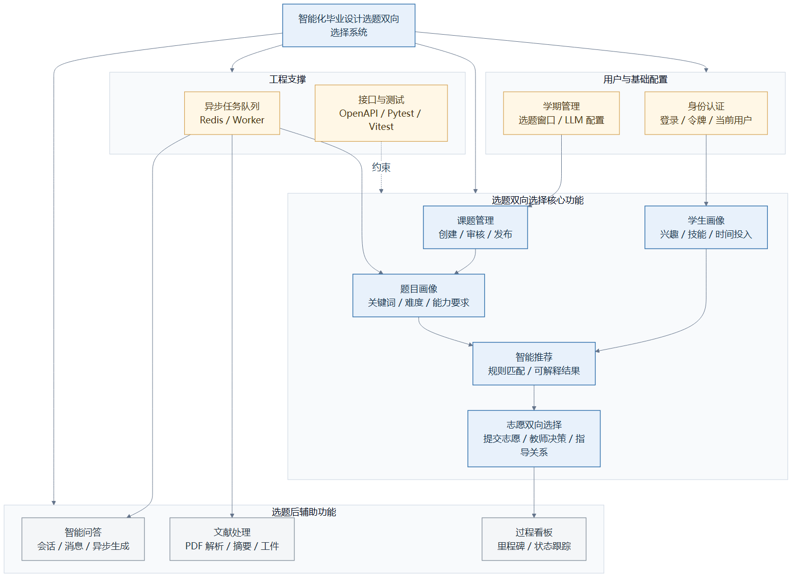

图3-1 系统功能模块结构图

功能性需求还体现在状态流转的完整性上。课题需要经历草稿、待审核、已发布、驳回或关闭等状态；学生志愿需要支持待处理、撤销、接受、拒绝和被替代等业务状态；异步任务需要支持等待、运行、完成和失败等状态。不同状态之间的转换必须由明确的业务动作触发，避免出现课题已满仍可接受、志愿被接受后其他志愿仍保持待处理等不一致情况。

从非功能需求看，系统主要需要满足响应性、可维护性、安全性、可扩展性和可追溯性要求。首先，课题列表、志愿提交和推荐结果查询属于高频交互，接口应尽量保持较短响应时间。对于大语言模型调用、PDF 解析和文献摘要等耗时任务，系统不宜在 HTTP 请求线程中同步等待，而应通过异步队列处理。其次，系统涉及多个业务域，若接口、业务规则、任务编排和外部适配混杂在同一层，会增加后续维护难度，因此需要采用清晰的分层架构。再次，学生、教师和管理员具有不同权限边界，系统应根据角色限制数据可见范围，防止越权访问。

此外，推荐结果应具有可解释性。毕业设计选题会影响学生后续较长时间的学习和开发过程，如果系统只给出排序分数，学生和教师难以判断推荐依据。因此，推荐模块需要返回关键词匹配、能力匹配、难度适配和容量状态等解释信息。系统还需要保留任务状态、错误信息和关键业务记录，便于测试、排错和过程追踪。

## 3.2 系统总体架构设计

系统采用前后端分离架构。前后端分离能够降低界面层与业务层之间的耦合，REST 架构则为资源化接口和统一交互方式提供了基础[14-15]。前端基于 React、TypeScript 和 Vite 构建，负责页面展示、表单交互、状态提示和接口调用；后端基于 Flask 构建 RESTful API，负责权限校验、业务规则、数据访问和任务受理；PostgreSQL 用于保存核心业务数据；Redis 用于承载异步任务队列；独立 Worker 负责消费队列并处理大语言模型调用、文档解析、课题画像和对账任务。系统总体架构如图3-2所示。

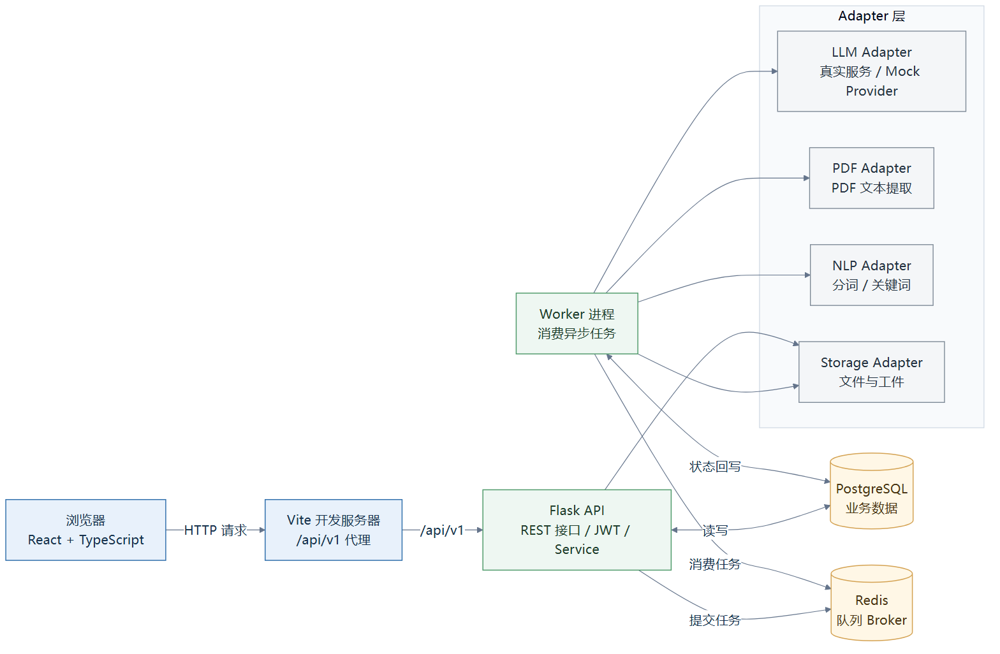

图3-2 系统总体架构图

在总体架构中，浏览器端只与后端 API 进行通信，不直接访问数据库、Redis 或外部模型服务。后端 API 进程承担“受理与查询”职责，例如创建课题、提交志愿、查询推荐结果、上传文档和查询任务状态。对于耗时任务，API 在完成参数校验、权限检查和数据库记录写入后，将任务载荷写入 Redis 队列，并立即返回任务标识或受理结果。Worker 进程从队列中取出任务，调用用例编排层完成具体处理，再将状态和结果回写数据库。

这种架构设计有两点考虑。第一，选题系统中的核心操作应保持稳定和可追踪，尤其是课题、志愿、指导关系等业务数据必须由后端统一处理。第二，AI 辅助能力具有外部服务依赖和处理耗时不确定性，适合通过队列与主业务请求隔离。通过 API 与 Worker 的分工，系统既能保证前端交互的及时反馈，也能为大模型调用、文档解析等任务提供独立扩展空间。

后端内部进一步采用分层结构，主要包括 API 层、Service 层、use_cases 编排层、task 队列与任务层、adapter 适配层和 model 持久化层。其结构如图3-3所示。

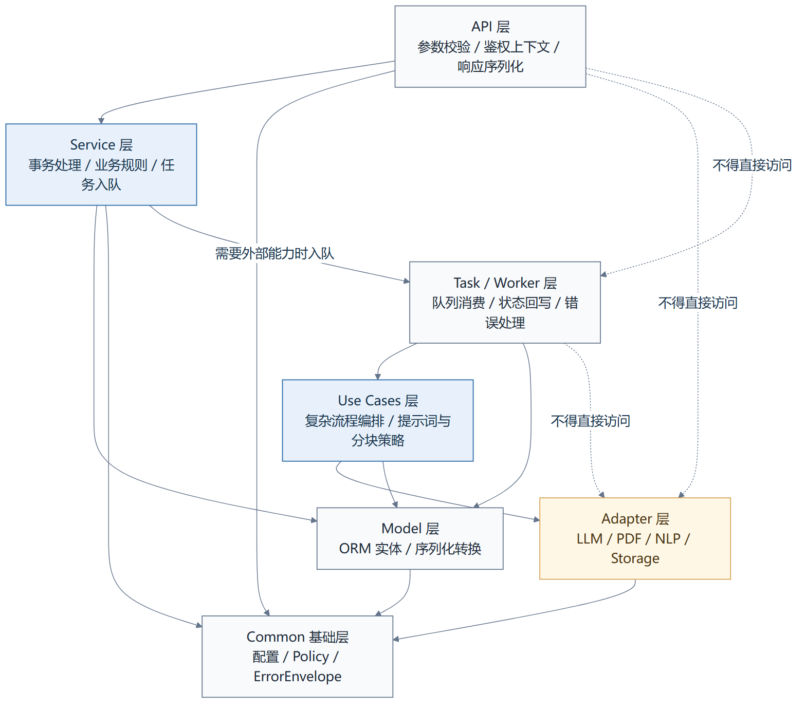

图3-3 后端分层架构图

其中，API 层负责解析 HTTP 请求、调用同域 Service 并返回统一响应；Service 层负责业务规则、事务控制、权限裁剪和入队决策；use_cases 层负责任务编排，例如对话上下文组织、文档处理流程和关键词生成流程；task 层负责队列入队、任务消费和状态回写；adapter 层负责封装外部能力，包括大语言模型、PDF 解析、NLP 分词和存储；model 层负责数据库实体和 ORM 映射。分层结构明确限制 API 层直接调用 adapter、task 或 ORM 业务写入，避免接口层承担过多职责。对于包含智能模块的系统而言，清晰的工程边界也有助于降低后续维护风险和技术债积累[32]。

## 3.3 系统功能模块设计与实现

系统功能模块围绕毕业设计选题全过程展开。各模块之间既相互独立，又通过课题、志愿、指导关系和任务状态形成连续的业务链路。

用户与学期管理模块负责系统基础数据。用户表中保存账号、角色、姓名、邮箱以及学生画像和教师画像等信息。学期模块保存选题周期、任务周期和大模型配置等数据，使课题、志愿、推荐和文档处理都能归属于具体学期。这样做可以避免不同届别或不同批次的选题数据混杂，也便于后续按学期统计和归档。

课题管理模块面向教师和管理员。教师可以创建课题，填写课题名称、简介、技术要求、关键词和容量，并将课题提交审核。管理员审核通过后，课题进入发布状态，学生才能查看和填报志愿。课题创建和更新时，系统会同步维护基础关键词，并在需要时触发课题画像生成任务。课题画像包括关键词、难度等级、能力要求、适合学生类型、风险提示和摘要等字段，为后续推荐计算提供输入。

志愿填报与教师决策模块用于形成最终指导关系。学生在选题开放窗口内可以提交第一志愿和第二志愿，系统根据学生、学期、课题和优先级设置唯一性约束，防止重复提交和优先级冲突。教师查看自己课题下的学生志愿后，可以执行接受或拒绝操作。接受志愿时，系统会在同一事务中更新志愿状态、写入指导关系、增加课题已选人数，并将该学生同学期其他待处理志愿置为被替代状态。该流程保证指导关系、志愿状态和课题容量之间保持一致。

任务看板模块用于衔接选题后的毕业设计过程。学生和教师可以围绕里程碑、任务节点和指导关系查看过程信息。虽然选题是本文系统的核心场景，但毕业设计并不止于选题，因此任务看板提供了从“选题结果”到“过程管理”的承接能力。

文档处理和对话辅助模块用于处理毕业设计过程中的资料阅读和问题咨询。学生上传 PDF 文献后，系统创建文档任务并交由 Worker 处理。对话辅助模块则通过会话和消息记录保存用户问题与系统回复，由异步任务生成回复结果。上述模块均通过统一异步状态向前端返回进度，避免长时间阻塞请求线程。

推荐服务模块面向学生提供课题推荐列表。系统根据学生画像、课题画像、课题状态和容量信息进行只读评分，不在推荐接口中直接调用大语言模型，也不写入课题画像。推荐结果包含课题标识、标题、得分以及可选解释信息，用于辅助学生理解“为什么推荐该课题”。

## 3.4 数据库设计与实现

系统数据库采用 PostgreSQL，并通过 SQLAlchemy 进行对象关系映射。数据库设计围绕用户、学期、课题、学生画像、课题画像、推荐计算结果、志愿申请、指导关系、文档任务和异步任务等核心对象展开。整体实体关系如图3-4所示。

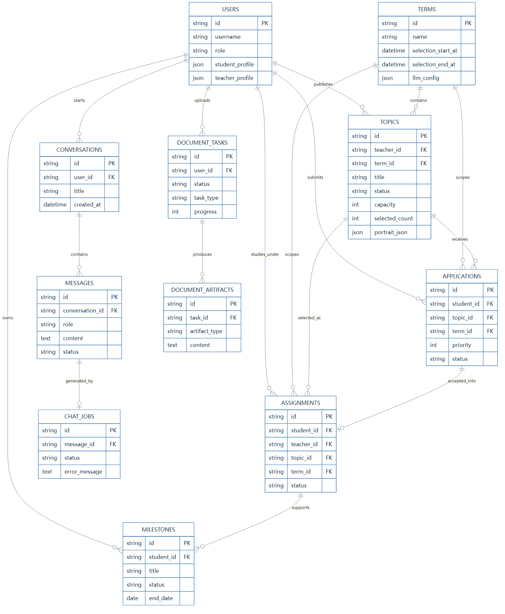

图3-4 数据库ER图

用户实体是系统权限和画像的基础。`users` 表保存用户标识、用户名、角色、显示名、邮箱、学生画像和教师画像等字段。其中，学生画像以 JSON 形式保存，主要包括技能标签、兴趣关键词、目标描述和每周投入时间等信息；教师画像可用于扩展教师研究方向和指导偏好。采用 JSON 字段保存画像数据，可以在保持关系型数据库事务能力的同时，为画像字段扩展保留灵活性。

课题实体由 `topics` 表表示，主要字段包括课题标题、简介、技术要求、技术关键词、容量、已选人数、教师标识、学期标识、状态和课题画像。课题画像保存在 `portrait_json` 字段中，并在接口返回时映射为契约中的 `portrait` 结构。画像字段包括关键词、难度等级、难度原因、所需能力、适合学生、风险提示和生成时间。该设计避免额外维护独立画像表，也便于推荐服务在查询课题时一次性读取画像数据。

志愿和指导关系分别由 `applications` 与 `assignments` 表表示。`applications` 表保存学生、课题、学期、优先级和志愿状态，并通过唯一约束限制同一学生在同一学期对同一课题重复提交，以及同一学生同一学期同一优先级重复占用。`assignments` 表是指导关系的真源，保存学生、教师、课题、学期、关联志愿和确认时间。教师接受志愿后，系统以 `assignments` 作为后续过程管理和任务看板的依据。

对话和异步任务相关数据包括 `conversations`、`messages`、`chat_jobs`、`document_tasks` 等表。对话表保存会话元数据，消息表保存用户消息和助手占位消息，聊天任务表保存生成任务的状态、重试次数、错误信息和模型调用元数据。文档任务表保存文件名、存储路径、任务类型、语言、当前阶段、进度、结果、错误原因和重试信息。通过这些表，系统可以把 AI 辅助过程从一次性请求转化为可查询、可追踪的任务记录。

推荐结果在当前实现中不作为独立历史表持久化，而是由推荐服务根据 `users.student_profile`、`topics.tech_keywords`、`topics.portrait_json`、课题状态和容量信息实时计算得到。这样设计可以避免推荐结果与画像数据、课题状态之间产生滞后不一致；若后续需要进行推荐效果评估或用户行为分析，可在现有接口结果基础上扩展推荐日志表。

主要数据表说明如表3-2所示。

表3-2 核心数据表说明表

| 数据表或实体 | 主要内容 | 设计作用 |
| --- | --- | --- |
| `users` | 用户身份、角色、邮箱、学生画像、教师画像 | 支撑登录、权限控制和推荐画像输入 |
| `terms` | 学期、选题时间窗口、配置项 | 划分不同选题批次，约束志愿填报范围 |
| `topics` | 课题信息、容量、状态、技术关键词、课题画像 | 保存课题主数据，并为推荐计算提供画像 |
| `applications` | 学生志愿、优先级、业务状态 | 支撑志愿填报、撤销、教师决策 |
| `assignments` | 学生、教师、课题之间的指导关系 | 作为选题结果和后续任务管理的真源 |
| `conversations` / `messages` | 对话会话与消息记录 | 支撑对话辅助和异步回复状态展示 |
| `chat_jobs` | 对话生成任务状态和运行元数据 | 记录聊天异步任务执行过程 |
| `document_tasks` | 文档上传、解析、摘要和结果状态 | 支撑 PDF 文献处理与结果查询 |
| `reconcile_dispatch_failures` | 对账任务入队失败记录 | 记录指导关系对账任务的补偿线索 |
| 推荐结果逻辑对象 | 推荐课题、匹配得分、解释因素、容量状态 | 由推荐接口实时计算，不单独作为业务真源表保存 |

数据库设计还强调状态枚举之间的区分。异步任务状态统一采用 `pending`、`running`、`done` 和 `failed`；志愿状态则采用 `pending`、`withdrawn`、`accepted`、`rejected` 和 `superseded`。二者虽然都可能出现 `pending`，但语义不同：前者表示任务执行状态，后者表示业务审批状态。将两类状态分开，有助于前后端在测试和页面展示中避免混淆。

## 3.5 后端接口与业务逻辑实现

后端接口以 `spec/contract.yaml` 为契约依据，统一挂载在 `/api/v1` 路径下。接口按业务域划分为 identity、terms、taskboard、chat、document、topic、selection 和 recommendations 等部分。本文不逐项罗列所有接口，而是从业务职责角度概括核心接口设计，如表3-3所示。

从实现角度看，后端接口不是对数据库表的简单增删改查，而是围绕毕业设计选题流程组织业务动作。课题发布链路用于确定候选课题来源，推荐查询链路用于生成可解释候选课题，志愿填报与教师决策链路用于确认指导关系，文档和对话链路则用于受理耗时的大语言模型辅助任务。因此，本节在说明接口域划分的同时，重点分析这些链路如何通过 Service、事务和队列实现。

表3-3 核心 API 接口职责表

| 接口域 | 代表性资源 | 主要职责 |
| --- | --- | --- |
| identity | `/auth/login`、`/users/me` | 完成登录、刷新、登出和当前用户信息维护 |
| terms | `/terms`、`/terms/{term_id}/llm-config` | 管理学期信息和学期级模型配置 |
| taskboard | `/milestones` | 管理毕业设计过程任务和里程碑 |
| topic | `/topics`、`/topics/{topic_id}/review` | 完成课题创建、修改、审核和发布 |
| selection | `/applications`、`/assignments` | 完成志愿提交、撤销、教师决策和指导关系查询 |
| recommendations | `/recommendations/topics` | 为学生返回只读 Top-N 课题推荐结果 |
| chat | `/conversations`、`/chat/jobs/{job_id}` | 管理对话、消息和聊天异步任务状态 |
| document | `/document-tasks` | 创建文档处理任务并查询处理结果 |

后端接口实现遵循接口层与业务层分离的原则。API 层主要承担请求解析、参数传递和响应封装职责，Service 层则负责权限判断、事务提交、状态变更、入队决策和错误映射。这样可以减少接口层中的业务分支，使同一业务逻辑能够被接口、测试和任务编排复用。

在课题管理链路中，教师创建课题时，TopicService 会校验标题、简介、技术要求、容量和学期等字段，随后构造课题记录并同步生成基础画像。基础画像主要来自教师填写的技术关键词和课题文本中的分词结果，用于保证课题创建后能够立即参与基本匹配。若课题文本发生变化，系统会在完成业务数据提交后触发 `keyword_jobs` 队列，交由 Worker 补充更完整的课题画像。课题状态从草稿到待审核，再到发布或驳回，由教师提交和管理员审核操作驱动。只有处于发布状态的课题才进入学生可见范围和推荐候选集，这一限制保证了推荐结果不会包含未审核或已关闭课题。

在推荐查询链路中，`/recommendations/topics` 接口只面向学生角色开放。RecommendService 首先读取当前学生的 `student_profile`，再读取指定学期内已发布的课题，并从 `topics.tech_keywords` 与 `topics.portrait_json` 中取得课题侧关键词和能力要求。推荐计算发生在读路径中，系统只进行候选过滤、相似度计算和排序，不修改课题、画像或志愿数据。这样处理可以使推荐接口保持轻量和稳定，也能避免推荐查询对业务数据产生副作用。若前端请求解释信息，后端会在结果中补充匹配技能、匹配关键词、难度适配、容量状态和警告信息，使推荐结果能够服务于学生选题判断。

在志愿处理链路中，SelectionService 是核心业务入口。学生提交志愿时，系统校验用户角色、课题状态、学期一致性、选题窗口和优先级合法性，并通过数据库约束保证同一学生同一学期志愿不重复。该阶段的关键在于把“学生意愿”记录为可追踪的业务状态，而不是直接形成指导关系。教师决策时，系统根据课题归属判断教师是否有权处理该志愿，并根据课题容量判断是否仍可接受。若教师拒绝志愿，系统仅更新该志愿状态；若教师接受志愿，系统在同一事务中写入 `assignments`、更新 `applications` 状态、更新 `topics.selected_count`，并将该学生同学期其他待处理志愿置为 `superseded`。主事务提交后，系统再入队 `reconcile_jobs`，用于后续对 `assignments` 和课题已选人数进行对账。主事务和对账任务分离，可以保证教师接受操作的核心结果先落库，同时为队列异常提供补偿空间。

在异步任务受理链路中，Chat 和 Document 接口采用“先落库、后入队、再查询”的方式。以对话消息为例，系统先保存用户消息和助手占位消息，再创建 `chat_jobs` 任务并写入队列，接口返回任务标识和消息记录。文档处理接口同样先创建 `document_tasks` 记录，再将 PDF 解析任务写入 `pdf_parse` 队列。API 层不直接等待大模型或 PDF 解析结果，而是由前端根据任务标识查询后续状态。该链路与课题和志愿链路不同，其核心不是立即完成业务结果，而是可靠地创建一个可追踪任务。

志愿填报与教师决策流程如图3-5所示。

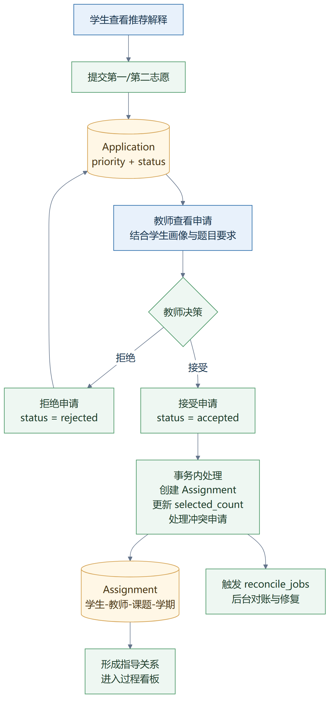

图3-5 志愿填报与教师决策流程图

错误处理方面，系统使用统一错误响应结构，错误码包括 `VALIDATION_ERROR`、`ROLE_FORBIDDEN`、`RESOURCE_CONFLICT`、`CAPACITY_EXCEEDED`、`QUEUE_UNAVAILABLE` 等。对于策略拒绝或队列不可用等情况，接口返回明确的错误码和错误信息，便于前端展示和测试断言。异步任务受理接口通常在任务创建和入队后返回 `202`，由前端通过任务详情接口继续查询执行状态。

## 3.6 前端页面与交互实现

前端采用 React、TypeScript 和 Vite 实现。React 负责组件化页面组织，TypeScript 用于约束接口数据结构和页面状态，Vite 用于开发调试和生产构建。前端页面围绕不同角色的核心工作流组织，包括登录页、仪表盘、课题页面、任务看板页面、文档处理页面以及推荐结果展示区域。系统主要页面效果如图3-6所示。

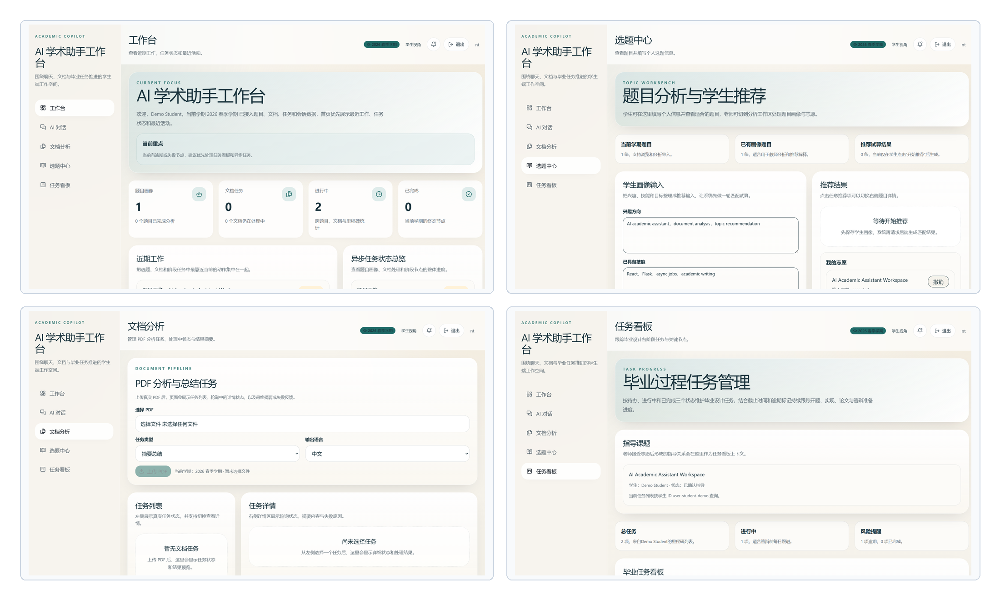

图3-6 前端核心页面截图

登录页面负责提交用户凭据并保存认证状态。登录成功后，前端根据当前用户角色展示不同导航入口。学生更关注课题浏览、推荐结果、志愿状态和文档任务；教师更关注课题管理、学生志愿、指导关系和任务看板；管理员则更关注学期和审核管理。通过角色化入口设计，系统能够减少用户在无关页面之间切换的成本。

课题页面用于展示课题列表、课题详情、关键词、容量和状态。学生侧可以查看已发布课题，并结合推荐结果进行志愿提交；教师侧可以创建或编辑课题，并提交审核。课题表单需要对标题、简介、技术要求、容量和学期等字段进行校验，避免无效数据进入后端。对于涉及异步画像生成的操作，前端根据接口返回的任务状态展示处理中、已完成或失败提示。

任务看板页面用于呈现毕业设计过程中的任务和里程碑。该页面承接选题完成后的指导关系，使学生和教师能够围绕同一任务记录开展过程管理。文档处理页面用于上传 PDF 文件、查看处理状态和阅读摘要结果。由于文档处理属于异步任务，前端不会假设上传后立即得到结果，而是通过任务列表或任务详情轮询状态，展示 `pending`、`running`、`done` 和 `failed` 等状态。

前端交互设计还重点处理异常和反馈。对于表单校验错误，前端在提交前尽量给出字段级提示；对于后端返回的统一错误结构，前端根据错误码显示对应提示；对于异步任务，前端通过加载状态和结果状态区分“已受理但未完成”和“执行失败”两类情况。这样的交互方式能够让用户理解系统当前正在处理什么，避免把耗时任务误认为系统无响应。

## 3.7 智能推荐模块设计与实现

智能推荐模块的目标是根据学生画像与课题画像，为学生返回可解释的课题推荐列表。与通用推荐系统不同，毕业设计选题推荐既要考虑兴趣和技能匹配，也要考虑课题状态、教师容量、难度适配和业务流程约束。因此，本文系统采用基于画像和规则约束的 Top-N 推荐方式，而不是依赖大规模历史数据训练模型。

课题画像是推荐计算的重要输入。教师创建或更新课题时，系统从课题标题、简介、技术要求和教师填写的技术关键词中提取基础关键词，并将结果写入 `topics.portrait_json`。对于需要更复杂分析的内容，系统通过 `keyword_jobs` 异步任务生成或补充画像字段，例如难度等级、能力要求、适合学生类型、风险提示和摘要。课题画像生成流程如图3-7所示。

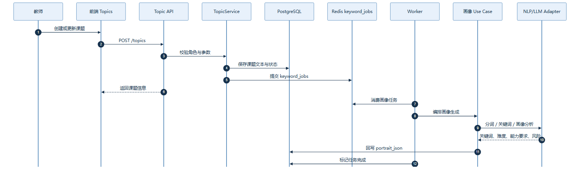

图3-7 课题画像生成流程图

课题画像生成采用同步与异步结合的方式。同步部分主要完成基础关键词处理，保证课题创建后立即具备可用于推荐的基础信息；异步部分用于处理耗时或不稳定的 AI 辅助分析，避免课题保存接口长时间等待外部模型结果。画像生成结果落库后，推荐服务只读取已有画像，不在推荐请求中重新调用大模型。

学生画像保存在用户实体的 `student_profile` 字段中，主要包括技能标签、兴趣关键词、目标描述和投入时间等信息。推荐服务会从学生画像中提取 `skills`、`keywords`、`interests` 和 `goal` 等词项，并与课题侧的技术关键词和画像关键词进行集合匹配。对于课题画像中的能力要求，系统还根据学生画像中的关键词判断能力是否匹配。

推荐模块以关键词匹配、技能匹配、难度匹配、容量约束和状态约束作为主要因素。其中，关键词匹配反映学生兴趣与课题方向的重合程度，技能匹配反映学生已有能力与课题要求之间的对应关系，难度匹配用于判断课题难度与学生投入时间或能力基础是否协调。容量约束和状态约束则体现业务规则，即课题需要仍有可选名额，且只有已发布课题才能进入推荐候选集。这些因素共同构成推荐得分和解释信息。

推荐计算与解释生成由 `GET /recommendations/topics` 接口完成，参数包括 `term_id`、`top_n` 和 `explain`。后端首先校验当前用户是否为学生，然后读取该学期已发布课题作为候选集。对于每个候选课题，系统合并课题手工关键词与画像关键词，计算学生画像词项集合与课题词项集合之间的 Jaccard 相似度，并按照得分进行排序。该相似度计算承接第2章公式2-1，综合排序思想与公式2-2保持一致，同时保留可解释推荐所强调的推荐依据说明[13]。推荐计算流程如图3-8所示。

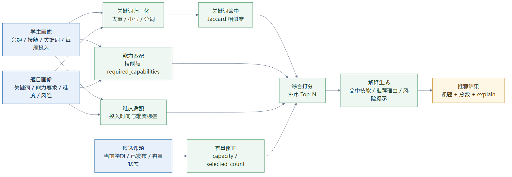

图3-8 智能推荐计算流程图

当 `explain=true` 时，系统会在推荐结果中返回解释字段，包括匹配技能、匹配关键词、匹配能力、难度适配、容量状态、警告信息和推荐原因。例如，当学生画像中包含 React、Flask、数据库等词项，而某一课题画像中也包含相关关键词时，系统会将这些共同词项作为推荐解释的一部分；若课题容量已满或学生画像与课题关键词重合较少，系统也会在警告信息中体现。这样，推荐结果不仅可以排序，还可以帮助学生理解自身条件与课题要求之间的关系。

在工程边界上，推荐服务是同步只读服务。它读取学生画像、课题关键词和课题画像进行计算，不调用 LLM，也不改写课题画像。该设计使推荐接口具备较好的响应稳定性，同时避免推荐结果受外部模型实时输出波动影响。对于画像质量提升，系统通过课题创建、课题更新和 `keyword_jobs` 队列在写路径上完成，而不是在推荐读路径上完成。

## 3.8 异步任务与文档处理实现

系统中的对话生成、文档处理、课题画像补充和指导关系对账都属于异步任务。为统一这些任务的处理方式，系统采用 Redis 队列与 Worker 进程。系统接口契约中定义了统一的异步任务队列，包括 `chat_jobs`、`pdf_parse`、`document_jobs`、`keyword_jobs` 和 `reconcile_jobs`。各队列职责如表3-4所示。

表3-4 异步队列任务说明表

| 队列名称 | 任务来源 | 主要职责 |
| --- | --- | --- |
| `chat_jobs` | 用户发送对话消息 | 调用对话编排逻辑生成助手回复，并回写消息状态 |
| `pdf_parse` | 文档上传任务 | 解析 PDF，提取文本或页面内容 |
| `document_jobs` | 文档解析完成后的处理任务 | 对文档内容进行摘要、结论提取或对比处理 |
| `keyword_jobs` | 课题创建或更新 | 补充课题画像关键词、能力要求和难度等信息 |
| `reconcile_jobs` | 教师接受志愿后 | 对指导关系与课题已选人数进行一致性对账 |

异步任务统一采用 `pending`、`running`、`done` 和 `failed` 状态。任务创建后处于 `pending`；Worker 成功领取任务后进入 `running`；任务处理成功并写回结果后进入 `done`；当任务执行异常、队列不可用或超时补偿发生时进入 `failed`，并记录错误码和错误信息。任务状态流转如图3-9所示。

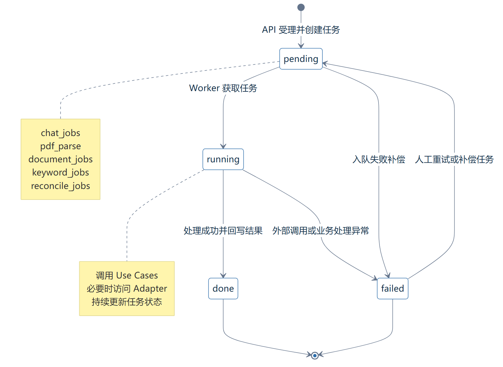

图3-9 异步任务状态流转图

在文档处理模块中，用户上传 PDF 文件后，DocumentService 校验文件、学期和任务类型，保存文件引用并创建 `document_tasks` 记录。随后系统将 PDF 解析任务写入 `pdf_parse` 队列，并向前端返回文档任务标识。Worker 消费 `pdf_parse` 后提取文本内容，并在需要时继续入队 `document_jobs`，由后续任务完成摘要、结论提取或对比分析。处理结果包括摘要、要点列表、原始模型信息、结果存储位置和错误信息等字段。文献处理异步流程如图3-10所示。

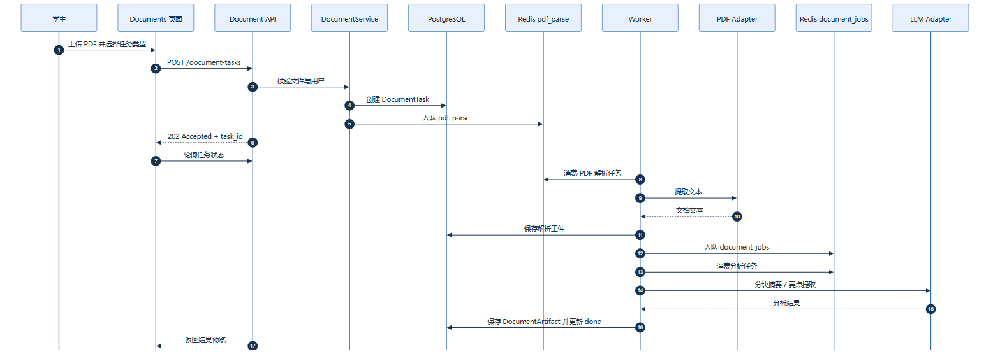

图3-10 文献处理异步流程图

该设计将文件上传、PDF 解析和内容生成拆分为多个阶段。一方面，上传接口只负责受理任务，避免用户长时间等待；另一方面，任务状态可在前端持续展示，用户能够看到文档处于等待、运行、完成或失败状态。对于失败任务，系统保留错误码、错误信息、重试次数和下一次重试时间等字段，为后续排查和优化提供依据。

对话辅助模块采用类似思路。用户发送消息后，系统先写入用户消息和助手占位消息，并创建 `chat_jobs` 任务，然后返回 `202` 和任务标识。Worker 处理任务时，通过 use_cases 层组织上下文，再调用 adapter 层完成模型访问，并将生成结果写回助手消息。这样可以保证 API 请求线程不直接等待大模型生成结果，也能让前端通过消息状态或任务查询展示生成进度。面向后续更复杂的任务编排，思维链提示和推理-行动结合方法为对话式任务拆解与工具调用提供了可参考的思路[50-51]。对于文献材料处理和后续问答扩展，检索增强生成和文本摘要相关研究可为系统继续增强文档理解能力提供参考[31,52]。

## 3.9 本章小结

本章围绕毕业设计选题支持系统的设计与实现进行了说明。首先，从学生、教师和管理员三类角色出发，分析了选题主流程、过程管理、文档处理和推荐服务等功能需求，并提出响应性、可维护性、安全性和可解释性等非功能要求。其次，系统采用前后端分离、RESTful API、PostgreSQL、Redis 队列和 Worker 的总体架构，并在后端内部划分 API、Service、use_cases、task、adapter 和 model 等层次，以降低业务逻辑与外部能力之间的耦合。

在数据设计方面，系统围绕用户、学期、课题、学生画像、课题画像、志愿、指导关系、对话消息和文档任务等核心实体组织数据库结构。后端接口以 OpenAPI 契约为基础，重点实现课题审核、志愿决策、推荐查询、文档任务和对话任务等业务。前端则围绕不同角色的工作流组织页面，并通过状态提示和异常处理改善用户交互体验。智能推荐模块采用基于画像和规则约束的只读 Top-N 计算方式，既保留推荐得分，也输出解释因素。异步任务模块通过 Redis 队列和 Worker 处理聊天、文档、画像和对账任务，保证耗时任务不阻塞 API 请求。

通过上述设计，系统覆盖了从课题发布、画像生成、推荐排序、学生志愿、教师决策到指导关系建立的主要流程，也为后续第4章的功能验证、性能分析和系统优化提供了实现基础。

# 第4章 性能分析与优化

第3章完成了系统需求、架构、功能模块、数据库、前后端实现、智能推荐和异步任务机制的设计与实现说明。本章在此基础上，对系统进行功能测试、接口运行验证、前端测试与构建验证，并结合系统架构特点分析接口响应、推荐计算、异步任务、文档处理和前端构建等方面的性能表现。相关截图和日志用于佐证测试与联调结果。

## 4.1 测试环境与测试方法

系统测试主要在本地容器化联调环境和前端开发环境中完成。后端部分通过 Docker Compose 启动 PostgreSQL、Redis、Flask Web 服务和 Worker，并在容器中执行 pytest 测试；前端部分通过 npm 命令执行 Vitest 测试、TypeScript 编译和 Vite 生产构建；系统联调部分通过健康检查和服务状态验证前后端与基础组件是否能够协同运行。测试环境配置如表4-1所示。

表4-1 测试环境配置表

| 测试对象 | 环境或工具 | 配置与说明 |
| --- | --- | --- |
| 后端运行环境 | Docker Compose、Python 3.11.15 | 在容器中运行 Flask Web 服务和 Worker |
| 后端测试框架 | pytest 9.0.3 | 执行架构约束、应用工厂、Policy、Worker 和关键词处理测试 |
| 数据库 | PostgreSQL 16-alpine | 保存用户、课题、志愿、指导关系和异步任务等数据 |
| 队列服务 | Redis 7-alpine | 承载 `chat_jobs`、`pdf_parse`、`document_jobs`、`keyword_jobs` 和 `reconcile_jobs` 等队列 |
| 前端运行环境 | Node.js、npm、Vite 7.3.2 | 执行前端测试与生产构建 |
| 前端测试框架 | Vitest 3.2.4 | 验证页面、路由、工具函数和业务状态处理 |
| 后端访问方式 | 本地 API 服务 | 用于接口联调、健康检查和后端运行验证 |
| 前端访问方式 | 本地 Web 页面 | 用于系统页面联调、交互验证和截图 |

测试方法包括三类。第一类是自动化功能测试，主要验证后端模块、架构约束、异步队列、Policy 策略、Worker 运行和前端页面逻辑。第二类是运行与构建验证，主要检查前端生产构建是否成功、后端服务是否健康、Docker Compose 中各服务是否处于运行状态。第三类是性能与机制分析，结合测试结果和系统设计，对接口响应、推荐计算、异步任务处理和文档处理流程进行分析。

## 4.2 功能测试与结果分析

功能测试用于验证系统核心模块是否能够按照设计目标运行。测试内容覆盖后端架构约束、队列与 Worker、应用工厂、Policy 策略、课题关键词处理、前端页面逻辑、任务看板、课题页面、文档页面、登录页面和路由保护等内容。系统功能测试概况如表4-2所示。

表4-2 功能测试用例与结果分析表

| 测试模块 | 测试内容 | 预期结果 | 实际结果 |
| --- | --- | --- | --- |
| 应用工厂与基础配置 | 验证 Flask 应用创建、扩展初始化和健康检查 | 应用能够正常创建并对外提供服务 | 通过，容器环境中服务可启动 |
| 架构约束 | 验证 API、Service、use_cases、task、adapter 的依赖边界 | API 不直接调用 adapter、task 不跳过 use_cases | 通过，专项测试覆盖架构规则 |
| 队列与 Worker | 验证任务入队、队列键、Worker 消费顺序和任务分发 | 队列名称与契约一致，Worker 可消费任务 | 通过，相关测试全部通过 |
| Policy 策略 | 验证入队前策略检查和拒绝行为 | Policy 拒绝时不执行入队副作用 | 通过，策略测试通过 |
| 课题关键词 | 验证课题关键词与画像基础数据处理 | 课题创建或更新后可生成基础画像信息 | 通过，关键词相关测试通过 |
| 前端页面逻辑 | 验证登录、仪表盘、课题、任务看板、文档和对话页面 | 页面状态、表单行为和数据展示符合预期 | 通过，Vitest 测试通过 |
| 前端构建 | 验证 TypeScript 编译和 Vite 生产构建 | 构建成功并生成生产产物 | 通过，构建成功 |
| 系统联调 | 验证 PostgreSQL、Redis、Web、Worker 共同运行 | 基础服务运行正常，健康检查通过 | 通过，联调环境健康 |

后端专项测试在容器环境中执行，测试范围覆盖队列与 Worker、架构约束、应用工厂、Policy 策略、Worker 运行时和课题关键词处理等内容。测试结果显示共收集 82 个测试项，全部通过，用时 7.40s，结果如图4-1所示。

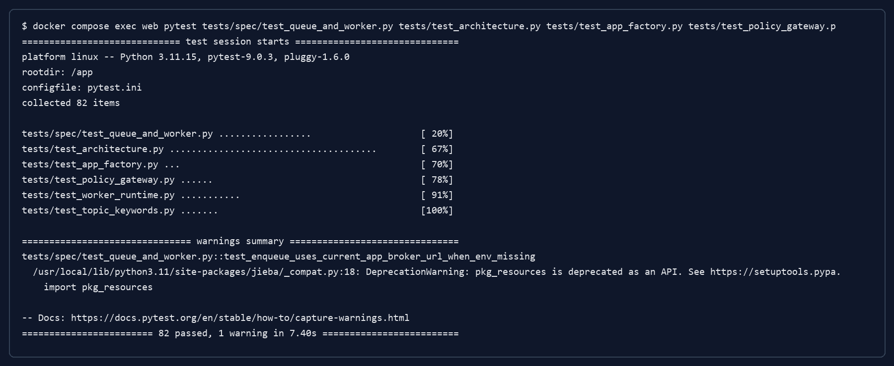

图4-1 后端测试运行结果截图

后端测试结果说明，系统的核心工程约束得到验证。特别是队列与 Worker、架构分层、Policy 门面和课题关键词处理均通过自动化测试，表明第3章中设计的分层结构和异步机制并非只停留在设计文档中，而是通过测试用例进行了约束和验证。对于包含智能模块的软件系统，工程边界、测试覆盖和运行监测有助于降低后续维护风险[32]。

系统联调环境通过 Docker Compose 启动，服务状态包括 PostgreSQL、Redis、Web 服务和 Worker。运行日志显示数据库、队列服务、后端 Web 服务与 Worker 均处于可用状态，后端健康检查能够正常返回结果，前端页面也能够访问并完成联调操作。联调运行结果如图4-2所示。

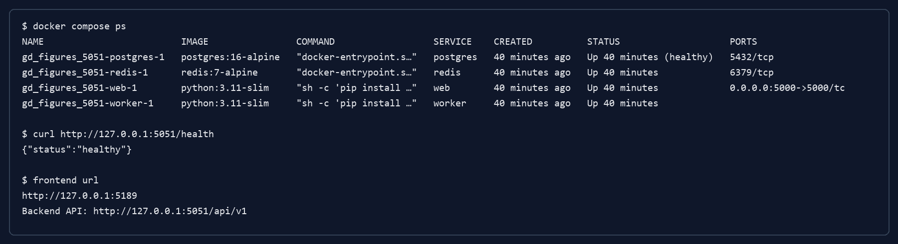

图4-2 系统联调运行截图

## 4.3 接口测试与运行结果

接口测试重点验证后端 API 的契约一致性和运行方式。系统接口以 `spec/contract.yaml` 为依据，统一使用 `/api/v1` 作为基础路径，覆盖登录、用户信息、学期、任务看板、对话、文档、课题、志愿、指导关系和推荐等资源。REST 架构强调资源标识、统一接口和客户端服务端分离，这为接口测试按照资源域组织提供了理论依据[15]。接口测试不追求罗列所有路径，而是围绕核心运行机制验证以下几类行为。

第一，普通业务接口应能按照角色和资源边界运行。课题接口需要支持课题创建、更新、提交审核和管理员审核；志愿接口需要支持学生提交志愿、撤销志愿、修改优先级以及教师接受或拒绝志愿；推荐接口需要面向学生返回指定学期的 Top-N 课题推荐结果。第二，异步接口应返回受理结果，而不是在请求线程内等待大模型或文档处理完成。对话消息发送和文档上传均属于这一类，契约中规定其受理响应为 202。第三，异常情况需要返回统一错误结构，便于前端按照错误码进行处理。

后端测试结果汇总如表4-3所示。

表4-3 后端测试结果汇总表

| 测试范围 | 测试文件或内容 | 测试项数量 | 结果 | 耗时 |
| --- | --- | --- | --- | --- |
| 队列与 Worker | `tests/spec/test_queue_and_worker.py` | 17 | 通过 | 计入总耗时 |
| 架构约束 | `tests/test_architecture.py` | 38 | 通过 | 计入总耗时 |
| 应用工厂 | `tests/test_app_factory.py` | 3 | 通过 | 计入总耗时 |
| Policy 策略 | `tests/test_policy_gateway.py` | 6 | 通过 | 计入总耗时 |
| Worker 运行时 | `tests/test_worker_runtime.py` | 11 | 通过 | 计入总耗时 |
| 课题关键词 | `tests/test_topic_keywords.py` | 7 | 通过 | 计入总耗时 |
| 合计 | 后端专项测试 | 82 | 全部通过，存在 1 条非阻断提示 | 7.40s |

从接口运行机制看，系统采用“API 受理 + Worker 处理”的方式降低耗时任务对接口响应的影响。以 Chat 和 Document 为例，接口只负责校验、写入任务记录和入队，随后由 Worker 完成模型调用或文档处理。与同步等待方式相比，这一机制的差异如表4-4所示。

表4-4 异步处理与同步阻塞方式对比表

| 对比维度 | 同步阻塞方式 | 本文系统异步方式 |
| --- | --- | --- |
| 接口响应 | API 等待模型或文档处理完成后返回 | API 完成受理和入队后返回任务标识 |
| 用户反馈 | 用户长时间等待，难以区分处理中和失败 | 前端可展示 `pending`、`running`、`done`、`failed` 状态 |
| 外部依赖影响 | 模型服务延迟直接影响 HTTP 请求 | 外部服务延迟主要影响 Worker 任务完成时间 |
| 错误处理 | 错误集中暴露在请求响应中 | 错误可记录到任务状态和错误字段中 |
| 扩展方式 | 增加 API 进程也可能被耗时任务占满 | 可按任务量扩展 Worker 或队列处理能力 |
| 可测试性 | 难以隔离 API 与模型调用 | 可分别测试 API 受理、队列入队和 Worker 消费 |

该对比表明，异步机制更适合本文系统中的大语言模型调用、PDF 解析、文档摘要和课题画像补充等任务。接口层保持受理和查询职责，可以降低请求线程被外部模型服务阻塞的风险；Worker 层则承担耗时处理和状态回写任务，使系统在工程结构上更清晰。

## 4.4 前端构建与页面测试

前端测试使用 Vitest 执行，覆盖页面工具函数、业务类型、路由保护、仪表盘、登录页、课题页、任务看板、文档页、对话页和布局组件等内容。测试日志显示，共 23 个测试文件、61 个测试项通过。随后执行生产构建，系统通过 TypeScript 编译和 Vite 构建流程，生产产物能够正常生成。前端测试与构建结果如图4-3所示。

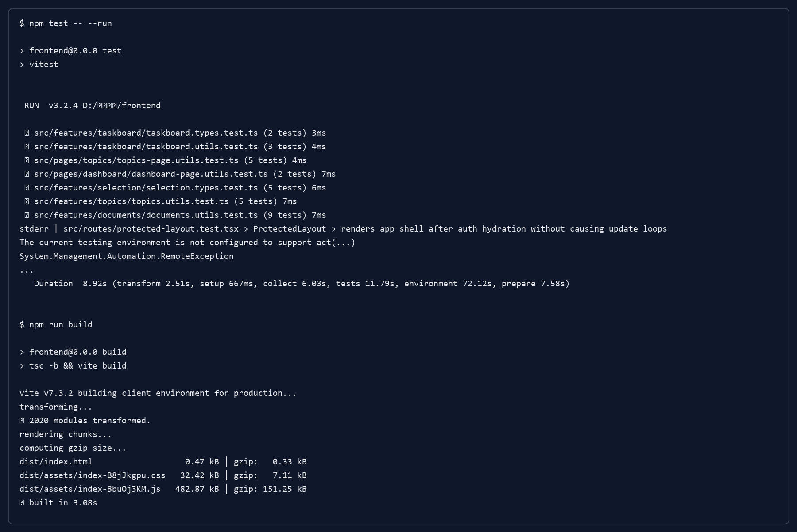

图4-3 前端测试与构建结果截图

前端测试与构建结果汇总如表4-5所示。

表4-5 前端测试与构建结果汇总表

| 项目 | 结果 |
| --- | --- |
| 测试命令 | `npm test -- --run` |
| 测试框架 | Vitest 3.2.4 |
| 测试文件数 | 23 个 |
| 测试用例数 | 61 个 |
| 测试结果 | 全部通过 |
| 测试耗时 | 8.92s |
| 构建命令 | `npm run build` |
| 构建工具 | TypeScript + Vite 7.3.2 |
| 转换模块数 | 2020 个 |
| CSS 产物 | 32.42 kB，压缩后约 7.11 kB |
| JS 产物 | 482.87 kB，压缩后约 151.25 kB |
| 构建耗时 | 约 3 秒 |
| 构建结果 | 成功 |

测试结果说明前端页面的核心逻辑具备基本可靠性。登录页测试验证了演示账号填充行为，仪表盘测试验证了工作区概览，课题页测试验证了教师工作区和课题相关逻辑，任务看板测试验证了里程碑创建，文档页测试验证了任务列表变化时的选中状态保持，对话页测试验证了缺省会话创建行为。这些测试覆盖了系统主要页面的交互入口。

前端 lint 日志中出现了 React Hook 相关规则提示，主要涉及状态派生方式和依赖项稳定性。相关提示可作为后续前端渲染优化的依据，后续可通过调整状态组织方式和减少不必要的重复渲染来改善复杂页面的数据刷新表现。

## 4.5 性能分析

系统性能分析围绕接口响应、推荐计算、异步任务、前端构建和文档处理五个方面展开。由于本文系统主要为本科毕业设计选题支持场景，系统规模以学院或专业范围内的课题和学生为主，因此本节属于基于测试结果与运行机制的性能分析，重点在验证系统结构是否能够支撑稳定响应、可维护扩展和耗时任务隔离。

在接口响应方面，普通查询接口和业务提交接口主要执行参数校验、权限判断、数据库读写和 JSON 序列化。课题列表、志愿提交、指导关系查询和推荐查询等接口均不应直接执行耗时模型调用。对于 Chat 和 Document 这类与 AI 或文档处理相关的接口，系统采用 202 受理机制，将耗时操作交由 Worker 完成。因此，接口响应时间主要受数据库操作和入队操作影响，而不直接受大语言模型生成时间影响。

在推荐计算方面，推荐服务采用同步只读计算。系统读取学生画像、课题关键词和课题画像后，基于集合相似度和解释因素生成 Top-N 排序。该过程不调用 LLM，也不写入数据库，因此相较于在线生成式推荐具有更稳定的响应特征。在当前选题场景下，课题数量通常有限，采用内存评分和排序即可满足本科毕业设计选题支持需求。后续若课题规模增大，可结合矩阵分解、神经协同过滤或语义相似度等推荐优化思路扩展排序模型[33-34,44]。

在异步任务方面，系统将聊天回复、PDF 解析、文档摘要、课题画像补充和指导关系对账纳入 Redis 队列。该设计的性能价值在于将“请求受理”和“任务执行”拆开，使 API 线程不被外部模型服务或文档处理过程占用。Worker 可以按队列逐步消费任务，并将状态回写为 `pending`、`running`、`done` 或 `failed`。从运行结果看，系统联调环境中 Web 与 Worker 同时启动，Redis 可作为队列中间件支撑任务流转。

在文档处理方面，系统采用“上传任务、PDF 解析、文档处理、结果回写”的分阶段方式。PDF 文档解析和摘要生成通常比普通接口查询耗时更长，若同步处理会影响用户等待体验。通过异步文档任务，用户上传后即可获得任务记录，前端可以持续展示处理状态。该机制更适合毕业设计文献阅读辅助场景，也便于后续加入文档分块、摘要缓存和失败重试等优化策略。

在前端构建方面，生产构建能够完成模块转换并生成 JS、CSS 等静态资源，产物体积处于当前系统规模下的可接受范围，页面逻辑能够通过生产构建验证。后续可结合路由级代码拆分、依赖分析和组件渲染优化进一步改善首屏加载和运行体验。

推荐解释性分析如表4-6所示。可解释推荐和可解释人工智能研究均强调，系统应向用户提供结果依据，以提高用户对模型输出的理解和判断能力[13,53-54]。

表4-6 推荐解释性分析表

| 解释因素 | 数据来源 | 解释作用 |
| --- | --- | --- |
| 关键词匹配 | 学生画像关键词、课题技术关键词、课题画像关键词 | 说明学生兴趣与课题方向是否重合 |
| 技能匹配 | 学生技能标签、课题能力要求 | 说明学生已有能力是否支撑课题实施 |
| 难度适配 | 课题画像难度、学生投入时间或能力基础 | 提示课题难度与学生准备程度是否协调 |
| 容量状态 | 课题容量、已选人数 | 提示课题是否仍有可选名额 |
| 课题状态 | 课题审核与发布状态 | 保证推荐结果只包含可选课题 |
| 推荐原因 | 匹配词项、得分和业务提示 | 帮助学生理解推荐排序依据 |

## 4.6 与传统系统的对比分析

传统毕业设计管理系统通常以流程线上化和材料归档为主要目标，能够解决课题发布、学生选题、教师确认和过程记录等问题[1,17,20-21]。但在选题匹配、推荐解释、文档处理和异步 AI 辅助方面，传统系统往往依赖人工判断或外部工具。本文系统在保留流程管理能力的基础上，将智能推荐、课题画像、学生画像、文档处理和任务看板纳入统一系统。二者对比如表4-7所示。

表4-7 本文系统与传统毕业设计管理系统对比表

| 对比维度 | 传统毕业设计管理系统 | 本文系统 |
| --- | --- | --- |
| 选题方式 | 学生主要浏览课题列表并人工判断 | 系统根据学生画像和课题画像提供 Top-N 推荐 |
| 匹配依据 | 主要依赖课题标题、简介和师生沟通 | 综合关键词、技能、难度、容量和状态进行匹配 |
| 推荐解释性 | 通常不提供推荐依据 | 返回匹配技能、关键词、难度适配和容量状态 |
| 流程衔接 | 多关注课题发布和志愿记录 | 覆盖课题发布、推荐、志愿、教师决策和指导关系 |
| 文档处理 | 多依赖学生线下阅读或外部工具 | 支持 PDF 上传、异步解析和摘要处理 |
| 任务管理 | 常以节点记录为主 | 通过任务看板承接选题后的过程管理 |
| AI 辅助 | 通常不包含或与系统分离 | 将课题画像、对话辅助和文档处理纳入流程 |
| 工程机制 | 常见同步接口和单体业务实现 | 采用 REST 契约、分层架构、Redis 队列和 Worker |
| 测试验证 | 测试覆盖情况不一定明确 | 后端、前端、构建和联调均有日志与截图支撑 |

从对比结果可以看出，本文系统的特点不只是增加若干功能，而是将推荐能力与毕业设计选题流程结合起来。智能推荐服务于学生选题判断，志愿与教师决策机制保证推荐结果能够进入后续业务环节，文档处理和任务看板则承接选题后的毕业设计过程。这种设计使系统从“记录流程”进一步扩展为“支持决策并跟踪过程”。

## 4.7 系统优化措施

结合测试结果和系统运行机制，本文从后端接口、推荐计算、异步任务、前端页面和文档处理等方面提出工程优化措施。这些措施面向现有架构的运行稳定性、可维护性和用户体验。智能系统在长期演进中容易受到数据、模型、依赖和工程边界变化的影响，基础模型和增强语言模型的发展也提示系统需要同时关注能力扩展、外部依赖、风险控制和工程可维护性[32,55-56]。

结合接口响应、推荐计算、异步任务、前端页面和文档处理等方面的分析，后续工程优化措施如表4-8所示。

表4-8 系统优化措施表

| 优化方向 | 优化措施 | 预期效果 |
| --- | --- | --- |
| 接口响应优化 | 对高频查询接口增加分页、筛选条件和必要索引 | 减少无效数据传输，提高列表接口响应稳定性 |
| 推荐计算优化 | 缓存课题画像词项，必要时缓存热门学期推荐候选集 | 降低重复画像解析和排序成本 |
| 异步任务优化 | 增加队列长度监控、任务耗时统计和失败原因分类 | 改善任务调度可观测性，便于定位异常 |
| 文档处理优化 | 对 PDF 解析结果和分块摘要结果进行阶段化存储 | 支持失败恢复和增量处理 |
| 前端渲染优化 | 调整派生状态组织方式，减少不必要的重复渲染 | 改善复杂页面的数据刷新稳定性 |
| 前端资源优化 | 引入路由级代码拆分和依赖体积分析 | 改善首屏加载和生产包体控制 |
| 测试体系优化 | 将 lint、构建、后端专项测试和联调健康检查纳入固定流水线 | 保证回归验证一致性 |

其中，前端 lint 日志中出现的 Hook 规则项可作为页面优化的直接线索。对于由属性或查询结果派生出的状态，可优先采用更稳定的状态组织方式，减少由依赖变化引起的重复渲染。这样既能改善复杂页面在数据刷新时的稳定性，也有助于降低维护成本。

后端方面，接口和任务的优化重点在可观测性。当前系统已经通过任务状态和错误字段记录异步任务结果，后续可统计队列长度、任务平均耗时、失败类型分布和重试次数。对于推荐服务，可以在保持只读计算边界的基础上增加推荐日志，用于分析学生是否点击、收藏或提交推荐课题，从而为权重调整提供依据。

## 4.8 后续提升方向

在现有测试结果基础上，后续运行优化可从接口、队列、页面和测试流程四个方面展开。

首先，接口层可继续完善分页、筛选、缓存和索引策略。课题列表、推荐候选集和任务查询属于高频访问场景，适当减少无效数据传输，有助于保持列表接口和推荐接口的响应稳定性。

其次，异步任务可进一步完善运行监控。队列长度、任务耗时、失败原因和重试次数等信息能够帮助管理员判断任务压力，也便于定位 PDF 解析、文档摘要和对话回复中的异常情况。

再次，前端页面可围绕测试结果调整状态组织和资源加载方式。对于任务看板、文档列表和推荐结果页，可减少派生状态带来的重复渲染，并结合路由级代码拆分控制生产包体。

最后，测试流程可固定后端专项测试、前端自动化测试、生产构建和联调健康检查。将这些验证项纳入稳定的回归流程后，后续修改能够更快发现接口契约、页面交互和异步任务状态流转方面的偏差。

## 4.9 本章小结

本章对毕业设计选题支持系统进行了测试验证、运行分析和优化讨论。测试环境方面，系统通过 Docker Compose 组织 PostgreSQL、Redis、Web 服务和 Worker，并通过前端测试与生产构建验证页面逻辑和构建可用性。功能测试方面，后端专项测试共 82 项通过，前端测试共 61 项通过，系统联调环境健康检查通过，说明系统核心功能和运行环境已经得到基本验证。

在性能分析方面，本文从接口响应、推荐计算、异步任务、前端构建和文档处理等角度说明了系统的运行特点。系统通过只读推荐计算保证推荐接口稳定，通过 Redis 队列和 Worker 隔离耗时任务，通过前端构建结果验证页面生产可用性。与传统毕业设计管理系统相比，本文系统在智能推荐、流程衔接、文档处理、任务管理和可解释性方面具有更强的选题支持能力。最后，本章提出了接口、推荐、异步任务、文档处理、前端渲染和测试体系等方面的优化措施，并为第5章总结与展望提供依据。

# 第5章 结论与展望

## 5.1 研究工作总结

本文围绕“基于智能推荐与流程管理的毕业设计选题支持系统”开展研究与实现工作。针对高校毕业设计选题过程中课题信息分散、学生与课题匹配主要依赖人工判断、选题结果与后续过程管理衔接不够紧密等场景需求，本文在分析毕业设计选题流程和双向选择机制的基础上，设计并实现了一个面向学生、教师和管理员三类角色的 Web 支持系统。系统以课题管理、学生志愿、教师决策和指导关系建立为主线，同时引入学生画像、课题画像、智能推荐、文档处理和任务看板等功能，为毕业设计选题和后续过程管理提供信息化支撑。

在理论与技术基础方面，本文梳理了推荐系统、可解释推荐、文本处理、学生画像与课题画像建模、Web 系统开发、数据库设计和异步任务处理等内容。推荐模块采用集合相似度与规则约束相结合的方式，将学生兴趣、技能标签、课题关键词、课题难度、容量状态和发布状态纳入推荐计算。为增强推荐结果的可理解性，系统在结果中保留匹配关键词、匹配技能、难度适配和容量状态等解释信息，使学生能够理解推荐依据，该设计与可解释推荐的基本思想相一致[13]。

在系统设计与实现方面，本文采用前后端分离架构，前端基于 React、TypeScript 和 Vite 实现页面展示与交互，后端基于 Flask 和 SQLAlchemy 实现 RESTful API、业务服务、数据访问和异步任务受理。数据库采用 PostgreSQL 保存用户、学期、课题、志愿、指导关系、对话消息和文档任务等数据，Redis 队列与 Worker 进程用于处理聊天回复、PDF 解析、文档摘要、课题画像补充和指导关系对账等任务。系统通过 API 层、Service 层、use_cases 编排层、task 层、adapter 层和 model 层划分后端职责，使接口受理、业务规则、外部能力调用和持久化逻辑具有相对清晰的边界。

在测试与验证方面，本文对后端专项测试、前端页面测试、生产构建和系统联调进行了整理与分析。后端测试覆盖架构约束、应用工厂、队列与 Worker、Policy 策略、Worker 运行时和课题关键词处理等内容，共 82 个测试项通过；前端测试覆盖登录页、仪表盘、课题页、任务看板、文档页、对话页和路由保护等内容，共 61 个测试项通过；前端生产构建成功，系统联调环境中 PostgreSQL、Redis、Web 服务和 Worker 均能正常运行。测试结果表明，系统核心功能、接口契约、异步任务机制和前端页面逻辑具有可验证基础。

## 5.2 主要成果

本文的主要成果首先体现在毕业设计选题支持系统的实现上。系统围绕课题发布、课题审核、学生志愿、教师决策和指导关系建立组织选题主流程，并结合任务看板、文档处理、对话辅助和课题推荐支持选题后的过程管理。学生、教师和管理员分别通过角色化入口完成选题参与、课题指导和流程管理等操作，系统在功能组织上覆盖了从课题发布到指导关系建立的主要环节。

其次，本文完成了面向选题场景的推荐机制设计与实现。系统结合毕业设计选题数据规模和业务特点，采用基于画像和规则约束的 Top-N 推荐方法。推荐计算以学生画像和课题画像为输入，将关键词匹配、技能匹配、难度适配、容量约束和课题状态等因素纳入排序过程。该方法适合本科毕业设计选题场景中历史行为数据有限、课题数量相对可控、推荐结果需要便于解释的特点。

再次，本文实现了推荐结果的可解释性表达。系统在返回推荐课题时，不仅给出推荐得分和排序，还根据匹配词项、技能对应关系、课题容量和难度适配情况生成解释字段。学生在查看推荐结果时，可以知道系统推荐某一课题的主要依据，教师和管理员也可以从业务角度理解推荐结果的来源。与只给出分数的推荐方式相比，这种表达更适合毕业设计选题这一具有教学管理属性的场景。

此外，本文实现了基于异步任务的文档处理与状态追踪机制。系统将 PDF 解析、文档摘要、对话回复和课题画像补充等耗时任务从普通 HTTP 请求中分离出来，通过 Redis 队列和 Worker 进行处理。任务状态统一采用 `pending`、`running`、`done` 和 `failed` 表示，前端可根据任务标识查询处理进度。该机制使文档处理和 AI 辅助能力能够以可追踪、可反馈的方式融入系统流程，降低耗时任务对普通业务接口响应的影响。

最后，本文对系统进行了测试验证和运行分析。后端专项测试、前端自动化测试、生产构建和 Docker Compose 联调结果表明，系统在功能逻辑、架构约束、异步任务、页面交互和部署运行方面达到预期。第4章进一步从接口响应、推荐计算、异步任务、文档处理和前端构建等角度分析了系统运行特点，并提出了面向后续演进的优化措施。

## 5.3 创新点

本文工作的创新点主要体现在面向毕业设计选题场景的系统化应用设计上。第一，本文将学生画像与课题画像引入毕业设计选题支持过程。学生画像包括技能标签、兴趣关键词、目标描述和投入时间等信息，课题画像包括课题关键词、能力要求、难度等级、适合学生类型和风险提示等内容。通过画像之间的匹配，系统能够从学生条件与课题要求的对应关系出发提供推荐结果，为课题浏览和人工判断提供补充依据。

第二，本文设计了融合关键词、技能、难度和容量等因素的推荐计算方法。毕业设计选题推荐不同于一般商品或内容推荐，它不仅要考虑学生兴趣，还要考虑学生能力基础、课题难度、教师课题容量和课题发布状态。本文将这些因素用于推荐计算和候选过滤过程，在保证推荐逻辑易于理解的同时，使推荐结果更加贴合选题业务规则。该方法属于面向具体业务场景的工程化推荐实现，能够较好适应毕业设计选题数据规模和业务约束。

第三，本文在推荐结果中加入了可解释性表达。系统通过匹配关键词、匹配技能、难度适配、容量状态和推荐原因等字段说明推荐依据，使学生能够理解自身画像与课题画像之间的关系。该设计既提高了推荐结果的透明度，也便于学生在正式提交志愿前进行比较和判断。对于教学管理场景而言，可解释性对于辅助学生选题和教师决策具有较高应用价值。

第四，本文实现了选题流程、文档处理和任务管理之间的衔接。系统覆盖课题发布、志愿填报、教师决策和指导关系建立，并通过任务看板承接选题后的过程管理。文档处理和对话辅助用于支持学生在毕业设计推进过程中的资料整理和问题咨询，使系统功能由课题登记扩展到选题支持与过程管理。

第五，本文采用异步任务机制组织 AI 辅助和文档处理功能。对话回复、PDF 解析、文档摘要、课题画像补充和指导关系对账均通过队列与 Worker 处理，并通过统一任务状态向前端返回进度。该设计使耗时任务具有可追踪的处理过程，同时保持普通业务接口的响应稳定性。相较于同步处理方式，异步任务机制更适合包含 AI 辅助能力的 Web 系统实现。

## 5.4 未来展望

在现有研究基础上，未来可以从推荐方法、知识辅助、教学协同和应用部署等方向继续拓展。

首先，推荐方法可以从规则匹配扩展到语义匹配。当前系统主要采用关键词集合匹配、技能匹配和业务规则约束进行推荐，具有较好的透明性。后续可在保持推荐解释性的基础上，引入句向量、语义相似度、教师研究方向画像、历史选题数据和学生学习轨迹等信息，使系统能够更细致地识别学生兴趣与课题语义之间的关系。对于选题数据积累较充分的场景，还可以结合知识图谱推荐或图神经网络推荐等方法，对学生、教师、课题和技术方向之间的关系进行建模[57-58]。在推荐模型扩展过程中，仍需保留推荐依据说明，使推荐结果能够服务于教学场景中的辅助决策。

其次，知识辅助能力可以围绕毕业设计资料阅读继续拓展。未来可结合检索增强生成技术，支持文献问答、引用定位、章节摘要、主题聚类和开题资料整理等功能[31]。在生成式能力扩展过程中，还应继续保留来源追踪、人工确认和引用定位等机制，以保证文献处理结果在论文写作和指导过程中的可用性。

再次，教学协同能力可以围绕毕业设计不同阶段继续扩展。未来可增加任务模板、阶段检查、指导记录、成果材料归档和进度提醒等功能。教师端可增加指导学生概览、任务完成情况统计和风险提醒；管理员端可增加按学期、专业、教师和课题方向的统计分析。

最后，应用部署可面向实际教学场景继续完善。后续可加强运行监控、权限审计、健康检查和持续集成流程，使系统在多学期、多专业的教学管理环境中具备更稳定的应用基础。

综上，本文完成了基于智能推荐与流程管理的毕业设计选题支持系统的设计、实现和测试验证。系统把推荐机制、双向选择流程、文档处理和任务管理用于同一毕业设计选题场景，为毕业设计选题提供了面向具体教学场景的技术实现方案。未来随着数据积累和应用场景扩展，系统还可以在推荐质量、大语言模型辅助能力、过程管理深度和工程化运行能力方面继续完善。

# 参考文献

[1] 堵国樑, 贺晋, 冯旭. 毕业设计在线管理系统的研究与实践[J]. 中国教育信息化, 2008(03): 41-42.

[2] 郑鸿英, 高攀. 基于B/S的毕业设计(论文)管理系统的研究[J]. 电脑知识与技术, 2009, 5(01): 41-43.

[3] 席振元, 鞠宏军, 范玉涛. 基于校园网的毕业设计(论文)管理系统的设计与实现[J]. 计算机与现代化, 2009(05): 57-60.

[4] 曾小平, 吴暾华. 本科毕业设计管理系统的设计与实现[J]. 微型机与应用, 2011, 30(18): 83-85.

[5] 李浩君, 吴皖赣. 高校毕业设计过程质量管理系统的设计与实现[J]. 中国教育信息化, 2011(01): 49-52.

[6] 汤颖. 毕业设计立项与选题管理及其支持系统[J]. 合肥工业大学学报(自然科学版), 2006, 29(5): 614-617.

[7] 张洪海. 毕业设计与双向选择刍议[J]. 科技信息, 2007(35): 40.

[8] Castillo-Martínez I M, Flores-Arizmendi K A, Moreno-Muñoz D, et al. Artificial intelligence in higher education: a systematic literature review[J]. Frontiers in Education, 2024, 9: 1391485.

[9] Peláez-Sánchez I C, Velarde-Camaqui D, Glasserman-Morales L D. The impact of large language models on higher education: exploring the connection between AI and Education 4.0[J]. Frontiers in Education, 2024, 9: 1392091.

[10] Meyer J G, Urbanowicz R J, Martin P C N, et al. ChatGPT and large language models in academia: opportunities and challenges[J]. BioData Mining, 2023, 16: 20.

[11] Kasneci E, Sessler K, Küchemann S, et al. ChatGPT for good? On opportunities and challenges of large language models for education[J]. Learning and Individual Differences, 2023, 103: 102274.

[12] Drachsler H, Verbert K, Santos O C, Manouselis N. Panorama of recommender systems to support learning[M]//Ricci F, Rokach L, Shapira B. Recommender Systems Handbook. 2nd ed. Boston: Springer, 2015: 421-451.

[13] Zhang Y, Chen X. Explainable recommendation: a survey and new perspectives[J]. Foundations and Trends in Information Retrieval, 2020, 14(1): 1-101.

[14] 王建. Web项目前后端分离的设计与实现[J]. 电子技术与软件工程, 2018(03): 49-50.

[15] Fielding R T. Architectural styles and the design of network-based software architectures[D]. Irvine: University of California, 2000.

[16] 王艺强, 刘东伟, 许珊珊, 等. 本科毕业论文选题管理系统设计与实现[J]. 电脑编程技巧与维护, 2018(04): 122-125.

[17] 杨继清, 赵冠哲, 段再超, 等. 基于Web的本科论文选题及过程管理通用系统设计与实现[J]. 信息记录材料, 2019, 20(09): 136-137.

[18] 陈静怡, 徐践, 朱晓冬. 本科生毕业论文选题系统研建[J]. 办公自动化, 2023, 28(10): 4-6, 64.

[19] 金泉. 基于Web的毕业设计选题系统的设计与实现[D]. 济南: 山东大学, 2016.

[20] 陈益全. 毕业论文指导双向选择系统的设计与实现[J]. 电脑知识与技术, 2009, 5(32): 9064-9065.

[21] 郭毓. 基于Internet的毕业设计双向选题系统设计[J]. 中国电力教育, 2008(23): 145-146.

[22] Adomavicius G, Tuzhilin A. Toward the next generation of recommender systems: a survey of the state-of-the-art and possible extensions[J]. IEEE Transactions on Knowledge and Data Engineering, 2005, 17(6): 734-749.

[23] Zhang S, Yao L, Sun A, Tay Y. Deep learning based recommender system: a survey and new perspectives[J]. ACM Computing Surveys, 2019, 52(1): 1-38.

[24] Devlin J, Chang M W, Lee K, Toutanova K. BERT: pre-training of deep bidirectional transformers for language understanding[C]//Proceedings of the 2019 Conference of the North American Chapter of the Association for Computational Linguistics: Human Language Technologies. 2019: 4171-4186.

[25] Brown T B, Mann B, Ryder N, et al. Language models are few-shot learners[C]//Advances in Neural Information Processing Systems. 2020, 33: 1877-1901.

[26] Ouyang L, Wu J, Jiang X, et al. Training language models to follow instructions with human feedback[C]//Advances in Neural Information Processing Systems. 2022, 35: 27730-27744.

[27] Zhao W X, Zhou K, Li J, et al. A survey of large language models[J]. arXiv preprint arXiv:2303.18223, 2023.

[28] 郭欣欣, 李丹, 高嵩, 等. 应用ChatGPT辅助工科专业本科毕业论文写作[J]. 高等工程教育研究, 2023(S1): 128-132.

[29] Zhang Y, Li Y, Cui L, et al. Siren's song in the AI ocean: a survey on hallucination in large language models[J]. arXiv preprint arXiv:2309.01219, 2023.

[30] Ji Z, Lee N, Frieske R, et al. Survey of hallucination in natural language generation[J]. ACM Computing Surveys, 2023, 55(12): 1-38.

[31] Gao Y, Xiong Y, Gao X, et al. Retrieval-augmented generation for large language models: a survey[J]. arXiv preprint arXiv:2312.10997, 2023.

[32] Sculley D, Holt G, Golovin D, et al. Hidden technical debt in machine learning systems[C]//Advances in Neural Information Processing Systems. 2015, 28.

[33] Koren Y, Bell R, Volinsky C. Matrix factorization techniques for recommender systems[J]. Computer, 2009, 42(8): 30-37.

[34] He X, Liao L, Zhang H, Nie L, Hu X, Chua T S. Neural collaborative filtering[C]//Proceedings of the 26th International Conference on World Wide Web. 2017: 173-182.

[35] Mikolov T, Chen K, Corrado G, Dean J. Efficient estimation of word representations in vector space[C]//Proceedings of ICLR Workshop. 2013.

[36] Vaswani A, Shazeer N, Parmar N, et al. Attention is all you need[C]//Advances in Neural Information Processing Systems. 2017, 30.

[37] OpenAI. GPT-4 technical report[R]. arXiv preprint arXiv:2303.08774, 2023.

[38] Wei J, Bosma M, Zhao V Y, et al. Finetuned language models are zero-shot learners[C]//International Conference on Learning Representations. 2022.

[39] Yao S, Yu D, Zhao J, et al. Tree of thoughts: deliberate problem solving with large language models[C]//Advances in Neural Information Processing Systems. 2023, 36.

[40] Wang X, Wei J, Schuurmans D, et al. Self-consistency improves chain of thought reasoning in language models[C]//International Conference on Learning Representations. 2023.

[41] Liu P, Yuan W, Fu J, Jiang Z, Hayashi H, Neubig G. Pre-train, prompt, and predict: a systematic survey of prompting methods in natural language processing[J]. ACM Computing Surveys, 2023, 55(9): 1-35.

[42] Chung H W, Hou L, Longpre S, et al. Scaling instruction-finetuned language models[J]. Journal of Machine Learning Research, 2024, 25(70): 1-53.

[43] Lewis P, Perez E, Piktus A, et al. Retrieval-augmented generation for knowledge-intensive NLP tasks[C]//Advances in Neural Information Processing Systems. 2020, 33: 9459-9474.

[44] Reimers N, Gurevych I. Sentence-BERT: sentence embeddings using Siamese BERT-networks[C]//Proceedings of the 2019 Conference on Empirical Methods in Natural Language Processing and the 9th International Joint Conference on Natural Language Processing. 2019: 3982-3992.

[45] Raffel C, Shazeer N, Roberts A, et al. Exploring the limits of transfer learning with a unified text-to-text transformer[J]. Journal of Machine Learning Research, 2020, 21(140): 1-67.

[46] Liu Y, Lapata M. Text summarization with pretrained encoders[C]//Proceedings of the 2019 Conference on Empirical Methods in Natural Language Processing and the 9th International Joint Conference on Natural Language Processing. 2019: 3730-3740.

[47] Karpukhin V, Oguz B, Min S, et al. Dense passage retrieval for open-domain question answering[C]//Proceedings of the 2020 Conference on Empirical Methods in Natural Language Processing. 2020: 6769-6781.

[48] Izacard G, Grave E. Leveraging passage retrieval with generative models for open domain question answering[C]//Proceedings of the 16th Conference of the European Chapter of the Association for Computational Linguistics: Main Volume. 2021: 874-880.

[49] Amershi S, Weld D, Vorvoreanu M, et al. Guidelines for human-AI interaction[C]//Proceedings of the 2019 CHI Conference on Human Factors in Computing Systems. 2019: 1-13.

[50] Wei J, Wang X, Schuurmans D, et al. Chain-of-thought prompting elicits reasoning in large language models[C]//Advances in Neural Information Processing Systems. 2022, 35: 24824-24837.

[51] Yao S, Zhao J, Yu D, et al. ReAct: synergizing reasoning and acting in language models[C]//International Conference on Learning Representations. 2023.

[52] Lewis M, Liu Y, Goyal N, et al. BART: denoising sequence-to-sequence pre-training for natural language generation, translation, and comprehension[C]//Proceedings of the 58th Annual Meeting of the Association for Computational Linguistics. 2020: 7871-7880.

[53] Arrieta A B, Díaz-Rodríguez N, Del Ser J, et al. Explainable artificial intelligence (XAI): concepts, taxonomies, opportunities and challenges toward responsible AI[J]. Information Fusion, 2020, 58: 82-115.

[54] Carvalho D V, Pereira E M, Cardoso J S. Machine learning interpretability: a survey on methods and metrics[J]. Electronics, 2019, 8(8): 832.

[55] Bommasani R, Hudson D A, Adeli E, et al. On the opportunities and risks of foundation models[R]. arXiv preprint arXiv:2108.07258, 2021.

[56] Mialon G, Dessì R, Lomeli M, et al. Augmented language models: a survey[J]. Transactions on Machine Learning Research, 2023.

[57] Guo Q, Zhuang F, Qin C, et al. A survey on knowledge graph-based recommender systems[J]. IEEE Transactions on Knowledge and Data Engineering, 2022, 34(8): 3549-3568.

[58] Wu S, Sun F, Zhang W, Xie X, Cui B. Graph neural networks in recommender systems: a survey[J]. ACM Computing Surveys, 2022, 55(5): 1-37.

[59] Wang X, He X, Cao Y, Liu M, Chua T S. KGAT: knowledge graph attention network for recommendation[C]//Proceedings of the 25th ACM SIGKDD International Conference on Knowledge Discovery & Data Mining. 2019: 950-958.

[60] Weidinger L, Mellor J, Rauh M, et al. Ethical and social risks of harm from language models[J]. arXiv preprint arXiv:2112.04359, 2021.

# 致谢

本论文的完成离不开老师、同学和家人的帮助与支持。在毕业设计选题、系统设计、论文撰写和修改过程中，指导教师给予了耐心指导，从研究方向把握、系统功能梳理、论文结构安排到正文表达规范等方面提出了许多有价值的意见，使我能够逐步明确论文写作重点，并将系统实现与论文内容更好地结合起来。在此，向指导教师表示诚挚的感谢。

感谢学院和专业课程学习过程中各位老师的教导。通过程序设计、数据库、软件工程、Web 开发和系统测试等课程学习，我逐渐形成了完成本课题所需的专业基础。本文系统的需求分析、架构设计、数据库建模、前后端实现和测试验证，都离不开本科阶段所积累的理论知识和实践经验。

感谢同学们在毕业设计过程中给予的交流和帮助。围绕系统功能设计、页面交互、测试验证和论文表述等问题的讨论，使我能够从不同角度检查系统实现和论文内容，也帮助我及时发现并改进一些细节。感谢家人在学习和论文写作期间给予的理解与支持，使我能够较为专注地完成毕业设计任务。

最后，感谢所有在本科阶段给予我帮助和鼓励的人。毕业设计是一次对专业知识、工程实践能力和写作能力的综合训练。通过本次论文写作和系统实现，我对 Web 系统开发、智能推荐、流程管理和工程化测试有了更加完整的认识，也为今后的学习和工作积累了经验。

# 附录

## 附录A 核心接口说明

本文系统后端接口以 RESTful API 形式提供服务，统一围绕用户身份、学期、课题、志愿、推荐、任务看板、文档处理和对话辅助等业务域组织。正式论文正文第3章已经对接口设计原则和核心业务链路进行了说明，本附录仅选取具有代表性的接口类别进行补充说明，不列出完整接口契约。

表A-1 核心接口类别说明表

| 接口类别 | 主要接口或资源 | 功能说明 |
| --- | --- | --- |
| 用户与身份认证接口 | 登录、刷新令牌、登出、当前用户信息 | 支持用户登录、认证状态维护和当前用户资料读取，为学生、教师和管理员提供角色化访问基础 |
| 学期与配置接口 | 学期列表、学期详情、学期配置、学期级模型配置 | 管理毕业设计选题批次、时间范围和相关配置，使课题、志愿和推荐结果归属于具体学期 |
| 课题管理接口 | 课题列表、课题创建、课题更新、课题审核 | 支持教师申报课题、维护课题信息，管理员对课题进行审核和发布 |
| 志愿与指导关系接口 | 志愿提交、撤销、教师决策、指导关系查询 | 支持学生提交选题志愿，教师接受或拒绝志愿，并在接受后形成指导关系 |
| 推荐接口 | 课题 Top-N 推荐、推荐解释字段 | 根据学生画像、课题画像、课题状态和容量约束返回推荐结果及解释信息 |
| 文档处理接口 | 文档上传、文档任务查询、处理结果读取 | 支持 PDF 文献上传、异步解析、摘要处理和任务状态查询 |
| 对话辅助接口 | 会话创建、消息发送、聊天任务查询 | 支持学生在毕业设计过程中进行问题咨询，并通过异步任务返回生成结果 |
| 任务看板接口 | 里程碑、任务节点、指导关系下任务查询 | 支持选题完成后的过程管理和任务进度查看 |

异步类接口通常采用“受理请求、创建任务、返回任务标识、后续查询状态”的方式。前端提交文档处理或对话请求后，后端先写入任务记录并将任务加入队列，再由 Worker 进程处理。该方式避免在普通 HTTP 请求中同步等待大语言模型调用或 PDF 解析结果。

## 附录B 关键测试结果

系统测试主要覆盖后端专项测试、前端页面测试、前端生产构建和系统联调运行验证。正文第4章已对测试环境、功能测试和性能分析进行了说明，本附录对关键测试结果作简要汇总。

表B-1 关键测试结果汇总表

| 测试类别 | 测试内容 | 测试结果 | 对应材料 |
| --- | --- | --- | --- |
| 后端专项测试 | 架构约束、应用工厂、队列与 Worker、Policy 策略、课题关键词处理 | 共 82 个测试项通过 | `论文图片/logs/图5-1-后端测试运行结果.txt` |
| 前端自动化测试 | 登录页、仪表盘、课题页、任务看板、文档页、对话页和路由保护 | 共 61 个测试项通过 | `论文图片/logs/图5-2-前端测试与构建结果.txt` |
| 前端生产构建 | TypeScript 编译、Vite 生产构建、静态资源生成 | 构建成功 | `论文图片/logs/图5-2-前端build结果.txt` |
| 系统联调运行 | PostgreSQL、Redis、Web 服务、Worker 进程和健康检查 | 联调环境正常运行 | `论文图片/logs/图5-3-系统联调运行结果.txt` |

测试结果表明，系统核心业务逻辑、接口契约、异步任务状态流转、前端页面交互和容器化联调环境均得到验证。正文中使用的测试截图主要来自 `论文图片/exported/` 目录，测试日志主要来自 `论文图片/logs/` 目录。

## 附录C 系统页面截图说明

系统页面截图用于补充展示系统运行界面。正文第3章已使用前端核心页面截图说明主要页面效果，本附录对截图内容进行简要说明，便于读者理解各页面与业务流程的关系。

表C-1 系统页面截图说明表

| 页面名称 | 页面作用 | 对应截图文件 |
| --- | --- | --- |
| 登录页面 | 展示系统入口，支持用户输入账号信息并进入系统 | `论文图片/captures/图4-5-login.png` |
| 仪表盘页面 | 展示角色工作区概览，为用户进入课题、任务和文档等模块提供入口 | `论文图片/captures/图4-5-dashboard.png` |
| 课题页面 | 展示课题列表、课题状态、课题管理或学生选题相关信息 | `论文图片/captures/图4-5-topics.png` |
| 任务看板页面 | 展示毕业设计过程中的任务节点和里程碑信息 | `论文图片/captures/图4-5-taskboard.png` |
| 文档处理页面 | 展示文档上传、任务状态和文献处理结果查看入口 | `论文图片/captures/图4-5-documents.png` |

页面截图以系统实际运行结果为依据，主要用于说明系统功能已经形成可交互界面。正式排版时，可根据学校论文格式要求选择是否在附录中放置单页截图；若正文已放置拼图截图，附录可保留截图说明表，避免图片重复过多。

## 附录D 系统运行环境与验证说明

系统采用前后端分离架构，运行环境主要由前端页面、Flask 后端服务、PostgreSQL 数据库、Redis 队列服务和 Worker 进程组成。正文第4章中的测试与联调结果基于容器化联调环境整理。

表D-1 系统运行环境与依赖组成表

| 环境或组件 | 作用 |
| --- | --- |
| Python 与 Flask | 提供后端 Web 服务和 RESTful API |
| SQLAlchemy 与 PostgreSQL | 完成业务实体映射和核心数据持久化 |
| Redis | 承载对话、文档处理、课题画像和对账等异步任务队列 |
| Worker 进程 | 消费队列任务，执行 PDF 解析、文档处理、对话回复和画像补充等耗时操作 |
| React、TypeScript 与 Vite | 实现前端页面、路由、状态展示和生产构建 |
| Docker Compose | 组织数据库、队列、后端服务和 Worker 等组件，便于联调验证 |

系统中的主要异步队列包括 `chat_jobs`、`pdf_parse`、`document_jobs`、`keyword_jobs` 和 `reconcile_jobs`。其中，`chat_jobs` 用于对话回复生成，`pdf_parse` 用于 PDF 文本解析，`document_jobs` 用于文档摘要或结论提取，`keyword_jobs` 用于课题画像补充，`reconcile_jobs` 用于指导关系与课题容量对账。

异步任务状态统一采用 `pending`、`running`、`done` 和 `failed` 表示。任务创建后处于等待状态，Worker 领取任务后进入运行状态，处理成功后写回完成状态；若执行失败，则记录失败状态和错误信息。该状态设计便于前端展示任务进度，也便于后续排查异常任务。

运行验证主要关注各组件是否能够正常协同。联调阶段通过健康检查确认数据库、队列、后端服务和 Worker 的状态，通过页面访问验证前端路由与接口调用，通过后端专项测试、前端自动化测试和生产构建验证系统功能与运行环境。